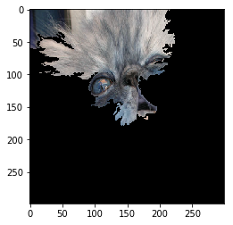
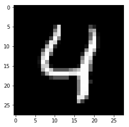
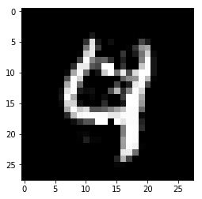
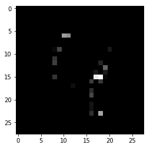
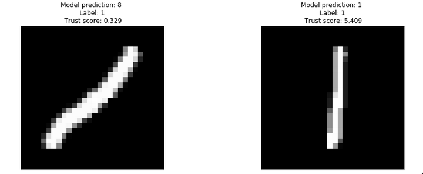

<p align="center">
  
</p>

[Alibi](https://docs.seldon.io/projects/alibi) is an open source Python library aimed at machine learning model inspection and interpretation. The initial focus on the library is on black-box, instance based model explanations.

*  [Documentation](https://docs.seldon.io/projects/alibi)

## Goals
* Provide high quality reference implementations of black-box ML model explanation algorithms
* Define a consistent API for interpretable ML methods
* Support multiple use cases (e.g. tabular, text and image data classification, regression)
* Implement the latest model explanation, concept drift, algorithmic bias detection and other ML
  model monitoring and interpretation methods

## Installation
Alibi can be installed from [PyPI](https://pypi.org/project/alibi):
```bash
pip install alibi
```

## Examples

[**Anchor method applied to the InceptionV3 model trained on ImageNet:**](examples/anchor_image_imagenet.ipynb)

Prediction: Persian Cat             | Anchor explanation
:-------------------------:|:------------------:
| 

[**Contrastive Explanation method applied to a CNN trained on MNIST:**](examples/cem_mnist.ipynb)

Prediction: 4             |  Pertinent Negative: 9               | Pertinent Positive: 4
:-------------------------:|:-------------------:|:------------------:
  |  | 

[**Trust scores applied to a softmax classifier trained on MNIST:**](examples/trustscore_mnist.ipynb)



