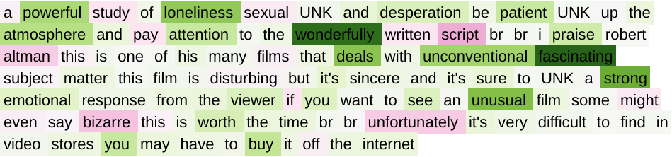
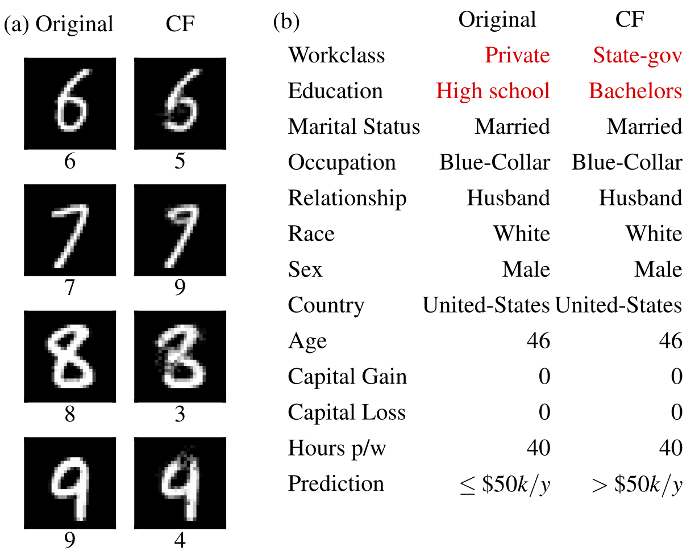
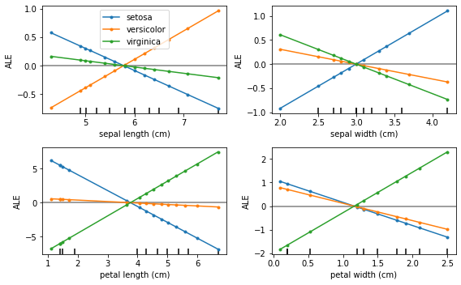

<p align="center">
  
</p>

[](https://github.com/SeldonIO/alibi/actions?query=workflow%3A%22CI%22)
[](https://docs.seldon.io/projects/alibi/en/latest/?badge=latest)
[](https://codecov.io/gh/SeldonIO/alibi)

[](https://badge.fury.io/py/alibi)

[](https://join.slack.com/t/seldondev/shared_invite/zt-vejg6ttd-ksZiQs3O_HOtPQsen_labg)
---
[Alibi](https://docs.seldon.io/projects/alibi) is an open source Python library aimed at machine learning model inspection and interpretation.
The focus of the library is to provide high-quality implementations of black-box, white-box, local and global
explanation methods for classification and regression models.
*  [Documentation](https://docs.seldon.io/projects/alibi/en/latest/)

If you're interested in outlier detection, concept drift or adversarial instance detection, check out our sister project [alibi-detect](https://github.com/SeldonIO/alibi-detect).

<table>
  <tr valign="top">
    <td width="50%" >
        <a href="https://docs.seldon.io/projects/alibi/en/latest/examples/anchor_image_imagenet.html">
            <br>
            <b>Anchor explanations for images</b>
            <br>
            <br>
            
        </a>
    </td>
    <td width="50%">
        <a href="https://docs.seldon.io/projects/alibi/en/latest/examples/integrated_gradients_imdb.html">
            <br>
            <b>Integrated Gradients for text</b>
            <br>
            <br>
            
        </a>
    </td>
  </tr>
  <tr valign="top">
    <td width="50%">
        <a href="https://docs.seldon.io/projects/alibi/en/latest/methods/CFProto.html">
            <br>
            <b>Counterfactual examples</b>
            <br>
            <br>
            
        </a>
    </td>
    <td width="50%">
        <a href="https://docs.seldon.io/projects/alibi/en/latest/methods/ALE.html">
            <br>
            <b>Accumulated Local Effects</b>
            <br>
            <br>
            
        </a>
    </td>
  </tr>
</table>

## Table of Contents

* [Installation and Usage](#installation-and-usage)
* [Supported Methods](#supported-methods)
  * [Model Explanations](#model-explanations)
  * [Model Confidence](#model-confidence)
  * [References and Examples](#references-and-examples)
* [Citations](#citations)

## Installation and Usage
Alibi can be installed from [PyPI](https://pypi.org/project/alibi):
```bash
pip install alibi
```
Alternatively, the development version can be installed:
```bash
pip install git+https://github.com/SeldonIO/alibi.git 
```

To take advantage of distributed computation of explanations, install `alibi` with `ray`:
```bash
pip install alibi[ray]
```

For SHAP support, install `alibi` as follows:
```bash
pip install alibi[shap]
```

The alibi explanation API takes inspiration from `scikit-learn`, consisting of distinct initialize,
fit and explain steps. We will use the [AnchorTabular](https://docs.seldon.io/projects/alibi/en/latest/methods/Anchors.html)
explainer to illustrate the API:

```python
from alibi.explainers import AnchorTabular

# initialize and fit explainer by passing a prediction function and any other required arguments
explainer = AnchorTabular(predict_fn, feature_names=feature_names, category_map=category_map)
explainer.fit(X_train)

# explain an instance
explanation = explainer.explain(x)
```

The explanation returned is an `Explanation` object with attributes `meta` and `data`. `meta` is a dictionary
containing the explainer metadata and any hyperparameters and `data` is a dictionary containing everything
related to the computed explanation. For example, for the Anchor algorithm the explanation can be accessed
via `explanation.data['anchor']` (or `explanation.anchor`). The exact details of available fields varies
from method to method so we encourage the reader to become familiar with the
[types of methods supported](https://docs.seldon.io/projects/alibi/en/latest/overview/algorithms.html).
 

## Supported Methods
The following tables summarize the possible use cases for each method.

### Model Explanations
|Method|Models|Explanations|Classification|Regression|Tabular|Text|Images|Categorical features|Train set required|Distributed|
|:---|:---|:---:|:---:|:---:|:---:|:---:|:---:|:---:|:---|:---:|
|[ALE](https://docs.seldon.io/projects/alibi/en/latest/methods/ALE.html)|BB|global|✔|✔|✔| | | |✔| |
|[Anchors](https://docs.seldon.io/projects/alibi/en/latest/methods/Anchors.html)|BB|local|✔| |✔|✔|✔|✔|For Tabular| |
|[CEM](https://docs.seldon.io/projects/alibi/en/latest/methods/CEM.html)|BB* TF/Keras|local|✔| |✔| |✔| |Optional| |
|[Counterfactuals](https://docs.seldon.io/projects/alibi/en/latest/methods/CF.html)|BB* TF/Keras|local|✔| |✔| |✔| |No| |
|[Prototype Counterfactuals](https://docs.seldon.io/projects/alibi/en/latest/methods/CFProto.html)|BB* TF/Keras|local|✔| |✔| |✔|✔|Optional| |
|[Counterfactuals with RL](https://docs.seldon.io/projects/alibi/en/latest/methods/CFRL.html)|BB|local|✔| |✔| |✔|✔|✔| |
|[Integrated Gradients](https://docs.seldon.io/projects/alibi/en/latest/methods/IntegratedGradients.html)|TF/Keras|local|✔|✔|✔|✔|✔|✔|Optional| |
|[Kernel SHAP](https://docs.seldon.io/projects/alibi/en/latest/methods/KernelSHAP.html)|BB|local <br></br>global|✔|✔|✔| | |✔|✔|✔|
|[Tree SHAP](https://docs.seldon.io/projects/alibi/en/latest/methods/TreeSHAP.html)|WB|local <br></br>global|✔|✔|✔| | |✔|Optional| | 

### Model Confidence
These algorithms provide **instance-specific** scores measuring the model confidence for making a
particular prediction.

|Method|Models|Classification|Regression|Tabular|Text|Images|Categorical Features|Train set required|
|:---|:---|:---:|:---:|:---:|:---:|:---:|:---:|:---|
|[Trust Scores](https://docs.seldon.io/projects/alibi/en/latest/methods/TrustScores.html)|BB|✔| |✔|✔(1)|✔(2)| |Yes|
|[Linearity Measure](https://docs.seldon.io/projects/alibi/en/latest/methods/LinearityMeasure.html)|BB|✔|✔|✔| |✔| |Optional|

Key:
 - **BB** - black-box (only require a prediction function)
 - **BB\*** - black-box but assume model is differentiable
 - **WB** - requires white-box model access. There may be limitations on models supported
 - **TF/Keras** - TensorFlow models via the Keras API
 - **Local** - instance specific explanation, why was this prediction made?
 - **Global** - explains the model with respect to a set of instances
 - **(1)** -  depending on model
 - **(2)** -  may require dimensionality reduction

## References and Examples
 - Accumulated Local Effects (ALE, [Apley and Zhu, 2016](https://arxiv.org/abs/1612.08468))
   - [Documentation](https://docs.seldon.io/projects/alibi/en/latest/methods/ALE.html)
   - Examples:
     [Boston housing dataset](https://docs.seldon.io/projects/alibi/en/latest/examples/ale_regression_boston.html),
     [Iris dataset](https://docs.seldon.io/projects/alibi/en/latest/examples/ale_classification.html)

 - Anchor explanations ([Ribeiro et al., 2018](https://homes.cs.washington.edu/~marcotcr/aaai18.pdf))
   - [Documentation](https://docs.seldon.io/projects/alibi/en/latest/methods/Anchors.html)
   - Examples:
     [income prediction](https://docs.seldon.io/projects/alibi/en/latest/examples/anchor_tabular_adult.html),
     [Iris dataset](https://docs.seldon.io/projects/alibi/en/latest/examples/anchor_tabular_iris.html),
     [movie sentiment classification](https://docs.seldon.io/projects/alibi/en/latest/examples/anchor_text_movie.html),
     [ImageNet](https://docs.seldon.io/projects/alibi/en/latest/examples/anchor_image_imagenet.html),
     [fashion MNIST](https://docs.seldon.io/projects/alibi/en/latest/examples/anchor_image_fashion_mnist.html)

- Contrastive Explanation Method (CEM, [Dhurandhar et al., 2018](https://papers.nips.cc/paper/7340-explanations-based-on-the-missing-towards-contrastive-explanations-with-pertinent-negatives))
  - [Documentation](https://docs.seldon.io/projects/alibi/en/latest/methods/CEM.html)
  - Examples: [MNIST](https://docs.seldon.io/projects/alibi/en/latest/examples/cem_mnist.html),
    [Iris dataset](https://docs.seldon.io/projects/alibi/en/latest/examples/cem_iris.html)

- Counterfactual Explanations (extension of
  [Wachter et al., 2017](https://arxiv.org/abs/1711.00399))
  - [Documentation](https://docs.seldon.io/projects/alibi/en/latest/methods/CF.html)
  - Examples: 
    [MNIST](https://docs.seldon.io/projects/alibi/en/latest/examples/cf_mnist.html)

- Counterfactual Explanations Guided by Prototypes ([Van Looveren and Klaise, 2019](https://arxiv.org/abs/1907.02584))
  - [Documentation](https://docs.seldon.io/projects/alibi/en/latest/methods/CFProto.html)
  - Examples:
    [MNIST](https://docs.seldon.io/projects/alibi/en/latest/examples/cfproto_mnist.html),
    [Boston housing dataset](https://docs.seldon.io/projects/alibi/en/latest/examples/cfproto_housing.html),
    [Adult income (one-hot)](https://docs.seldon.io/projects/alibi/en/latest/examples/cfproto_cat_adult_ohe.html),
    [Adult income (ordinal)](https://docs.seldon.io/projects/alibi/en/latest/examples/cfproto_cat_adult_ord.html)

- Model-agnostic Counterfactual Explanations via RL([Samoilescu et al., 2021](https://arxiv.org/abs/2106.02597))
  - [Documentation](https://docs.seldon.io/projects/alibi/en/latest/methods/CFRL.html)
  - Examples:
    [MNIST](https://docs.seldon.io/projects/alibi/en/latest/examples/cfrl_mnist.html),
    [Adult income](https://docs.seldon.io/projects/alibi/en/latest/examples/cfrl_adult.html)

- Integrated Gradients ([Sundararajan et al., 2017](https://arxiv.org/abs/1703.01365))
  - [Documentation](https://docs.seldon.io/projects/alibi/en/latest/methods/IntegratedGradients.html),
  - Examples:
    [MNIST example](https://docs.seldon.io/projects/alibi/en/latest/examples/integrated_gradients_mnist.html),
    [Imagenet example](https://docs.seldon.io/projects/alibi/en/latest/examples/integrated_gradients_imagenet.html),
    [IMDB example](https://docs.seldon.io/projects/alibi/en/latest/examples/integrated_gradients_imdb.html).

- Kernel Shapley Additive Explanations ([Lundberg et al., 2017](https://papers.nips.cc/paper/7062-a-unified-approach-to-interpreting-model-predictions))
  - [Documentation](https://docs.seldon.io/projects/alibi/en/latest/methods/KernelSHAP.html)
  - Examples:
    [SVM with continuous data](https://docs.seldon.io/projects/alibi/en/latest/examples/kernel_shap_wine_intro.html),
    [multinomial logistic regression with continous data](https://docs.seldon.io/projects/alibi/en/latest/examples/kernel_shap_wine_lr.html),
    [handling categorical variables](https://docs.seldon.io/projects/alibi/en/latest/examples/kernel_shap_adult_lr.html)
    
- Tree Shapley Additive Explanations ([Lundberg et al., 2020](https://www.nature.com/articles/s42256-019-0138-9))
  - [Documentation](https://docs.seldon.io/projects/alibi/en/latest/methods/TreeSHAP.html)
  - Examples:
    [Interventional (adult income, xgboost)](https://docs.seldon.io/projects/alibi/en/latest/examples/interventional_tree_shap_adult_xgb.html),
    [Path-dependent (adult income, xgboost)](https://docs.seldon.io/projects/alibi/en/latest/examples/path_dependent_tree_shap_adult_xgb.html)
    
- Trust Scores ([Jiang et al., 2018](https://arxiv.org/abs/1805.11783))
  - [Documentation](https://docs.seldon.io/projects/alibi/en/latest/methods/TrustScores.html)
  - Examples:
    [MNIST](https://docs.seldon.io/projects/alibi/en/latest/examples/trustscore_mnist.html),
    [Iris dataset](https://docs.seldon.io/projects/alibi/en/latest/examples/trustscore_mnist.html)

- Linearity Measure
  - [Documentation](https://docs.seldon.io/projects/alibi/en/latest/methods/LinearityMeasure.html)
  - Examples:
    [Iris dataset](https://docs.seldon.io/projects/alibi/en/latest/examples/linearity_measure_iris.html),
    [fashion MNIST](https://docs.seldon.io/projects/alibi/en/latest/examples/linearity_measure_fashion_mnist.html)

## Citations
If you use alibi in your research, please consider citing it.

BibTeX entry:

```
@article{JMLR:v22:21-0017,
  author  = {Janis Klaise and Arnaud Van Looveren and Giovanni Vacanti and Alexandru Coca},
  title   = {Alibi Explain: Algorithms for Explaining Machine Learning Models},
  journal = {Journal of Machine Learning Research},
  year    = {2021},
  volume  = {22},
  number  = {181},
  pages   = {1-7},
  url     = {http://jmlr.org/papers/v22/21-0017.html}
}
```
