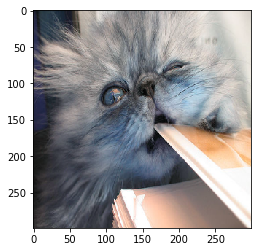

<p align="center">
  
</p>

[](https://travis-ci.com/SeldonIO/alibi)
[](https://docs.seldon.io/projects/alibi/en/latest/?badge=latest)

[](https://badge.fury.io/py/alibi)

[](http://seldondev.slack.com/messages/alibi)
---
[Alibi](https://docs.seldon.io/projects/alibi) is an open source Python library aimed at machine learning model inspection and interpretation. The initial focus on the library is on black-box, instance based model explanations.

*  [Documentation](https://docs.seldon.io/projects/alibi)

## Goals
* Provide high quality reference implementations of black-box ML model explanation algorithms
* Define a consistent API for interpretable ML methods
* Support multiple use cases (e.g. tabular, text and image data classification, regression)
* Implement the latest model explanation, concept drift, algorithmic bias detection and other ML
  model monitoring and interpretation methods

## Installation
Alibi can be installed from [PyPI](https://pypi.org/project/alibi):
```bash
pip install alibi
```
This will install `alibi` with all its dependencies:
```bash
  beautifulsoup4
  numpy
  Pillow
  pandas
  requests
  scikit-learn
  spacy
  scikit-image
  tensorflow
```

To run all the example notebooks, you may additionally run `pip install alibi[examples]` which will
install the following:
```bash
  seaborn
  Keras
```

## Supported algorithms
### Black-box model explanaton
 - Anchor explanations ([Ribeiro et al., 2018](https://homes.cs.washington.edu/~marcotcr/aaai18.pdf))
   - [Documentation](https://docs.seldon.io/projects/alibi/en/stable/methods/Anchors.html)
   - Examples:
     [income prediction](https://docs.seldon.io/projects/alibi/en/stable/examples/anchor_tabular_adult.html),
     [Iris dataset](https://docs.seldon.io/projects/alibi/en/stable/examples/anchor_tabular_iris.html),
     [movie sentiment classification](https://docs.seldon.io/projects/alibi/en/stable/examples/anchor_text_movie.html),
     [ImageNet](https://docs.seldon.io/projects/alibi/en/stable/examples/anchor_image_imagenet.html),
     [fashion MNIST](https://docs.seldon.io/projects/alibi/en/stable/examples/anchor_image_fashion_mnist.html)

- Contrastive Explanation Method (CEM, [Dhurandhar et al., 2018](https://papers.nips.cc/paper/7340-explanations-based-on-the-missing-towards-contrastive-explanations-with-pertinent-negatives))
  - [Documentation](https://docs.seldon.io/projects/alibi/en/stable/methods/CEM.html)
  - Examples: [MNIST](https://docs.seldon.io/projects/alibi/en/stable/examples/cem_mnist.html),
    [Iris dataset](https://docs.seldon.io/projects/alibi/en/stable/examples/cem_iris.html)

- Counterfactual Explanations (extension of
  [Wachter et al., 2017](https://arxiv.org/abs/1711.00399))
  - [Documentation](https://docs.seldon.io/projects/alibi/en/stable/methods/CF.html)
  - Examples: 
    [MNIST](https://docs.seldon.io/projects/alibi/en/stable/examples/cf_mnist.html)

- Counterfactual Explanations Guided by Prototypes ([Van Looveren et al., 2019](https://arxiv.org/abs/1907.02584))
  - [Documentation](https://docs.seldon.io/projects/alibi/en/stable/methods/CFProto.html)
  - Examples:
    [MNIST](https://docs.seldon.io/projects/alibi/en/stable/examples/cfproto_mnist.html),
    [Boston housing dataset](https://docs.seldon.io/projects/alibi/en/stable/examples/cfproto_housing.html),
    [Adult income (one-hot)](https://docs.seldon.io/projects/alibi/en/stable/examples/cfproto_cat_adult_ohe.html),
    [Adult income (ordinal)](https://docs.seldon.io/projects/alibi/en/stable/examples/cfproto_cat_adult_ord.html)

### Model confidence metrics
- Trust Scores ([Jiang et al., 2018](https://arxiv.org/abs/1805.11783))
  - [Documentation](https://docs.seldon.io/projects/alibi/en/stable/methods/TrustScores.html)
  - Examples:
    [MNIST](https://docs.seldon.io/projects/alibi/en/stable/examples/trustscore_mnist.html),
    [Iris dataset](https://docs.seldon.io/projects/alibi/en/stable/examples/trustscore_mnist.html)
- Linearity Measure
  - Examples:
    [Iris dataset](https://docs.seldon.io/projects/alibi/en/stable/examples/linearity_measure_iris.html),
    [fashion MNIST](https://docs.seldon.io/projects/alibi/en/stable/examples/linearity_measure_fashion_mnist.html)

## Example outputs

[**Anchor method applied to the InceptionV3 model trained on ImageNet:**](examples/anchor_image_imagenet.ipynb)

Prediction: Persian Cat             | Anchor explanation
:-------------------------:|:------------------:
| 

[**Contrastive Explanation method applied to a CNN trained on MNIST:**](examples/cem_mnist.ipynb)

Prediction: 4             |  Pertinent Negative: 9               | Pertinent Positive: 4
:-------------------------:|:-------------------:|:------------------:
  |  | 

[**Trust scores applied to a softmax classifier trained on MNIST:**](examples/trustscore_mnist.ipynb)


