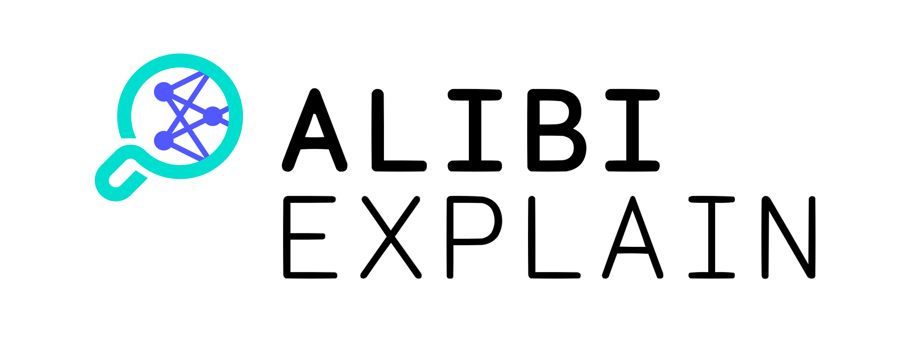

  

[Alibi](https://github.com/SeldonIO/alibi) is an open source Python library aimed at machine learning model inspection and interpretation.
The focus of the library is to provide high-quality implementations of black-box, white-box, local and global
explanation methods for classification and regression models.
