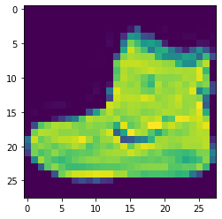
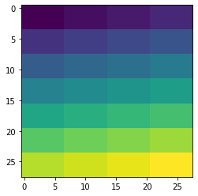
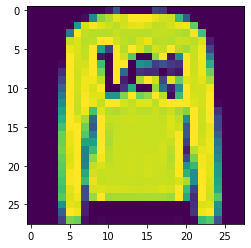
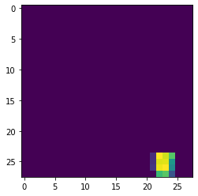

# Anchor explanations for fashion MNIST

```python
import matplotlib
%matplotlib inline
import matplotlib.pyplot as plt
import numpy as np
import tensorflow as tf
from tensorflow.keras.layers import Conv2D, Dense, Dropout, Flatten, MaxPooling2D, Input
from tensorflow.keras.models import Model
from tensorflow.keras.utils import to_categorical
from alibi.explainers import AnchorImage
```

### Load and prepare fashion MNIST data

```python
(x_train, y_train), (x_test, y_test) = tf.keras.datasets.fashion_mnist.load_data()
print('x_train shape:', x_train.shape, 'y_train shape:', y_train.shape)
```

```
x_train shape: (60000, 28, 28) y_train shape: (60000,)
```

```python
idx = 0
plt.imshow(x_train[idx]);
```



Scale, reshape and categorize data

```python
x_train = x_train.astype('float32') / 255
x_test = x_test.astype('float32') / 255
x_train = np.reshape(x_train, x_train.shape + (1,))
x_test = np.reshape(x_test, x_test.shape + (1,))
print('x_train shape:', x_train.shape, 'x_test shape:', x_test.shape)
y_train = to_categorical(y_train)
y_test = to_categorical(y_test)
print('y_train shape:', y_train.shape, 'y_test shape:', y_test.shape)
```

```
x_train shape: (60000, 28, 28, 1) x_test shape: (10000, 28, 28, 1)
y_train shape: (60000, 10) y_test shape: (10000, 10)
```

### Define CNN model

```python
def model():
    x_in = Input(shape=(28, 28, 1))
    x = Conv2D(filters=64, kernel_size=2, padding='same', activation='relu')(x_in)
    x = MaxPooling2D(pool_size=2)(x)
    x = Dropout(0.3)(x)
    
    x = Conv2D(filters=32, kernel_size=2, padding='same', activation='relu')(x)
    x = MaxPooling2D(pool_size=2)(x)
    x = Dropout(0.3)(x)
    
    x = Flatten()(x)
    x = Dense(256, activation='relu')(x)
    x = Dropout(0.5)(x)
    x_out = Dense(10, activation='softmax')(x)
    
    cnn = Model(inputs=x_in, outputs=x_out)
    cnn.compile(loss='categorical_crossentropy', optimizer='adam', metrics=['accuracy'])
    
    return cnn
```

```python
cnn = model()
cnn.summary()
```

```
Model: "model"
_________________________________________________________________
Layer (type)                 Output Shape              Param #   
=================================================================
input_1 (InputLayer)         [(None, 28, 28, 1)]       0         
_________________________________________________________________
conv2d (Conv2D)              (None, 28, 28, 64)        320       
_________________________________________________________________
max_pooling2d (MaxPooling2D) (None, 14, 14, 64)        0         
_________________________________________________________________
dropout (Dropout)            (None, 14, 14, 64)        0         
_________________________________________________________________
conv2d_1 (Conv2D)            (None, 14, 14, 32)        8224      
_________________________________________________________________
max_pooling2d_1 (MaxPooling2 (None, 7, 7, 32)          0         
_________________________________________________________________
dropout_1 (Dropout)          (None, 7, 7, 32)          0         
_________________________________________________________________
flatten (Flatten)            (None, 1568)              0         
_________________________________________________________________
dense (Dense)                (None, 256)               401664    
_________________________________________________________________
dropout_2 (Dropout)          (None, 256)               0         
_________________________________________________________________
dense_1 (Dense)              (None, 10)                2570      
=================================================================
Total params: 412,778
Trainable params: 412,778
Non-trainable params: 0
_________________________________________________________________
```

### Train model

```python
cnn.fit(x_train, y_train, batch_size=64, epochs=3)
```

```
Train on 60000 samples
Epoch 1/3
60000/60000 [==============================] - 29s 481us/sample - loss: 0.5932 - acc: 0.7819
Epoch 2/3
60000/60000 [==============================] - 33s 542us/sample - loss: 0.4066 - acc: 0.8506
Epoch 3/3
60000/60000 [==============================] - 32s 525us/sample - loss: 0.3624 - acc: 0.8681


<tensorflow.python.keras.callbacks.History at 0x7fae6dd5cb70>
```

```python
# Evaluate the model on test set
score = cnn.evaluate(x_test, y_test, verbose=0)
print('Test accuracy: ', score[1])
```

```
Test accuracy:  0.8867
```

### Define superpixels

Function to generate rectangular superpixels for a given image. Alternatively, use one of the built in methods. It is important to have meaningful superpixels in order to generate a useful explanation. Please check scikit-image's [segmentation methods](http://scikit-image.org/docs/dev/api/skimage.segmentation.html) (_felzenszwalb_, _slic_ and _quickshift_ built in the explainer) for more information on the built in methods.

```python
def superpixel(image, size=(4, 7)):
    segments = np.zeros([image.shape[0], image.shape[1]])
    row_idx, col_idx = np.where(segments == 0)
    for i, j in zip(row_idx, col_idx):
        segments[i, j] = int((image.shape[1]/size[1]) * (i//size[0]) + j//size[1])
    return segments
```

```python
segments = superpixel(x_train[idx])
plt.imshow(segments);
```



### Define prediction function

```python
predict_fn = lambda x: cnn.predict(x)
```

### Initialize anchor image explainer

```python
image_shape = x_train[idx].shape
explainer = AnchorImage(predict_fn, image_shape, segmentation_fn=superpixel)
```

### Explain a prediction

The explanation returns a mask with the superpixels that constitute the anchor.

Image to be explained:

```python
i = 1
image = x_test[i]
plt.imshow(image[:,:,0]);
```



Model prediction:

```python
cnn.predict(image.reshape(1, 28, 28, 1)).argmax()
```

```
2
```

The predicted category correctly corresponds to the class `Pullover`:

| Label | Description |
| ----- | ----------- |
| 0     | T-shirt/top |
| 1     | Trouser     |
| 2     | Pullover    |
| 3     | Dress       |
| 4     | Coat        |
| 5     | Sandal      |
| 6     | Shirt       |
| 7     | Sneaker     |
| 8     | Bag         |
| 9     | Ankle boot  |

Generate explanation:

```python
explanation = explainer.explain(image, threshold=.95, p_sample=.8, seed=0)
```

Show anchor:

```python
plt.imshow(explanation.anchor[:,:,0]);
```



From the example, it looks like the end of the sleeve alone is sufficient to predict a pullover.
