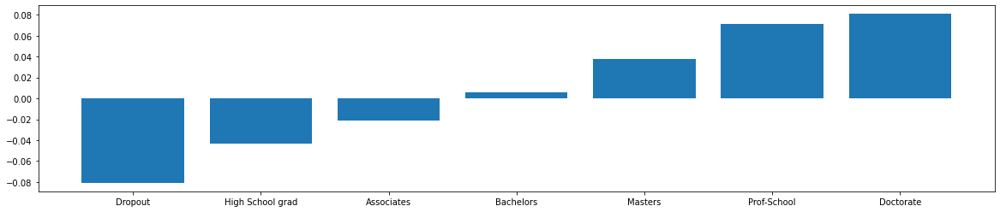

# Counterfactual explanations with one-hot encoded categorical variables

Real world machine learning applications often handle data with categorical variables. Explanation methods which rely on perturbations of the input features need to make sure those perturbations are meaningful and capture the underlying structure of the data. This becomes tricky for categorical features. For instance random perturbations across possible categories or enforcing a ranking between categories based on frequency of occurrence in the training data do not capture this structure. Our method captures the relation between categories of a variable numerically through the context given by the other features in the data and/or the predictions made by the model. First it captures the pairwise distances between categories and then applies multi-dimensional scaling. More details about the method can be found in the [documentation](https://docs.seldon.io/projects/alibi/en/stable/methods/CFProto.html). The example notebook illustrates this approach on the _adult_ dataset, which contains a mixture of categorical and numerical features used to predict whether a person's income is above or below $50k.

Note

To enable support for CounterfactualProto, you may need to run

```bash
pip install alibi[tensorflow]
```

```python
import tensorflow as tf
tf.get_logger().setLevel(40) # suppress deprecation messages
tf.compat.v1.disable_v2_behavior() # disable TF2 behaviour as alibi code still relies on TF1 constructs
from tensorflow.keras.layers import Dense, Dropout, Input
from tensorflow.keras.models import Model
from tensorflow.keras.utils import to_categorical

%matplotlib inline
import matplotlib
import matplotlib.pyplot as plt
import numpy as np
import os
from sklearn.preprocessing import OneHotEncoder
from time import time
from alibi.datasets import fetch_adult
from alibi.explainers import CounterfactualProto
from alibi.utils import ohe_to_ord, ord_to_ohe

print('TF version: ', tf.__version__)
print('Eager execution enabled: ', tf.executing_eagerly()) # False
```

```
TF version:  2.8.0
Eager execution enabled:  False
```

## Load adult dataset

The `fetch_adult` function returns a `Bunch` object containing the features, the targets, the feature names and a mapping of the categories in each categorical variable.

```python
adult = fetch_adult()
data = adult.data
target = adult.target
feature_names = adult.feature_names
category_map_tmp = adult.category_map
target_names = adult.target_names
```

Define shuffled training and test set:

```python
def set_seed(s=0):
    np.random.seed(s)
    tf.random.set_seed(s)
```

```python
set_seed()
data_perm = np.random.permutation(np.c_[data, target])
X = data_perm[:,:-1]
y = data_perm[:,-1]
```

```python
idx = 30000
y_train, y_test = y[:idx], y[idx+1:]
```

Reorganize data so categorical features come first:

```python
X = np.c_[X[:, 1:8], X[:, 11], X[:, 0], X[:, 8:11]]
```

Adjust `feature_names` and `category_map` as well:

```python
feature_names = feature_names[1:8] + feature_names[11:12] + feature_names[0:1] + feature_names[8:11]
print(feature_names)
```

```
['Workclass', 'Education', 'Marital Status', 'Occupation', 'Relationship', 'Race', 'Sex', 'Country', 'Age', 'Capital Gain', 'Capital Loss', 'Hours per week']
```

```python
category_map = {}
for i, (_, v) in enumerate(category_map_tmp.items()):
    category_map[i] = v
```

Create a dictionary with as keys the categorical columns and values the number of categories for each variable in the dataset:

```python
cat_vars_ord = {}
n_categories = len(list(category_map.keys()))
for i in range(n_categories):
    cat_vars_ord[i] = len(np.unique(X[:, i]))
print(cat_vars_ord)
```

```
{0: 9, 1: 7, 2: 4, 3: 9, 4: 6, 5: 5, 6: 2, 7: 11}
```

Since we will apply one-hot encoding (OHE) on the categorical variables, we convert `cat_vars_ord` from the ordinal to OHE format. `alibi.utils.mapping` contains utility functions to do this. The keys in `cat_vars_ohe` now represent the first column index for each one-hot encoded categorical variable. This dictionary will later be used in the counterfactual explanation.

```python
cat_vars_ohe = ord_to_ohe(X, cat_vars_ord)[1]
print(cat_vars_ohe)
```

```
{0: 9, 9: 7, 16: 4, 20: 9, 29: 6, 35: 5, 40: 2, 42: 11}
```

## Preprocess data

Scale numerical features between -1 and 1:

```python
X_num = X[:, -4:].astype(np.float32, copy=False)
xmin, xmax = X_num.min(axis=0), X_num.max(axis=0)
rng = (-1., 1.)
X_num_scaled = (X_num - xmin) / (xmax - xmin) * (rng[1] - rng[0]) + rng[0]
```

Apply OHE to categorical variables:

```python
X_cat = X[:, :-4].copy()
ohe = OneHotEncoder(categories='auto', sparse=False).fit(X_cat)
X_cat_ohe = ohe.transform(X_cat)
```

Combine numerical and categorical data:

```python
X = np.c_[X_cat_ohe, X_num_scaled].astype(np.float32, copy=False)
X_train, X_test = X[:idx, :], X[idx+1:, :]
print(X_train.shape, X_test.shape)
```

```
(30000, 57) (2560, 57)
```

## Train neural net

```python
def nn_ohe():
    
    x_in = Input(shape=(57,))
    x = Dense(60, activation='relu')(x_in)
    x = Dropout(.2)(x)
    x = Dense(60, activation='relu')(x)
    x = Dropout(.2)(x)
    x = Dense(60, activation='relu')(x)
    x = Dropout(.2)(x)
    x_out = Dense(2, activation='softmax')(x)
    
    nn = Model(inputs=x_in, outputs=x_out)
    nn.compile(loss='categorical_crossentropy', optimizer='adam', metrics=['accuracy'])
    
    return nn
```

```python
set_seed()
nn = nn_ohe()
nn.summary()
nn.fit(X_train, to_categorical(y_train), batch_size=256, epochs=30, verbose=0)
```

```
Model: "model"
_________________________________________________________________
Layer (type)                 Output Shape              Param #   
=================================================================
input_1 (InputLayer)         [(None, 57)]              0         
_________________________________________________________________
dense (Dense)                (None, 60)                3480      
_________________________________________________________________
dropout (Dropout)            (None, 60)                0         
_________________________________________________________________
dense_1 (Dense)              (None, 60)                3660      
_________________________________________________________________
dropout_1 (Dropout)          (None, 60)                0         
_________________________________________________________________
dense_2 (Dense)              (None, 60)                3660      
_________________________________________________________________
dropout_2 (Dropout)          (None, 60)                0         
_________________________________________________________________
dense_3 (Dense)              (None, 2)                 122       
=================================================================
Total params: 10,922
Trainable params: 10,922
Non-trainable params: 0
_________________________________________________________________


<tensorflow.python.keras.callbacks.History at 0x7f2d7cc5e410>
```

## Generate counterfactual

Original instance:

```python
X = X_test[0].reshape((1,) + X_test[0].shape)
```

Initialize counterfactual parameters. The feature perturbations are applied in the numerical feature space, after transforming the categorical variables to numerical features. As a result, the dimensionality and values of `feature_range` are defined in the numerical space.

```python
shape = X.shape
beta = .01
c_init = 1.
c_steps = 5
max_iterations = 500
rng = (-1., 1.)  # scale features between -1 and 1
rng_shape = (1,) + data.shape[1:]
feature_range = ((np.ones(rng_shape) * rng[0]).astype(np.float32), 
                 (np.ones(rng_shape) * rng[1]).astype(np.float32))
```

Initialize explainer:

```python
def set_seed(s=0):
    np.random.seed(s)
    tf.random.set_seed(s)
```

```python
set_seed()
cf = CounterfactualProto(nn,
                         shape,
                         beta=beta,
                         cat_vars=cat_vars_ohe,
                         ohe=True,  # OHE flag
                         max_iterations=max_iterations,
                         feature_range=feature_range,
                         c_init=c_init,
                         c_steps=c_steps
                        )
```

Fit explainer. `d_type` refers to the distance metric used to convert the categorical to numerical values. Valid options are `abdm`, `mvdm` and `abdm-mvdm`. `abdm` infers the distance between categories of the same variable from the context provided by the other variables. This requires binning of the numerical features as well. `mvdm` computes the distance using the model predictions, and `abdm-mvdm` combines both methods. More info on both distance measures can be found in the [documentation](https://docs.seldon.io/projects/alibi/en/stable/methods/CFProto.html).

```python
cf.fit(X_train, d_type='abdm', disc_perc=[25, 50, 75]);
```

We can now visualize the transformation from the categorical to numerical values for each category. The example below shows that the **Education** feature is ordered from _High School Dropout_ to having obtained a _Doctorate_ degree. As a result, if we perturb an instance representing a person that has obtained a _Bachelors_ degree, the nearest perturbations will result in a counterfactual instance with either a _Masters_ or an _Associates_ degree.

```python
def plot_bar(dist, cols, figsize=(10,4)):
    dist = dist.reshape(dist.shape[0])
    idx = np.argsort(dist)
    fig, ax = plt.subplots(figsize=figsize)
    plt.bar(cols[idx], dist[idx])
    print(cols[idx])
```

```python
cat = 'Education'
idx = feature_names.index(cat)
plot_bar(cf.d_abs[idx], np.array(category_map[idx]), figsize=(20,4))
```

```
['Dropout' 'High School grad' 'Associates' 'Bachelors' 'Masters'
 'Prof-School' 'Doctorate']


```



Explain instance:

```python
explanation = cf.explain(X)
```

Helper function to more clearly describe explanations:

```python
def describe_instance(X, explanation, eps=1e-2):
    print('Original instance: {}  -- proba: {}'.format(target_names[explanation.orig_class],
                                                       explanation.orig_proba[0]))
    print('Counterfactual instance: {}  -- proba: {}'.format(target_names[explanation.cf['class']],
                                                             explanation.cf['proba'][0]))
    print('\nCounterfactual perturbations...')
    print('\nCategorical:')
    X_orig_ord = ohe_to_ord(X, cat_vars_ohe)[0]
    X_cf_ord = ohe_to_ord(explanation.cf['X'], cat_vars_ohe)[0]
    delta_cat = {}
    for i, (_, v) in enumerate(category_map.items()):
        cat_orig = v[int(X_orig_ord[0, i])]
        cat_cf = v[int(X_cf_ord[0, i])]
        if cat_orig != cat_cf:
            delta_cat[feature_names[i]] = [cat_orig, cat_cf]
    if delta_cat:
        for k, v in delta_cat.items():
            print('{}: {}  -->   {}'.format(k, v[0], v[1]))
    print('\nNumerical:')
    delta_num = X_cf_ord[0, -4:] - X_orig_ord[0, -4:]
    n_keys = len(list(cat_vars_ord.keys()))
    for i in range(delta_num.shape[0]):
        if np.abs(delta_num[i]) > eps:
            print('{}: {:.2f}  -->   {:.2f}'.format(feature_names[i+n_keys],
                                            X_orig_ord[0,i+n_keys],
                                            X_cf_ord[0,i+n_keys]))
```

```python
describe_instance(X, explanation)
```

```
Original instance: <=50K  -- proba: [0.70744723 0.29255277]
Counterfactual instance: >50K  -- proba: [0.37736374 0.62263626]

Counterfactual perturbations...

Categorical:
Education: Associates  -->   Bachelors

Numerical:
```

By obtaining a higher level of education the income is predicted to be above $50k.

## Change the categorical distance metric

Instead of `abdm`, we now use `mvdm` as our distance metric.

```python
set_seed()
cf.fit(X_train, d_type='mvdm')
explanation = cf.explain(X)
describe_instance(X, explanation)
```

```
Original instance: <=50K  -- proba: [0.70744723 0.29255277]
Counterfactual instance: >50K  -- proba: [0.38161737 0.61838263]

Counterfactual perturbations...

Categorical:
Education: Associates  -->   Bachelors

Numerical:
```

The same conclusion hold using a different distance metric.

## Use k-d trees to build prototypes

We can also use _k-d trees_ to build class prototypes to guide the counterfactual to nearby instances in the counterfactual class as described in [Interpretable Counterfactual Explanations Guided by Prototypes](https://arxiv.org/abs/1907.02584).

```python
use_kdtree = True
theta = 10.  # weight of prototype loss term
```

Initialize, fit and explain instance:

```python
set_seed()
X = X_test[7].reshape((1,) + X_test[0].shape)
cf = CounterfactualProto(nn,
                         shape,
                         beta=beta,
                         theta=theta,
                         cat_vars=cat_vars_ohe,
                         ohe=True,
                         use_kdtree=use_kdtree,
                         max_iterations=max_iterations,
                         feature_range=feature_range,
                         c_init=c_init,
                         c_steps=c_steps
                        )
cf.fit(X_train, d_type='abdm')
explanation = cf.explain(X)
describe_instance(X, explanation)
```

```
Original instance: <=50K  -- proba: [0.5211548  0.47884512]
Counterfactual instance: >50K  -- proba: [0.49958408 0.500416  ]

Counterfactual perturbations...

Categorical:

Numerical:
Age: -0.53  -->   -0.51
```

By slightly increasing the age of the person the income would be predicted to be above $50k.

## Use an autoencoder to build prototypes

Another option is to use an autoencoder to guide the perturbed instance to the counterfactual class. We define and train the autoencoder:

```python
def ae_model():
    # encoder
    x_in = Input(shape=(57,))
    x = Dense(60, activation='relu')(x_in)
    x = Dense(30, activation='relu')(x)
    x = Dense(15, activation='relu')(x)
    encoded = Dense(10, activation=None)(x)
    encoder = Model(x_in, encoded)
    
    # decoder
    dec_in = Input(shape=(10,))
    x = Dense(15, activation='relu')(dec_in)
    x = Dense(30, activation='relu')(x)
    x = Dense(60, activation='relu')(x)
    decoded = Dense(57, activation=None)(x)
    decoder = Model(dec_in, decoded)
    
    # autoencoder = encoder + decoder
    x_out = decoder(encoder(x_in))
    autoencoder = Model(x_in, x_out)
    autoencoder.compile(optimizer='adam', loss='mse')
    
    return autoencoder, encoder, decoder
```

```python
set_seed()
ae, enc, dec = ae_model()
ae.summary()
ae.fit(X_train, X_train, batch_size=128, epochs=100, validation_data=(X_test, X_test), verbose=0)
```

```
Model: "model_3"
_________________________________________________________________
Layer (type)                 Output Shape              Param #   
=================================================================
input_2 (InputLayer)         [(None, 57)]              0         
_________________________________________________________________
model_1 (Model)              (None, 10)                5935      
_________________________________________________________________
model_2 (Model)              (None, 57)                5982      
=================================================================
Total params: 11,917
Trainable params: 11,917
Non-trainable params: 0
_________________________________________________________________


<tensorflow.python.keras.callbacks.History at 0x7f2d783aff90>
```

Weights for the autoencoder and prototype loss terms:

```python
beta = .1  # L1
gamma = 10.  # autoencoder
theta = .1  # prototype
```

Initialize, fit and explain instance:

```python
set_seed()
X = X_test[19].reshape((1,) + X_test[0].shape)
cf = CounterfactualProto(nn,
                         shape,
                         beta=beta,
                         enc_model=enc,
                         ae_model=ae,
                         gamma=gamma,
                         theta=theta,
                         cat_vars=cat_vars_ohe,
                         ohe=True,
                         max_iterations=max_iterations,
                         feature_range=feature_range,
                         c_init=c_init,
                         c_steps=c_steps
                        )
cf.fit(X_train, d_type='abdm')
explanation = cf.explain(X)
describe_instance(X, explanation)
```

```
Original instance: >50K  -- proba: [0.48656026 0.5134398 ]
Counterfactual instance: <=50K  -- proba: [0.71456206 0.28543794]

Counterfactual perturbations...

Categorical:
Education: High School grad  -->   Dropout

Numerical:
```

## Black box model with k-d trees

Now we assume that we only have access to the model's prediction function and treat it as a black box. The k-d trees are again used to define the prototypes.

```python
use_kdtree = True
theta = 10.  # weight of prototype loss term
```

Initialize, fit and explain instance:

```python
set_seed()

X = X_test[24].reshape((1,) + X_test[0].shape)

# define predict function
predict_fn = lambda x: nn.predict(x)

cf = CounterfactualProto(predict_fn,
                         shape,
                         beta=beta,
                         theta=theta,
                         cat_vars=cat_vars_ohe,
                         ohe=True,
                         use_kdtree=use_kdtree,
                         max_iterations=max_iterations,
                         feature_range=feature_range,
                         c_init=c_init,
                         c_steps=c_steps
                        )
cf.fit(X_train, d_type='abdm')
explanation = cf.explain(X)
describe_instance(X, explanation)
```

```
Original instance: >50K  -- proba: [0.20676644 0.7932335 ]
Counterfactual instance: <=50K  -- proba: [0.5048416  0.49515834]

Counterfactual perturbations...

Categorical:

Numerical:
Age: -0.15  -->   -0.19
Hours per week: -0.20  -->   -0.51
```

If the person was younger and worked less, he or she would have a predicted income below $50k.
