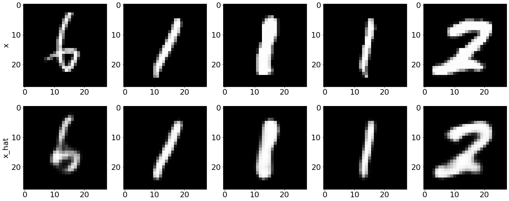
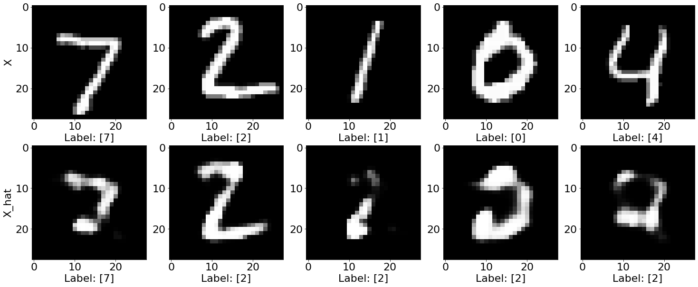

# Counterfactual with Reinforcement Learning (CFRL) on MNIST

This method is described in [Model-agnostic and Scalable Counterfactual Explanations via Reinforcement Learning](https://arxiv.org/abs/2106.02597) and can generate counterfactual instances for any black-box model. The usual optimization procedure is transformed into a learnable process allowing to generate batches of counterfactual instances in a single forward pass even for high dimensional data. The training pipeline is model-agnostic and relies only on prediction feedback by querying the black-box model. Furthermore, the method allows target and feature conditioning.

**We exemplify the use case for the TensorFlow backend. This means that all models: the autoencoder, the actor and the critic are TensorFlow models. Our implementation supports PyTorch backend as well.**

CFRL uses [Deep Deterministic Policy Gradient (DDPG)](https://arxiv.org/abs/1509.02971) by interleaving a state-action function approximator called critic, with a learning an approximator called actor to predict the optimal action. The method assumes that the critic is differentiable with respect to the action argument, thus allowing to optimize the actor's parameters efficiently through gradient-based methods.

The DDPG algorithm requires two separate networks, an actor $\mu$ and a critic $Q$. Given the encoded representation of the input instance $z = enc(x)$, the model prediction $y\_M$, the target prediction $y\_T$ and the conditioning vector $c$, the actor outputs the counterfactual’s latent representation $z\_{CF} = \mu(z, y\_M, y\_T, c)$. The decoder then projects the embedding $z\_{CF}$ back to the original input space, followed by optional post-processing.

The training step consists of simultaneously optimizing the actor and critic networks. The critic regresses on the reward $R$ determined by the model prediction, while the actor maximizes the critic’s output for the given instance through $L\_{max}$. The actor also minimizes two objectives to encourage the generation of sparse, in-distribution counterfactuals. The sparsity loss $L\_{sparsity}$ operates on the decoded counterfactual $x\_{CF}$ and combines the $L\_1$ loss over the standardized numerical features and the $L\_0$ loss over the categorical ones. The consistency loss $L\_{consist}$ aims to encode the counterfactual $x\_{CF}$ back to the same latent representation where it was decoded from and helps to produce in-distribution counterfactual instances.Formally, the actor's loss can be written as: $L\_{actor} = L\_{max} + \lambda\_{1}L\_{sparsity} + \lambda\_{2}L\_{consistency}$

Note

To enable support for CounterfactualRLTabular with tensorflow backend, you may need to run

```bash
pip install alibi[tensorflow]
```

```python
import os
import numpy as np
import matplotlib.pyplot as plt
from typing import Dict

import tensorflow as tf
import tensorflow.keras as keras

from alibi.explainers import CounterfactualRL
from alibi.models.tensorflow import AE
from alibi.models.tensorflow import Actor, Critic
from alibi.models.tensorflow import MNISTEncoder, MNISTDecoder, MNISTClassifier
from alibi.explainers.cfrl_base import Callback
```

## Load MNIST dataset

```python
# Define constants.
BATCH_SIZE = 64
BUFFER_SIZE = 1024

# Load MNIST dataset.
(X_train, Y_train), (X_test, Y_test) = tf.keras.datasets.mnist.load_data()

# Expand dimensions and normalize.
X_train = np.expand_dims(X_train, axis=-1).astype(np.float32) / 255.
X_test = np.expand_dims(X_test, axis=-1).astype(np.float32) / 255.

# Define trainset.
trainset_classifier = tf.data.Dataset.from_tensor_slices((X_train, Y_train))
trainset_classifier = trainset_classifier.shuffle(buffer_size=BUFFER_SIZE).batch(BATCH_SIZE)

# Define testset.
testset_classifier = tf.data.Dataset.from_tensor_slices((X_test, Y_test))
testset_classifier = testset_classifier.shuffle(buffer_size=BUFFER_SIZE).batch(BATCH_SIZE)
```

### Define and train CNN classifier

```python
# Number of classes.
NUM_CLASSES = 10
EPOCHS = 5

# Define classifier path and create dir if it doesn't exist.
classifier_path = os.path.join("tensorflow", "MNIST_classifier")
if not os.path.exists(classifier_path):
    os.makedirs(classifier_path)

# Construct classifier. This is the classifier used in the paper experiments.
classifier = MNISTClassifier(output_dim=NUM_CLASSES)

# Define optimizer and loss function
optimizer = keras.optimizers.Adam(learning_rate=1e-3)
loss = keras.losses.SparseCategoricalCrossentropy(from_logits=True)

# Complile the model.
classifier.compile(optimizer=optimizer, 
                   loss=loss,
                   metrics=[tf.keras.metrics.SparseCategoricalAccuracy()])


if len(os.listdir(classifier_path)) == 0:
    # Fit and save the classifier.
    classifier.fit(trainset_classifier, epochs=EPOCHS)
    classifier.save(classifier_path)
else:
    # Load the classifier if already fitted.
    classifier = keras.models.load_model(classifier_path)
```

```
Epoch 1/5
938/938 [==============================] - 12s 11ms/step - loss: 0.4742 - sparse_categorical_accuracy: 0.8550
Epoch 2/5
938/938 [==============================] - 12s 13ms/step - loss: 0.0935 - sparse_categorical_accuracy: 0.9709
Epoch 3/5
938/938 [==============================] - 11s 12ms/step - loss: 0.0639 - sparse_categorical_accuracy: 0.9799
Epoch 4/5
938/938 [==============================] - 11s 12ms/step - loss: 0.0516 - sparse_categorical_accuracy: 0.9832
Epoch 5/5
938/938 [==============================] - 11s 12ms/step - loss: 0.0453 - sparse_categorical_accuracy: 0.9851
INFO:tensorflow:Assets written to: tensorflow/MNIST_classifier/assets
```

```python
# Evaluate the classifier
loss, accuracy = classifier.evaluate(testset_classifier)
```

```
157/157 [==============================] - 1s 6ms/step - loss: 0.0383 - sparse_categorical_accuracy: 0.9879
```

### Define the predictor (black-box)

Now that we've trained the CNN classifier, we can define the black-box model. Note that the output of the black-box is a distribution which can be either a soft-label distribution (probabilities/logits for each class) or a hard-label distribution (one-hot encoding). Internally, CFRL takes the `argmax`. Moreover the output **DOES NOT HAVE TO BE DIFFERENTIABLE**.

```python
# Define predictor function (black-box) used to train the CFRL
def predictor(X: np.ndarray):
    Y = classifier(X).numpy()
    return Y
```

### Define and train autoencoder

Instead of directly modeling the perturbation vector in the potentially high-dimensional input space, we first train an autoencoder. The weights of the encoder are frozen and the actor applies the counterfactual perturbations in the latent space of the encoder. The pre-trained decoder maps the counterfactual embedding back to the input feature space.

The autoencoder follows a standard design. The model is composed from two submodules, the encoder and the decoder. The forward pass consists of passing the input to the encoder, obtain the input embedding and pass the embedding through the decoder.

```python
class AE(keras.Model):
    def __init__(self, encoder: keras.Model, decoder: keras.Model, **kwargs) -> None:
        super().__init__(**kwargs)
        self.encoder = encoder
        self.decoder = decoder

    def call(self, x: tf.Tensor, **kwargs):
        z = self.encoder(x)
        x_hat = self.decoder(z)
        return x_hat
```

```python
# Define autoencoder trainset.
trainset_ae = tf.data.Dataset.from_tensor_slices(X_train)
trainset_ae = trainset_ae.map(lambda x: (x, x))
trainset_ae = trainset_ae.shuffle(buffer_size=BUFFER_SIZE).batch(BATCH_SIZE)

# Define autoencode testset.
testset_ae = tf.data.Dataset.from_tensor_slices(X_test)
testset_ae = testset_ae.map(lambda x: (x, x))
testset_ae = testset_ae.shuffle(buffer_size=BUFFER_SIZE).batch(BATCH_SIZE)
```

```python
# Define autoencoder path and create dir if it doesn't exist.
ae_path = os.path.join("tensorflow", "MNIST_autoencoder")
if not os.path.exists(ae_path):
    os.makedirs(ae_path)

# Define latent dimension.
LATENT_DIM = 64
EPOCHS = 50
    
# Define autoencoder.
ae = AE(encoder=MNISTEncoder(latent_dim=LATENT_DIM),
        decoder=MNISTDecoder())

# Define optimizer and loss function.
optimizer = keras.optimizers.Adam(learning_rate=1e-3)
loss = keras.losses.BinaryCrossentropy(from_logits=False)

# Compile autoencoder.
ae.compile(optimizer=optimizer, loss=loss)

if len(os.listdir(ae_path)) == 0:
    # Fit and save autoencoder.
    ae.fit(trainset_ae, epochs=EPOCHS)
    ae.save(ae_path)
else:
    # Load the model.
    ae = keras.models.load_model(ae_path)
```

```
Epoch 1/50
938/938 [==============================] - 9s 8ms/step - loss: 0.2846
Epoch 2/50
938/938 [==============================] - 8s 8ms/step - loss: 0.1431
Epoch 3/50
938/938 [==============================] - 8s 8ms/step - loss: 0.1287
Epoch 4/50
938/938 [==============================] - 8s 8ms/step - loss: 0.1224
Epoch 5/50
938/938 [==============================] - 8s 8ms/step - loss: 0.1184
Epoch 6/50
938/938 [==============================] - 8s 8ms/step - loss: 0.1155
Epoch 7/50
938/938 [==============================] - 8s 8ms/step - loss: 0.1129
Epoch 8/50
938/938 [==============================] - 8s 8ms/step - loss: 0.1111
Epoch 9/50
938/938 [==============================] - 8s 8ms/step - loss: 0.1094
Epoch 10/50
938/938 [==============================] - 8s 8ms/step - loss: 0.1078
Epoch 11/50
938/938 [==============================] - 8s 8ms/step - loss: 0.1066
Epoch 12/50
938/938 [==============================] - 8s 8ms/step - loss: 0.1056
Epoch 13/50
938/938 [==============================] - 8s 8ms/step - loss: 0.1045
Epoch 14/50
938/938 [==============================] - 8s 8ms/step - loss: 0.1038
Epoch 15/50
938/938 [==============================] - 8s 8ms/step - loss: 0.1030
Epoch 16/50
938/938 [==============================] - 8s 8ms/step - loss: 0.1023
Epoch 17/50
938/938 [==============================] - 8s 8ms/step - loss: 0.1016
Epoch 18/50
938/938 [==============================] - 8s 8ms/step - loss: 0.1010
Epoch 19/50
938/938 [==============================] - 8s 8ms/step - loss: 0.1005
Epoch 20/50
938/938 [==============================] - 8s 8ms/step - loss: 0.1000
Epoch 21/50
938/938 [==============================] - 8s 8ms/step - loss: 0.0997
Epoch 22/50
938/938 [==============================] - 8s 8ms/step - loss: 0.0992
Epoch 23/50
938/938 [==============================] - 8s 8ms/step - loss: 0.0987
Epoch 24/50
938/938 [==============================] - 8s 8ms/step - loss: 0.0983
Epoch 25/50
938/938 [==============================] - 7s 7ms/step - loss: 0.0980
Epoch 26/50
938/938 [==============================] - 7s 8ms/step - loss: 0.0977
Epoch 27/50
938/938 [==============================] - 7s 8ms/step - loss: 0.0973
Epoch 28/50
938/938 [==============================] - 7s 7ms/step - loss: 0.0971
Epoch 29/50
938/938 [==============================] - 7s 7ms/step - loss: 0.0967
Epoch 30/50
938/938 [==============================] - 7s 7ms/step - loss: 0.0964
Epoch 31/50
938/938 [==============================] - 7s 7ms/step - loss: 0.0962
Epoch 32/50
938/938 [==============================] - 7s 7ms/step - loss: 0.0960
Epoch 33/50
938/938 [==============================] - 7s 8ms/step - loss: 0.0957
Epoch 34/50
938/938 [==============================] - 8s 9ms/step - loss: 0.0954
Epoch 35/50
938/938 [==============================] - 7s 8ms/step - loss: 0.0953
Epoch 36/50
938/938 [==============================] - 8s 8ms/step - loss: 0.0951
Epoch 37/50
938/938 [==============================] - 7s 8ms/step - loss: 0.0949
Epoch 38/50
938/938 [==============================] - 7s 8ms/step - loss: 0.0948
Epoch 39/50
938/938 [==============================] - 7s 8ms/step - loss: 0.0944
Epoch 40/50
938/938 [==============================] - 9s 10ms/step - loss: 0.0941
Epoch 41/50
938/938 [==============================] - 7s 7ms/step - loss: 0.0940
Epoch 42/50
938/938 [==============================] - 8s 9ms/step - loss: 0.0938
Epoch 43/50
938/938 [==============================] - 9s 10ms/step - loss: 0.0937
Epoch 44/50
938/938 [==============================] - 7s 7ms/step - loss: 0.0935
Epoch 45/50
938/938 [==============================] - 7s 8ms/step - loss: 0.0933
Epoch 46/50
938/938 [==============================] - 7s 7ms/step - loss: 0.0932
Epoch 47/50
938/938 [==============================] - 7s 7ms/step - loss: 0.0930
Epoch 48/50
938/938 [==============================] - 7s 7ms/step - loss: 0.0929
Epoch 49/50
938/938 [==============================] - 8s 8ms/step - loss: 0.0928
Epoch 50/50
938/938 [==============================] - 7s 8ms/step - loss: 0.0925
INFO:tensorflow:Assets written to: tensorflow/MNIST_autoencoder/assets
```

### Test the autoencoder

```python
# Define number of samples to be displayed
NUM_SAMPLES = 5

# Get some random samples from test
np.random.seed(0)
indices = np.random.choice(X_test.shape[0], NUM_SAMPLES)
inputs = [X_test[i].reshape(1, 28, 28, 1) for i in indices]
inputs = np.concatenate(inputs, axis=0)

# Pass samples through the autoencoder
inputs_hat = ae(inputs).numpy()
```

```python
# Plot inputs and reconstructions.
plt.rcParams.update({'font.size': 22})
fig, ax = plt.subplots(2, NUM_SAMPLES, figsize=(25, 10))

for i in range(NUM_SAMPLES):
    ax[0][i].imshow(inputs[i], cmap='gray')
    ax[1][i].imshow(inputs_hat[i], cmap='gray')
    
text1 = ax[0][0].set_ylabel("x")
text2 = ax[1][0].set_ylabel("x_hat")        
```



### Counterfactual with Reinforcement Learning

```python
# Define constants
COEFF_SPARSITY = 7.5               # sparisty coefficient
COEFF_CONSISTENCY = 0              # consisteny coefficient -> no consistency
TRAIN_STEPS = 50000                # number of training steps -> consider increasing the number of steps
BATCH_SIZE = 100                   # batch size
```

#### Define and fit the explainer

```python
# Define explainer.
explainer = CounterfactualRL(predictor=predictor,
                             encoder=ae.encoder,
                             decoder=ae.decoder,
                             latent_dim=LATENT_DIM,
                             coeff_sparsity=COEFF_SPARSITY,
                             coeff_consistency=COEFF_CONSISTENCY,
                             train_steps=TRAIN_STEPS,
                             batch_size=BATCH_SIZE,
                             backend="tensorflow")
```

```python
# Fit the explainer
explainer = explainer.fit(X=X_train)
```

```
100%|██████████| 50000/50000 [31:04<00:00, 26.82it/s]
```

#### Test explainer

```python
# Generate counterfactuals for some test instances.
explanation = explainer.explain(X_test[0:200], Y_t=np.array([2]), batch_size=100)
```

```
100%|██████████| 2/2 [00:00<00:00, 36.14it/s]
```

```python
fig, ax = plt.subplots(2, NUM_SAMPLES, figsize=(25, 10))

for i in range(NUM_SAMPLES):
    ax[0][i].imshow(explanation.data['orig']['X'][i], cmap='gray')
    ax[1][i].imshow(explanation.data['cf']['X'][i], cmap='gray')
    
    ax[0][i].set_xlabel("Label: " + str(explanation.data['orig']['class'][i]))
    ax[1][i].set_xlabel("Label: " + str(explanation.data['cf']['class'][i]))
    

text1 = ax[0][0].set_ylabel("X")
text2 = ax[1][0].set_ylabel("X_hat")    
```



### Logging

Logging is clearly important when dealing with deep learning models. Thus, we provide an interface to write custom callbacks for logging purposes after each training step which we defined [here](https://github.com/ramonpzg/alibi/blob/rp-alibi-newdocs-dec23/doc/source/api/alibi.explainers.cfrl_base.rst#alibi.explainers.cfrl_base.Callback). In the following cells we provide some example to log in **Weights and Biases**.

#### Logging reward callback

```python
class RewardCallback(Callback):
    def __call__(self,
                 step: int, 
                 update: int, 
                 model: CounterfactualRL,
                 sample: Dict[str, np.ndarray],
                 losses: Dict[str, float]):
        if step % 100 != 0:
            return
        
        # Get the counterfactual and target.
        X_cf = sample["X_cf"]
        Y_t = sample["Y_t"]
        
        # Get prediction label.
        Y_m_cf = predictor(X_cf)
        
        # Compute reward
        reward = np.mean(model.params["reward_func"](Y_m_cf, Y_t))
        wandb.log({"reward": reward})
```

#### Logging images callback

```python
class ImagesCallback(Callback):
    def __call__(self,
                 step: int, 
                 update: int, 
                 model: CounterfactualRL,
                 sample: Dict[str, np.ndarray],
                 losses: Dict[str, float]):
        # Log every 100 steps
        if step % 100 != 0:
            return
        
        # Defie number of samples to be displayed.
        NUM_SAMPLES = 10
        
        X = sample["X"][:NUM_SAMPLES]        # input instance
        X_cf = sample["X_cf"][:NUM_SAMPLES]  # counterfactual
        diff = np.abs(X - X_cf)              # differences
        
        Y_m = sample["Y_m"][:NUM_SAMPLES].astype(int)   # input labels
        Y_t = sample["Y_t"][:NUM_SAMPLES].astype(int)   # target labels
        Y_m_cf = predictor(X_cf).astype(int)            # counterfactual labels
        
        # Concatentate images,
        X = np.concatenate(X, axis=1)
        X_cf = np.concatenate(X_cf, axis=1)
        diff = np.concatenate(diff, axis=1)
        
        # Construct full image.
        img = np.concatenate([X, X_cf, diff], axis=0)
            
        # Construct caption.
        caption = ""
        caption += "Input:\t%s\n" % str(list(np.argmax(Y_m, axis=1)))
        caption += "Target:\t%s\n" % str(list(np.argmax(Y_t, axis=1)))
        caption += "Predicted:\t%s\n" % str(list(np.argmax(Y_m_cf, axis=1)))
        
        # Log image.
        wandb.log({"samples": wandb.Image(img, caption=caption)})
```

#### Logging losses callback

```python
class LossCallback(Callback):
    def __call__(self,
                 step: int, 
                 update: int, 
                 model: CounterfactualRL,
                 sample: Dict[str, np.ndarray],
                 losses: Dict[str, float]):
        # Log evary 100 updates.
        if (step + update) % 100 == 0:
            wandb.log(losses)
```

Having defined the callbacks, we can define a new explainer that will include logging.

```python
import wandb

# Initialize wandb.
wandb_project = "MNIST Counterfactual with Reinforcement Learning"
wandb.init(project=wandb_project)

# Define explainer as before and include callbacks.
explainer = CounterfactualRL(...,
                             callbacks=[RewardCallback(), ImagesCallback()])

# Fit the explainer.
explainer.fit(X=X_train)

# Close wandb.
wandb.finish()
```
