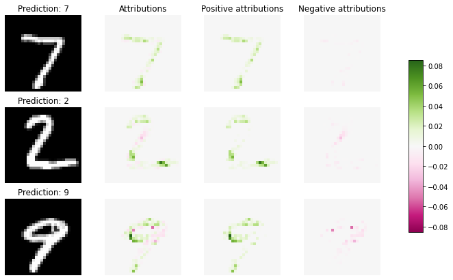

# Integrated gradients for MNIST

In this notebook we apply the integrated gradients method to a convolutional network trained on the MNIST dataset. Integrated gradients defines an attribution value for each feature of the input instance (in this case for each pixel in the image) by integrating the model's gradients with respect to the input along a straight path from a baseline instance $x^\prime$ to the input instance $x.$

A more detailed description of the method can be found [here](https://docs.seldon.io/projects/alibi/en/stable/methods/IntegratedGradients.html). Integrated gradients was originally proposed in Sundararajan et al., ["Axiomatic Attribution for Deep Networks"](https://arxiv.org/abs/1703.01365).

Note

To enable support for IntegratedGradients, you may need to run

```bash
pip install alibi[tensorflow]
```

```python
import numpy as np
import os
import tensorflow as tf
from tensorflow.keras.layers import Activation, Conv2D, Dense, Dropout
from tensorflow.keras.layers import Flatten, Input, Reshape, MaxPooling2D
from tensorflow.keras.models import Model
from tensorflow.keras.utils import to_categorical
from alibi.explainers import IntegratedGradients
import matplotlib.pyplot as plt
print('TF version: ', tf.__version__)
print('Eager execution enabled: ', tf.executing_eagerly()) # True
```

```
TF version:  2.5.0
Eager execution enabled:  True
```

## Load data

Loading and preparing the MNIST data set.

```python
train, test = tf.keras.datasets.mnist.load_data()
X_train, y_train = train
X_test, y_test = test
test_labels = y_test.copy()
train_labels = y_train.copy()
                         
X_train = X_train.reshape(-1, 28, 28, 1).astype('float64') / 255
X_test = X_test.reshape(-1, 28, 28, 1).astype('float64') / 255
y_train = to_categorical(y_train, 10)
y_test = to_categorical(y_test, 10)
print(X_train.shape, y_train.shape, X_test.shape, y_test.shape)
```

```
(60000, 28, 28, 1) (60000, 10) (10000, 28, 28, 1) (10000, 10)
```

## Train model

Train a convolutional neural network on the MNIST dataset. The model includes 2 convolutional layers and it reaches a test accuracy of 0.98. If `save_model = True`, a local folder `./model_mnist` will be created and the trained model will be saved in that folder. If the model was previously saved, it can be loaded by setting `load_mnist_model = True`.

```python
load_mnist_model = False
save_model = True
```

```python
filepath = './model_mnist/'  # change to directory where model is saved
if load_mnist_model:
    model = tf.keras.models.load_model(os.path.join(filepath, 'model.h5'))
else:
    # define model
    inputs = Input(shape=(X_train.shape[1:]), dtype=tf.float64)
    x = Conv2D(64, 2, padding='same', activation='relu')(inputs)
    x = MaxPooling2D(pool_size=2)(x)
    x = Dropout(.3)(x)
    
    x = Conv2D(32, 2, padding='same', activation='relu')(x)
    x = MaxPooling2D(pool_size=2)(x)
    x = Dropout(.3)(x)
    
    x = Flatten()(x)
    x = Dense(256, activation='relu')(x)
    x = Dropout(.5)(x)
    logits = Dense(10, name='logits')(x)
    outputs = Activation('softmax', name='softmax')(logits)
    model = Model(inputs=inputs, outputs=outputs)
    model.compile(loss='categorical_crossentropy',
                  optimizer='adam',
                  metrics=['accuracy'])
    
    # train model
    model.fit(X_train,
              y_train,
              epochs=6,
              batch_size=256,
              verbose=1,
              validation_data=(X_test, y_test)
              )
    if save_model:
        if not os.path.exists(filepath):
            os.makedirs(filepath)
        model.save(os.path.join(filepath, 'model.h5'))
```

```
Epoch 1/6
235/235 [==============================] - 16s 65ms/step - loss: 0.5084 - accuracy: 0.8374 - val_loss: 0.1216 - val_accuracy: 0.9625
Epoch 2/6
235/235 [==============================] - 14s 60ms/step - loss: 0.1686 - accuracy: 0.9488 - val_loss: 0.0719 - val_accuracy: 0.9781
Epoch 3/6
235/235 [==============================] - 17s 70ms/step - loss: 0.1205 - accuracy: 0.9634 - val_loss: 0.0520 - val_accuracy: 0.9841
Epoch 4/6
235/235 [==============================] - 18s 76ms/step - loss: 0.0979 - accuracy: 0.9702 - val_loss: 0.0443 - val_accuracy: 0.9863
Epoch 5/6
235/235 [==============================] - 16s 69ms/step - loss: 0.0844 - accuracy: 0.9733 - val_loss: 0.0382 - val_accuracy: 0.9872
Epoch 6/6
235/235 [==============================] - 14s 59ms/step - loss: 0.0742 - accuracy: 0.9768 - val_loss: 0.0364 - val_accuracy: 0.9875
```

## Calculate integrated gradients

The IntegratedGradients class implements the integrated gradients attribution method. A description of the method can be found [here](https://docs.seldon.io/projects/alibi/en/stable/methods/IntegratedGradients.html).

In the following example, the baselines (i.e. the starting points of the path integral) are black images (all pixel values are set to zero). This means that black areas of the image will always have zero attribution. The path integral is defined as a straight line from the baseline to the input image. The path is approximated by choosing 50 discrete steps according to the Gauss-Legendre method.

```python
# Initialize IntegratedGradients instance
n_steps = 50
method = "gausslegendre"
ig  = IntegratedGradients(model,
                          n_steps=n_steps, 
                          method=method)
```

```python
# Calculate attributions for the first 10 images in the test set
nb_samples = 10
X_test_sample = X_test[:nb_samples]
predictions = model(X_test_sample).numpy().argmax(axis=1)
explanation = ig.explain(X_test_sample, 
                         baselines=None, 
                         target=predictions)
```

```python
# Metadata from the explanation object
explanation.meta
```

```
{'name': 'IntegratedGradients',
 'type': ['whitebox'],
 'explanations': ['local'],
 'params': {'method': 'gausslegendre',
  'n_steps': 50,
  'internal_batch_size': 100,
  'layer': 0}}
```

```python
# Data fields from the explanation object
explanation.data.keys()
```

```
dict_keys(['attributions', 'X', 'baselines', 'predictions', 'deltas', 'target'])
```

```python
# Get attributions values from the explanation object
attrs = explanation.attributions[0]
```

## Visualize attributions

Sample images from the test dataset and their attributions.

* The first column shows the original image.
* The second column shows the values of the attributions.
* The third column shows the positive valued attributions.
* The fourth column shows the negative valued attributions.

The attributions are calculated using the black image as a baseline for all samples.

```python
fig, ax = plt.subplots(nrows=3, ncols=4, figsize=(10, 7))
image_ids = [0, 1, 9]
cmap_bound = np.abs(attrs[[0, 1, 9]]).max()

for row, image_id in enumerate(image_ids):
    # original images
    ax[row, 0].imshow(X_test[image_id].squeeze(), cmap='gray')
    ax[row, 0].set_title(f'Prediction: {predictions[image_id]}')
    
    # attributions
    attr = attrs[image_id]
    im = ax[row, 1].imshow(attr.squeeze(), vmin=-cmap_bound, vmax=cmap_bound, cmap='PiYG')
    
    # positive attributions
    attr_pos = attr.clip(0, 1)
    im_pos = ax[row, 2].imshow(attr_pos.squeeze(), vmin=-cmap_bound, vmax=cmap_bound, cmap='PiYG')
    
    # negative attributions
    attr_neg = attr.clip(-1, 0)
    im_neg = ax[row, 3].imshow(attr_neg.squeeze(), vmin=-cmap_bound, vmax=cmap_bound, cmap='PiYG')
    
ax[0, 1].set_title('Attributions');
ax[0, 2].set_title('Positive attributions');
ax[0, 3].set_title('Negative attributions');

for ax in fig.axes:
    ax.axis('off')

fig.colorbar(im, cax=fig.add_axes([0.95, 0.25, 0.03, 0.5]));
```


