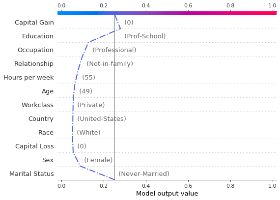

# Handling categorical variables with KernelSHAP

Note

To enable SHAP support, you may need to run

```bash
pip install alibi[shap]
```

```python
# shap.summary_plot currently doesn't work with matplotlib>=3.6.0,
# see bug report: https://github.com/slundberg/shap/issues/2687
!pip install matplotlib==3.5.3
```

## Introduction

In this example, we show how the KernelSHAP method can be used for tabular data, which contains both numerical (continuous) and categorical attributes. Using a logistic regression model fitted to the `Adult` dataset, we examine the performance of the KernelSHAP algorithm against the exact shap values. We investigate the effect of the background dataset size on the estimated shap values and present two ways of handling categorical data.

```python
import shap
shap.initjs()

import matplotlib.pyplot as plt
import numpy as np
import pandas as pd

from alibi.explainers import KernelShap
from alibi.datasets import fetch_adult
from scipy.special import logit
from sklearn.compose import ColumnTransformer
from sklearn.impute import SimpleImputer
from sklearn.linear_model import LogisticRegression
from sklearn.metrics import accuracy_score, confusion_matrix, ConfusionMatrixDisplay
from sklearn.model_selection import cross_val_score, train_test_split
from sklearn.pipeline import Pipeline
from sklearn.preprocessing import StandardScaler, OneHotEncoder
```

## Data preparation

### Load and split

The `fetch_adult` function returns a `Bunch` object containing the features, the targets, the feature names and a mapping of categorical variables to numbers.

```python
adult = fetch_adult()
adult.keys()
```

```
dict_keys(['data', 'target', 'feature_names', 'target_names', 'category_map'])
```

```python
data = adult.data
target = adult.target
target_names = adult.target_names
feature_names = adult.feature_names
category_map = adult.category_map
```

Note that for your own datasets you can use our utility function `gen_category_map` to create the category map.

```python
from alibi.utils import gen_category_map
```

```python
np.random.seed(0)
data_perm = np.random.permutation(np.c_[data, target])
data = data_perm[:,:-1]
target = data_perm[:,-1]
```

```python
idx = 30000
X_train,y_train = data[:idx,:], target[:idx]
X_test, y_test = data[idx+1:,:], target[idx+1:]
```

### Create feature transformation pipeline

### Create feature transformation pipeline

Create feature pre-processor. Needs to have 'fit' and 'transform' methods. Different types of pre-processing can be applied to all or part of the features. In the example below we will standardize ordinal features and apply one-hot-encoding to categorical features.

Ordinal features:

```python
ordinal_features = [x for x in range(len(feature_names)) if x not in list(category_map.keys())]
ordinal_transformer = Pipeline(steps=[('imputer', SimpleImputer(strategy='median')),
                                      ('scaler', StandardScaler())])
```

Categorical features:

```python
categorical_features = list(category_map.keys())
categorical_transformer = Pipeline(steps=[('imputer', SimpleImputer(strategy='median')),
                                          ('onehot', OneHotEncoder(drop='first', handle_unknown='error'))])
```

Note that in order to be able to interpret the coefficients corresponding to the categorical features, the option `drop='first'` has been passed to the `OneHotEncoder`. This means that for a categorical variable with `n` levels, the length of the code will be `n-1`. This is necessary in order to avoid introducing feature multicolinearity, which would skew the interpretation of the results. For more information about the issue about multicolinearity in the context of linear modelling see [\[1\]](kernel_shap_adult_lr.md#References).

Combine and fit:

```python
preprocessor = ColumnTransformer(transformers=[('num', ordinal_transformer, ordinal_features),
                                               ('cat', categorical_transformer, categorical_features)])
preprocessor.fit(X_train)
```

<pre><code>ColumnTransformer(transformers=[('num',
                             Pipeline(steps=[(&#x26;#x27;imputer&#x26;#x27;,                                              SimpleImputer(strategy=&#x26;#x27;median&#x26;#x27;)),                                             (&#x26;#x27;scaler&#x26;#x27;, StandardScaler())]),                             [0, 8, 9, 10]),                            (&#x26;#x27;cat&#x26;#x27;,                             Pipeline(steps=[(&#x26;#x27;imputer&#x26;#x27;,                                              SimpleImputer(strategy=&#x26;#x27;median&#x26;#x27;)),                                             (&#x26;#x27;onehot&#x26;#x27;,                                              OneHotEncoder(drop=&#x26;#x27;first&#x26;#x27;))]),                             [1, 2, 3, 4, 5, 6, 7, 11])])&#x3C;/pre>&#x3C;b>In a Jupyter environment, please rerun this cell to show the HTML representation or trust the notebook. &#x3C;br />On GitHub, the HTML representation is unable to render, please try loading this page with nbviewer.org.&#x3C;/b>&#x3C;/div>&#x3C;div class="sk-container" hidden>&#x3C;div class="sk-item sk-dashed-wrapped">&#x3C;div class="sk-label-container">&#x3C;div class="sk-label sk-toggleable">&#x3C;input class="sk-toggleable__control sk-hidden--visually" id="sk-estimator-id-1" type="checkbox" >&#x3C;label for="sk-estimator-id-1" class="sk-toggleable__label sk-toggleable__label-arrow">ColumnTransformer&#x3C;/label>&#x3C;div class="sk-toggleable__content">&#x3C;pre>ColumnTransformer(transformers=[(&#x26;#x27;num&#x26;#x27;,                             Pipeline(steps=[(&#x26;#x27;imputer&#x26;#x27;,                                              SimpleImputer(strategy=&#x26;#x27;median&#x26;#x27;)),                                             (&#x26;#x27;scaler&#x26;#x27;, StandardScaler())]),                             [0, 8, 9, 10]),                            (&#x26;#x27;cat&#x26;#x27;,                             Pipeline(steps=[(&#x26;#x27;imputer&#x26;#x27;,                                              SimpleImputer(strategy=&#x26;#x27;median&#x26;#x27;)),                                             (&#x26;#x27;onehot&#x26;#x27;,                                              OneHotEncoder(drop=&#x26;#x27;first&#x26;#x27;))]),                             [1, 2, 3, 4, 5, 6, 7, 11])])&#x3C;/pre>&#x3C;/div>&#x3C;/div>&#x3C;/div>&#x3C;div class="sk-parallel">&#x3C;div class="sk-parallel-item">&#x3C;div class="sk-item">&#x3C;div class="sk-label-container">&#x3C;div class="sk-label sk-toggleable">&#x3C;input class="sk-toggleable__control sk-hidden--visually" id="sk-estimator-id-2" type="checkbox" >&#x3C;label for="sk-estimator-id-2" class="sk-toggleable__label sk-toggleable__label-arrow">num&#x3C;/label>&#x3C;div class="sk-toggleable__content">&#x3C;pre>[0, 8, 9, 10]&#x3C;/pre>&#x3C;/div>&#x3C;/div>&#x3C;/div>&#x3C;div class="sk-serial">&#x3C;div class="sk-item">&#x3C;div class="sk-serial">&#x3C;div class="sk-item">&#x3C;div class="sk-estimator sk-toggleable">&#x3C;input class="sk-toggleable__control sk-hidden--visually" id="sk-estimator-id-3" type="checkbox" >&#x3C;label for="sk-estimator-id-3" class="sk-toggleable__label sk-toggleable__label-arrow">SimpleImputer&#x3C;/label>&#x3C;div class="sk-toggleable__content">&#x3C;pre>SimpleImputer(strategy=&#x26;#x27;median&#x26;#x27;)&#x3C;/pre>&#x3C;/div>&#x3C;/div>&#x3C;/div>&#x3C;div class="sk-item">&#x3C;div class="sk-estimator sk-toggleable">&#x3C;input class="sk-toggleable__control sk-hidden--visually" id="sk-estimator-id-4" type="checkbox" >&#x3C;label for="sk-estimator-id-4" class="sk-toggleable__label sk-toggleable__label-arrow">StandardScaler&#x3C;/label>&#x3C;div class="sk-toggleable__content">&#x3C;pre>StandardScaler()&#x3C;/pre>&#x3C;/div>&#x3C;/div>&#x3C;/div>&#x3C;/div>&#x3C;/div>&#x3C;/div>&#x3C;/div>&#x3C;/div>&#x3C;div class="sk-parallel-item">&#x3C;div class="sk-item">&#x3C;div class="sk-label-container">&#x3C;div class="sk-label sk-toggleable">&#x3C;input class="sk-toggleable__control sk-hidden--visually" id="sk-estimator-id-5" type="checkbox" >&#x3C;label for="sk-estimator-id-5" class="sk-toggleable__label sk-toggleable__label-arrow">cat&#x3C;/label>&#x3C;div class="sk-toggleable__content">&#x3C;pre>[1, 2, 3, 4, 5, 6, 7, 11]&#x3C;/pre>&#x3C;/div>&#x3C;/div>&#x3C;/div>&#x3C;div class="sk-serial">&#x3C;div class="sk-item">&#x3C;div class="sk-serial">&#x3C;div class="sk-item">&#x3C;div class="sk-estimator sk-toggleable">&#x3C;input class="sk-toggleable__control sk-hidden--visually" id="sk-estimator-id-6" type="checkbox" >&#x3C;label for="sk-estimator-id-6" class="sk-toggleable__label sk-toggleable__label-arrow">SimpleImputer&#x3C;/label>&#x3C;div class="sk-toggleable__content">&#x3C;pre>SimpleImputer(strategy=&#x26;#x27;median&#x26;#x27;)&#x3C;/pre>&#x3C;/div>&#x3C;/div>&#x3C;/div>&#x3C;div class="sk-item">&#x3C;div class="sk-estimator sk-toggleable">&#x3C;input class="sk-toggleable__control sk-hidden--visually" id="sk-estimator-id-7" type="checkbox" >&#x3C;label for="sk-estimator-id-7" class="sk-toggleable__label sk-toggleable__label-arrow">OneHotEncoder&#x3C;/label>&#x3C;div class="sk-toggleable__content">&#x3C;pre>OneHotEncoder(drop=&#x26;#x27;first&#x26;#x27;)&#x3C;/pre>&#x3C;/div>&#x3C;/div>&#x3C;/div>&#x3C;/div>&#x3C;/div>&#x3C;/div>&#x3C;/div>&#x3C;/div>&#x3C;/div>&#x3C;/div>&#x3C;/div>&#x3C;/div>
Preprocess the data
X_train_proc = preprocessor.transform(X_train)X_test_proc = preprocessor.transform(X_test)
Fit a binary logistic regression classifier to the Adult dataset
Training
classifier = LogisticRegression(multi_class='multinomial',                                random_state=0,                                max_iter=500,                                verbose=0,                               )classifier.fit(X_train_proc, y_train)
LogisticRegression(max_iter=500, multi_class='multinomial', random_state=0)In a Jupyter environment, please rerun this cell to show the HTML representation or trust the notebook. 
On GitHub, the HTML representation is unable to render, please try loading this page with nbviewer.org.LogisticRegressionLogisticRegression(max_iter=500, multi_class='multinomial', random_state=0)
Model assessment
y_pred = classifier.predict(X_test_proc)
cm = confusion_matrix(y_test, y_pred)
title = 'Confusion matrix for the logistic regression classifier'disp = ConfusionMatrixDisplay.from_estimator(classifier,                                              X_test_proc,                                              y_test,                                             display_labels=target_names,                                             cmap=plt.cm.Blues,                                             normalize=None,                                            )disp.ax_.set_title(title);

print('Test accuracy: ', accuracy_score(y_test, classifier.predict(X_test_proc)))
Test accuracy:  0.855078125
Intepreting the logistic regression model
In order to interpret the logistic regression model, we need to first recover the encoded feature names. The feature effect of a categorical variable is computed by summing the coefficients of the encoded variables. Hence, we first understand how the preprocessing transformation acts on the data and then obtain the overall effects from the model coefficients.
First, we are concerned with understanding the dimensionality of a preprocessed record and what it is comprised of.
idx = 0print(f"The dimensionality of a preprocessed record is {X_train_proc[idx:idx+1, :].shape}.")print(f"Then number of continuos features in the original data is {len(ordinal_features)}.")
The dimensionality of a preprocessed record is (1, 49).Then number of continuos features in the original data is 4.
Therefore, of 49, 45 of the dimensions of the original data are encoded categorical features. We obtain feat_enc_dim, an array with the lengths of the encoded dimensions for each categorical variable that will be use for processing the results later on.
fts = [feature_names[x] for x in categorical_features]# get feature names for the encoded categorical featuresohe = preprocessor.transformers_[1][1].named_steps['onehot']cat_enc_feat_names = ohe.get_feature_names_out(fts) # compute encoded dimension; -1 as ohe is setup with drop='first'feat_enc_dim = [len(cat_enc) - 1 for cat_enc in ohe.categories_]d = {'feature_names': fts , 'encoded_dim': feat_enc_dim}df = pd.DataFrame(data=d)print(df)total_dim = df['encoded_dim'].sum() print(f"The dimensionality of the encoded categorical features is {total_dim}.")assert total_dim == len(cat_enc_feat_names)
    feature_names  encoded_dim0       Workclass            81       Education            62  Marital Status            33      Occupation            84    Relationship            55            Race            46             Sex            17         Country           10The dimensionality of the encoded categorical features is 45.
By analysing an encoded record, we can recover the mapping of column indices to the features they represent.
print(X_train_proc[0, :])  
  (0, 0)	-0.8464456331823879  (0, 1)	-0.14513571926899238  (0, 2)	-0.21784551572515998  (0, 3)	0.28898151525672766  (0, 7)	1.0  (0, 15)	1.0  (0, 19)	1.0  (0, 21)	1.0  (0, 32)	1.0  (0, 37)	1.0  (0, 47)	1.0
numerical_feats_idx  = preprocessor.transformers_[0][2]categorical_feats_idx  = preprocessor.transformers_[1][2]scaler = preprocessor.transformers_[0][1].named_steps['scaler']print((X_train[idx, numerical_feats_idx] - scaler.mean_)/scaler.scale_)num_feats_names = [feature_names[i] for i in numerical_feats_idx]cat_feats_names = [feature_names[i] for i in categorical_feats_idx]print(num_feats_names)
[-0.84644563 -0.14513572 -0.21784552  0.28898152]['Age', 'Capital Gain', 'Capital Loss', 'Hours per week']
Therefore, the first four columns of the encoded data represent the Age, Capital Gain Capital Loss and Hours per week features. Notice these features have a different index in the dataset prior to processing X_train.
The remainder of the columns encode the encoded categorical features, as shown below.
print(cat_enc_feat_names)
['Workclass_1.0' 'Workclass_2.0' 'Workclass_3.0' 'Workclass_4.0' 'Workclass_5.0' 'Workclass_6.0' 'Workclass_7.0' 'Workclass_8.0' 'Education_1.0' 'Education_2.0' 'Education_3.0' 'Education_4.0' 'Education_5.0' 'Education_6.0' 'Marital Status_1.0' 'Marital Status_2.0' 'Marital Status_3.0' 'Occupation_1.0' 'Occupation_2.0' 'Occupation_3.0' 'Occupation_4.0' 'Occupation_5.0' 'Occupation_6.0' 'Occupation_7.0' 'Occupation_8.0' 'Relationship_1.0' 'Relationship_2.0' 'Relationship_3.0' 'Relationship_4.0' 'Relationship_5.0' 'Race_1.0' 'Race_2.0' 'Race_3.0' 'Race_4.0' 'Sex_1.0' 'Country_1.0' 'Country_2.0' 'Country_3.0' 'Country_4.0' 'Country_5.0' 'Country_6.0' 'Country_7.0' 'Country_8.0' 'Country_9.0' 'Country_10.0']
To obtain a single coefficient for each categorical variable, we pass a list with the indices where each encoded categorical variable starts and the encodings dimensions to the sum_categories function.
from alibi.explainers.shap_wrappers import sum_categories
Compute the start index of each categorical variable knowing that the categorical variables are adjacent and follow the continuous features.
start=len(ordinal_features)cat_feat_start = [start]for dim in feat_enc_dim[:-1]:    cat_feat_start.append(dim + cat_feat_start[-1])
beta = classifier.coef_beta = np.concatenate((-beta, beta), axis=0)intercepts = classifier.intercept_intercepts =  np.concatenate((-intercepts, intercepts), axis=0)all_coef = sum_categories(beta, cat_feat_start, feat_enc_dim)
Extract and plot feature importances. Please see  example for background on interpreting logistic regression coefficients.
def get_importance(class_idx, beta, feature_names, intercepts=None):    """    Retrive and sort abs magnitude of coefficients from model.    """        # sort the absolute value of model coef from largest to smallest    srt_beta_k = np.argsort(np.abs(beta[class_idx, :]))[::-1]    feat_names = [feature_names[idx] for idx in srt_beta_k]    feat_imp = beta[class_idx, srt_beta_k]    # include bias among feat importances     if intercepts is not None:         intercept = intercepts[class_idx]        bias_idx = len(feat_imp) - np.searchsorted(np.abs(feat_imp)[::-1], np.abs(intercept) )        feat_imp = np.insert(feat_imp, bias_idx, intercept.item(), )        intercept_idx = np.where(feat_imp == intercept)[0][0]        feat_names.insert(intercept_idx, 'bias')    return feat_imp, feat_namesdef plot_importance(feat_imp, feat_names, class_idx, **kwargs):    """    Create a horizontal barchart of feature effects, sorted by their magnitude.    """        left_x, right_x = kwargs.get("left_x"), kwargs.get("right_x")    eps_factor = kwargs.get("eps_factor", 4.5)        fig, ax = plt.subplots(figsize=(10, 5))    y_pos = np.arange(len(feat_imp))    ax.barh(y_pos, feat_imp)    ax.set_yticks(y_pos)    ax.set_yticklabels(feat_names, fontsize=15)    ax.invert_yaxis()                  # labels read top-to-bottom    ax.set_xlabel(f'Feature effects for class {class_idx}', fontsize=15)    ax.set_xlim(left=left_x, right=right_x)        for i, v in enumerate(feat_imp):        eps = 0.03        if v &#x3C; 0:            eps = -eps_factor*eps        ax.text(v + eps, i + .25, str(round(v, 3)))        return ax, fig
class_idx = 0perm_feat_names = num_feats_names + cat_feats_names 
perm_feat_names # feats are reordered by preprocessor
['Age', 'Capital Gain', 'Capital Loss', 'Hours per week', 'Workclass', 'Education', 'Marital Status', 'Occupation', 'Relationship', 'Race', 'Sex', 'Country']
feat_imp, srt_feat_names = get_importance(class_idx,                                           all_coef,                                           perm_feat_names,                                         )
srt_feat_names
['Marital Status', 'Education', 'Capital Gain', 'Occupation', 'Workclass', 'Race', 'Country', 'Sex', 'Relationship', 'Hours per week', 'Age', 'Capital Loss']
_, class_0_fig = plot_importance(feat_imp,                                  srt_feat_names,                                  class_idx,                                 left_x=-2.5,                                 right_x=3.7,                                 eps_factor=12  # controls text distance from end of bar                                )

Note that in the above, the feature effects are with respect to the model bias, which has a value of $1.31$.
# Sanity check to ensure graph is correct.print(beta[class_idx, 0:4]) # Age, Capital Gains, Capital Loss, Hours per week print(np.sum(beta[class_idx, 18:21])) # Marital status
[-0.15990831 -1.17397349 -0.13215877 -0.17288254]3.2134915799542094
Apply KernelSHAP to explain the model

Note that the local accuracy property of SHAP (eq. (5) in )  requires
\begin{equation*}
f(x) = g(x') = \phi_0 + \sum_{i=1}^M \phi_i x_i'.
\label{eq:local_acc} \tag{1}
\end{equation*}
<strong>Hence, sum of the feature importances should be equal to the model output, $f(x)$. By passing link='logit' to the explainer, we ensure that $\phi_0$, the base value (see Local explanation section ) will be calculated in the margin space (i.e., a logit transformation is applied to the probabilities) where the logistic regression model is additive.
</strong>Further considerations when applying the KernelSHAP method to this dataset are:

<strong>the background dataset size: by setting a larger value for the stop_example_idx in the set below, you can observe how the runtime of the algorithm increases. At the same time, it is important to have a diverse but sufficiently large set of samples as background so that the missing feature values are correctly integrated. A way to reduce the number of samples is to pass the summarise_background=True flag to the explainer fit option along with the desired number of samples (n_background_samples). If there are no categorical variables in the data and there is no data  grouping, then a k-means clustering algorithm is used to summarise the data. Otherwise, the data is sampled uniformly at random. Below, we used the train_test_split function of sklearn instead so that the label proportions are approximately the same as in the original split.
</strong><strong>the number of instances to be explained: the test set contains a number of 2560 records, which are $49$-dimensional after pre-processing, as opposed to $13$-dimensional as in the Wine dataset example. For this reason, only a fraction of fraction_explained (default $5%$) are explained by way of getting a more general view of the model behaviour compared to simply analysing local explanations
</strong><strong>treating the encoded categorical features as a group of features that are jointly perturbed as opposed to being perturbed individually
</strong>
def split_set(X, y, fraction, random_state=0):    """    Given a set X, associated labels y, splits a fraction y from X.    """    _, X_split, _, y_split = train_test_split(X,                                               y,                                               test_size=fraction,                                               random_state=random_state,                                             )    print(f"Number of records: {X_split.shape[0]}")    print(f"Number of class {0}: {len(y_split) - y_split.sum()}")    print(f"Number of class {1}: {y_split.sum()}")        return X_split, y_split
fraction_explained = 0.05 X_explain, y_explain = split_set(X_test,                                  y_test,                                  fraction_explained,                                  )X_explain_proc = preprocessor.transform(X_explain)
Number of records: 128Number of class 0: 96Number of class 1: 32
# Select only 100 examples for the background dataset to speedup computationstart_example_idx = 0stop_example_idx = 100background_data = slice(start_example_idx, stop_example_idx)
Exploiting explanation model additivity to estimate the effects of categorical features
Inspired by equation (1), a way to estimate the overall effect of a categorical variable is to treat its encoded levels as individual binary variables and sum the estimated effects for the encoded dimensions.
pred_fcn = classifier.predict_probalr_explainer = KernelShap(pred_fcn, link='logit', feature_names=perm_feat_names)lr_explainer.fit(X_train_proc[background_data, :])
KernelShap(meta={    'name': 'KernelShap',    'type': ['blackbox'],    'explanations': ['local', 'global'],    'params': {        'groups': None,        'group_names': None,        'weights': None,        'summarise_background': False    }})
# passing the logit link function to the explainer ensures the units are consistent ...mean_scores_train = logit(pred_fcn(X_train_proc[background_data, :]).mean(axis=0))# print(mean_scores_train - lr_explainer.expected_value)  
lr_explainer.expected_value
array([ 1.08786649, -1.08786649])
explanation = lr_explainer.explain(X_explain_proc,                                    summarise_result=True,                                   cat_vars_start_idx=cat_feat_start,                                   cat_vars_enc_dim=feat_enc_dim,                                  ) 
We now sum the estimate shap values for each dimension to obtain one shap value for each categorical variable!
def rank_features(shap_values, feat_names):    """    Given an NxF array of shap values where N is the number of     instances and F number of features, the function ranks the    shap values according to their average magnitude.     """        avg_mag = np.mean(np.abs(shap_values), axis=0)    srt = np.argsort(avg_mag)[::-1]    rank_values = avg_mag[srt]    rank_names = [feat_names[idx] for idx in srt]        return rank_values, rank_namesdef get_ranked_values(explanation):    """    Retrives a tuple of (feature_effects, feature_names) for    each class explained. A feature's effect is its average    shap value magnitude across an array of instances.    """        ranked_shap_vals = []    for cls_idx in range(len(explanation.shap_values)):        this_ranking = (            explanation.raw['importances'][str(cls_idx)]['ranked_effect'],            explanation.raw['importances'][str(cls_idx)]['names']                       )        ranked_shap_vals.append(this_ranking)        return ranked_shap_vals
ranked_combined_shap_vals = get_ranked_values(explanation)
Because the columns have been permuted by the preprocessor, the columns of the instances to be explained have to be permuted before creating the summary plot.
perm_feat_names
['Age', 'Capital Gain', 'Capital Loss', 'Hours per week', 'Workclass', 'Education', 'Marital Status', 'Occupation', 'Relationship', 'Race', 'Sex', 'Country']
def permute_columns(X, feat_names, perm_feat_names):    """    Permutes the original dataset so that its columns    (ordered according to feat_names) have the order     of the variables after transformation with the     sklearn preprocessing pipeline (perm_feat_names).    """        perm_X = np.zeros_like(X)    perm = []    for i, feat_name in enumerate(perm_feat_names):        feat_idx = feat_names.index(feat_name)        perm_X[:, i] = X[:, feat_idx]        perm.append(feat_idx)    return perm_X, perm
perm_X_explain, _ = permute_columns(X_explain, feature_names, perm_feat_names)
shap.summary_plot(explanation.shap_values[0], perm_X_explain, perm_feat_names)

Note that the aggregated local explanations of this limited set are in partial agreement with the global explanation provided by the model coefficients. The top 3 most important features are determined to be the same. We can see that, high values of the Capital Gains decrease the odds of a sample being classified as class_0 (income &#x3C;$50k).
Grouping features with KernelShap

An alternative way to deal with one-hot encoded categorical variables is to group the levels of a categorical variables and treat them as a single variable during the sampling process that generates the training data for the explanation model. Dealing with the categorical variables in this way can help reduce the variance of the shap values estimate  . Note that this does not necessarily result in a runtime saving: by default the algorithm estimates the shap values by creating a training dataset for the weighed regression, which consists of tiling nsamples   copies of the background dataset. By default, this parameter is set to auto, which is given by 2*M + 2**11 where M is the number of features which can be perturbed. Therefore, because 2*M &#x3C; 2 ** 11, one should not expect to see significant time savings when reducing the number of columns. The runtime can be improved by reducing nsamples at the cost of a loss in estimation accuracy. 
The following arguments should be passed to the fit step in order to perform grouping:

background_data: in this case, X_train_proc 
group_names: a list containing the feature names
groups: for each feature name in group_name, groups contains a list of column indices in X_train_proc which represent that feature.

def make_groups(num_feats_names, cat_feats_names, feat_enc_dim):    """    Given a list with numerical feat. names, categorical feat. names    and a list specifying the lengths of the encoding for each cat.    varible, the function outputs a list of group names, and a list    of the same len where each entry represents the column indices that    the corresponding categorical feature     """        group_names = num_feats_names + cat_feats_names    groups = []    cat_var_idx = 0        for name in group_names:         if name in num_feats_names:            groups.append(list(range(len(groups), len(groups) + 1)))        else:            start_idx = groups[-1][-1] + 1 if groups else 0            groups.append(list(range(start_idx, start_idx + feat_enc_dim[cat_var_idx] )))            cat_var_idx += 1        return group_names, groups            def sparse2ndarray(mat, examples=None):    """    Converts a scipy.sparse.csr.csr_matrix to a numpy.ndarray.    If specified, examples is slice object specifying which selects a    number of rows from mat and converts only the respective slice.    """        if examples:        return mat[examples, :].toarray()        return mat.toarray()
X_train_proc_d = sparse2ndarray(X_train_proc, examples=background_data)group_names, groups = make_groups(num_feats_names, cat_feats_names, feat_enc_dim)
Having created the groups, we are now ready to instantiate the explainer and explain our set.
X_explain_proc_d = sparse2ndarray(X_explain_proc)grp_lr_explainer = KernelShap(pred_fcn, link='logit', feature_names=perm_feat_names)grp_lr_explainer.fit(X_train_proc_d, group_names=group_names, groups=groups)
grouped_explanation = grp_lr_explainer.explain(X_explain_proc_d)
shap.summary_plot(grouped_explanation.shap_values[0], perm_X_explain, perm_feat_names)

ranked_grouped_shap_vals = get_ranked_values(grouped_explanation)
Having ranked the features by the average magnitude of their shap value, we can now see if they provide the same ranking. Yet another way to deal with the categorical variables is to fit the explainer to the unprocessed dataset and combine the preprocessor with the predictor. We show this approach yields the same results in  example.
def compare_ranking(ranking_1, ranking_2, methods=None):    for i, (combined, grouped) in enumerate(zip(ranking_1, ranking_2)):        print(f"Class: {i}")        c_names, g_names = combined[1], grouped[1]        c_mag, g_mag = combined[0], grouped[0]        different = []        for i, (c_n, g_n) in enumerate(zip(c_names, g_names)):            if c_n != g_n:                different.append((i, c_n, g_n))        if different:            method_1 = methods[0] if methods else "Method_1"            method_2 = methods[1] if methods else "Method_2"            i, c_ns, g_ns = list(zip(*different))            data = {"Rank": i, method_1: c_ns, method_2: g_ns}            df = pd.DataFrame(data=data)            print("Found the following rank differences:")            print(df)        else:            print("The methods provided the same ranking for the feature effects.")            print(f"The ranking is: {c_names}")        print("")        compare_ranking(ranked_combined_shap_vals, ranked_grouped_shap_vals)
Class: 0The methods provided the same ranking for the feature effects.The ranking is: ['Marital Status', 'Education', 'Capital Gain', 'Occupation', 'Sex', 'Relationship', 'Age', 'Hours per week', 'Workclass', 'Capital Loss', 'Country', 'Race']Class: 1The methods provided the same ranking for the feature effects.The ranking is: ['Marital Status', 'Education', 'Capital Gain', 'Occupation', 'Sex', 'Relationship', 'Age', 'Hours per week', 'Workclass', 'Capital Loss', 'Country', 'Race']
As shown in  example, for a logistic regression model, the exact shap values can be computed as shown below. Note that,  like KernelShap, this computation makes the assumption that the features are independent.
exact_shap = [(beta[:, None, :]*X_explain_proc_d)[i, ...] for i in range(beta.shape[0])] combined_exact_shap = [sum_categories(shap_values, cat_feat_start, feat_enc_dim) for shap_values in exact_shap]ranked_combined_exact_shap = [rank_features(vals, perm_feat_names) for vals in combined_exact_shap]
shap.summary_plot(combined_exact_shap[0], perm_X_explain, perm_feat_names )

Comparing the two summary plots above, we notice that albeit the estimation and the exact method rank the features Marital Status, Education and Capital Gain as the features that are most important for the classification decision, the ranking of the remainder of the features differs. In particular, while Race is estimated to be the sixth more important feature   using the exact shap value computation, it is deemed as the least important in the approximate computation. However, note that the exact shap value calculation takes into account the weight estimated by the logistic regression model. All the weights in the model are estimated jointly so that the model predictive distribution matches the predictive distribution of the training data. Thus, the values of the coefficients are a function of the entire dataset. On the other hand, to limit the computation time, the shap values are estimated using a small background dataset. This error is compounded by the fact that the estimation is approximate, since computing the exact values using the weighted regression has exponential computational complexity. Below, we show that the Race feature distribution is heavily skewed towards white individuals. Investigating correcting this imbalance would lead to more accurate estimation is left to future work.
from functools import partialfrom collections import Counter
def get_feature_distribution(dataset, feature, category_map, feature_names):    """Given a map of categorical variable indices to human-readable     values and an array of feature integer values, the function outputs     the distribution the feature in human readable format."""    feat_mapping = category_map[feature_names.index(feature)]    distrib_raw = Counter(dataset)    distrib = {feat_mapping[key]: val for key, val in distrib_raw.items()}        return distrib
get_distribution = partial(get_feature_distribution, feature_names=feature_names, category_map=category_map)race_idx = feature_names.index("Race")bkg_race_distrib = get_distribution(X_train[background_data, race_idx], 'Race')train_race_distrib = get_distribution(X_train[:, race_idx], 'Race')expl_race_distrib = get_distribution(X_explain[:, race_idx], 'Race')
print("Background data race distribution:")print(bkg_race_distrib)print("Train data race distribution:")print(train_race_distrib)print("Explain race distribution:")print(expl_race_distrib)
Background data race distribution:{'White': 89, 'Amer-Indian-Eskimo': 2, 'Black': 8, 'Asian-Pac-Islander': 1}Train data race distribution:{'White': 25634, 'Amer-Indian-Eskimo': 285, 'Black': 2868, 'Asian-Pac-Islander': 963, 'Other': 250}Explain race distribution:{'White': 105, 'Black': 20, 'Asian-Pac-Islander': 2, 'Amer-Indian-Eskimo': 1}
We now look to compare the approximate and the exact shap values as well as the relation between the shap computation and the logistic regression coefficients.
def reorder_feats(vals_and_names, src_vals_and_names):    """Given a two tuples, each containing a list of ranked feature    shap values and the corresponding feature names, the function     reorders the values in vals according to the order specified in    the list of names contained in src_vals_and_names.    """        _, src_names = src_vals_and_names    vals, names = vals_and_names    reordered = np.zeros_like(vals)        for i, name in enumerate(src_names):        alt_idx = names.index(name)        reordered[i] = vals[alt_idx]        return reordered, src_namesdef compare_avg_mag_shap(class_idx, comparisons, baseline, **kwargs):    """    Given a list of tuples, baseline, containing the feature values and a list with feature names     for each class and, comparisons, a list of lists with tuples with the same structure , the     function reorders the values of the features in comparisons entries according to the order     of the feature names provided in the baseline entries and displays the feature values for comparison.    """        methods = kwargs.get("methods", [f"method_{i}" for i in range(len(comparisons) + 1)])        n_features = len(baseline[class_idx][0])        # bar settings    bar_width = kwargs.get("bar_width", 0.05)    bar_space = kwargs.get("bar_space", 2)        # x axis     x_low = kwargs.get("x_low", 0.0)    x_high = kwargs.get("x_high", 1.0)    x_step = kwargs.get("x_step", 0.05)    x_ticks = np.round(np.arange(x_low, x_high + x_step, x_step), 3)    # y axis (these are the y coordinate of start and end of each group     # of bars)    start_y_pos = np.array(np.arange(0, n_features))*bar_space    end_y_pos = start_y_pos + bar_width*len(methods)    y_ticks = 0.5*(start_y_pos + end_y_pos)        # figure     fig_x = kwargs.get("fig_x", 10)    fig_y = kwargs.get("fig_y", 7)        # fontsizes     title_font = kwargs.get("title_fontsize", 20)    legend_font = kwargs.get("legend_fontsize", 20)    tick_labels_font = kwargs.get("tick_labels_fontsize", 20)    axes_label_fontsize = kwargs.get("axes_label_fontsize", 10)        # labels     title = kwargs.get("title", None)    ylabel = kwargs.get("ylabel", None)    xlabel = kwargs.get("xlabel", None)        # process input data     methods = list(reversed(methods))    base_vals = baseline[class_idx][0]     ordering = baseline[class_idx][1]    comp_vals = []        # reorder the features so that they match the order of the baseline (ordering)    for comparison in comparisons:        vals, ord_ = reorder_feats(comparison[class_idx], baseline[class_idx])        comp_vals.append(vals)        assert ord_ is ordering             all_vals = [base_vals] + comp_vals    data = dict(zip(methods, all_vals))    df = pd.DataFrame(data=data, index=ordering)        # plotting logic    fig, ax = plt.subplots(figsize=(fig_x, fig_y))    for i, col in enumerate(df.columns):        values = list(df[col])        y_pos = [y + bar_width*i for y  in start_y_pos]         ax.barh(y_pos, list(values), bar_width, label=col)        # add ticks, legend and labels    ax.set_xticks(x_ticks)    ax.set_xticklabels([str(x) for x in x_ticks], rotation=45, fontsize=tick_labels_font)    ax.set_xlabel(xlabel, fontsize=axes_label_fontsize)    ax.set_yticks(y_ticks)    ax.set_yticklabels(ordering, fontsize=tick_labels_font)    ax.set_ylabel(ylabel, fontsize=axes_label_fontsize)    ax.invert_yaxis()  # labels read top-to-bottom    ax.legend(fontsize=legend_font)       plt.grid(True)    plt.title(title, fontsize=title_font)    return ax, fig, df
class_idx = 0 ax, fig, _ = compare_avg_mag_shap(class_idx,                                [ranked_combined_shap_vals],                                ranked_combined_exact_shap,                                methods=('approximate', 'exact'),                               bar_width=0.5,                               tick_labels_fontsize=12,                               legend_fontsize=12,                               title="Comparison between exact and approximate feature effects",                               title_fontsize=15,                               xlabel=f"Features  effects (class {0})",                               ylabel="Feature",                               axes_label_fontsize=15,                               )

class_0_fig


As before, we see that features such as Occupation, Workclass or Race have similar effects according to the  ranking of the logistic regression coefficients and that the exact shap value estimation recovers this effect since it is computed using the underlying coefficients. Unlike in our previous example, these relationships are not recovered by the approximate estimation procedure. Therefore, whenever possible, exact shap value computation should be preferred to approximations. As shown in this example it is possible to calculate exact shap values for linear models and exact algorithms exist for tree models. The approximate procedure still gives insights into the model, but, as shown above, it can be quite sensitive when the effects of the variables are similar. The notable differences between the two explanations are the importance of the Race and Country are underestimated by a significant margin and their rank significantly differs from the exact computation.
Finally, as noted in  as the model bias   increases, more weight can be assigned to irrelevant features. This is perhaps expected since a linear model will suffer from bias when applied to data generated from a nonlinear process, so we don't expect the feature effects to be accurately estimated. This also affects the exact shap values, which depend on these coefficients.
Investigating the feature effects given a range of feature values
Given an individual record, one could ask questions of the type What would have been the effect of feature x had its value been y?. To answer this question one can create hypothetical instances starting from a base record, where the hypothetical instances have a different value for a chosen feature than the original record. Below, we study the effect of the Capital Gain feature as a function of its value. We choose the 0th record in the X_explain set, which represents an individual with no capital gain.
idx = 0base_record = X_explain[idx, ]cap_gain = X_explain[idx,feature_names.index('Capital Gain')]print(f"The capital gain of individual {idx} is {cap_gain}!")
The capital gain of individual 0 is 0!
We now create a dataset of records that differ from a base record only by the Capital Gain feature.
cap_increment = 100cap_range = range(0, 10100, cap_increment)hyp_record = np.repeat(base_record[None, :], len(cap_range), axis=0)hyp_record[:, feature_names.index('Capital Gain')] = cap_rangeassert (hyp_record[1, :] - hyp_record[0, ]).sum() == cap_incrementX_hyp_proc = preprocessor.transform(hyp_record)X_hyp_proc_d = X_hyp_proc.toarray()
We can explain the hypothetical instances in order to understand the change in the Capital Gain effect as a function of its value.
hyp_explainer = KernelShap(pred_fcn, link='logit', feature_names=perm_feat_names)hyp_explainer.fit(X_train_proc_d, group_names=group_names, groups=groups)hyp_explanation = hyp_explainer.explain(X_hyp_proc_d)
hyp_record_perm, _ = permute_columns(hyp_record, feature_names, perm_feat_names)
shap.dependence_plot('Capital Gain',                      hyp_explanation.shap_values[1],                      hyp_record_perm,                      feature_names=perm_feat_names,                      interaction_index=None,                    )

In a logistic regression model, the predictors are linearly related to the logits. Estimating the shap values using the KernelShap clearly recovers this aspect, as shown by the plot above. The dependence of the feature effect on the feature value has important implications on the shap value estimation; since the model relies on using the background dataset to simulate the effect of missing inputs in order to estimate any feature effect, it is important to select an appropriate background dataset in order to avoid biasing the estimate of the feature effect of interest. Below, we will experiment with the size of the background dataset, split from the training set of the classifier while keeping the class represensation proportions of the training set roughly the same.
An alternative way to display the effect of a value as a function of the feature value is to group the similar prediction paths, which can be done by specifying the hclust feature ordering option.
# obtain the human readable vesion of the base record (for display purposes)base_perm, perm = permute_columns(base_record[None, :], feature_names, perm_feat_names)br = []for i, x in enumerate(np.nditer(base_record.squeeze())):    if i in categorical_features:        br.append(category_map[i][x])    else:        br.append(x.item())br = [br[i] for i in perm]df = pd.DataFrame(data=np.array(br).reshape(1, -1), columns=perm_feat_names)
df

</code></pre>

|   | Age | Capital Gain | Capital Loss | Hours per week | Workclass | Education   | Marital Status | Occupation   | Relationship  | Race  | Sex    | Country       |
| - | --- | ------------ | ------------ | -------------- | --------- | ----------- | -------------- | ------------ | ------------- | ----- | ------ | ------------- |
| 0 | 49  | 0            | 0            | 55             | Private   | Prof-School | Never-Married  | Professional | Not-in-family | White | Female | United-States |

```python
r = shap.decision_plot(hyp_explainer.expected_value[1], 
                       hyp_explanation.shap_values[1][0:-1:5], 
                       hyp_record_perm, 
                       link='logit', 
                       feature_names=perm_feat_names,
                       feature_order='hclust', 
                       highlight=[0, 10],
                       new_base_value = 0.0,
                       return_objects=True)
```


```python
hyp_record[0:-1:5][10,:]
```

```
array([  49,    4,    6,    1,    5,    1,    4,    0, 5000,    0,   55,
          9])
```

The decision plot above informs us of the path to the decision `Income < $50,0000` for the original record (depicted in blue, and, for clarity, on its own below). Aditionally, decision paths for fictitious records where only the `Capital Gain` feature was altered are displayed. For clarity, only a handful of these instances have been plotted. Note that the base value of the plot has been altered to be the classification threshold [(6)](kernel_shap_adult_lr.md#Footnotes) as opposed to the expected prediction probability for individuals earning more than $50,000.

We see that the second highlighted instance (in purple) would have been predicted as making an income over $50, 0000 with approximately `0.6` probability, and that this change in prediction is largely dirven by the `Capital Gain` feature. We can see below that the income predictor would have predicted the income of this individual to be more than $50, 000 had the `Capital Gain` been over $3,500.

```python
# the 7th record from the filtered ones would be predicted to make an income > $50k
income_pred_probas = pred_fcn(preprocessor.transform(hyp_record[0:-1:5][7,:][None,:]))
print(f"Prediction probabilities: {income_pred_probas}")
# we can see that the minimum capital gain for the prediction to change is: $3,500
cap_gain_min = hyp_record[0:-1:5][7,feature_names.index('Capital Gain')]
print(f"Minimum capital gain is: ${cap_gain_min}")
```

```
Prediction probabilities: [[0.49346669 0.50653331]]
Minimum capital gain is: $3500
```

```python
shap.decision_plot(hyp_explainer.expected_value[1], 
                   hyp_explanation.shap_values[1][0], 
                   df, 
                   link='logit', 
                   feature_order=r.feature_idx, 
                   highlight=0
                  )
```



Note that passing `return_objects=True` and using the `r.feature_idx` as an input to the decision plot above we were able to plot the original record along with the feature values in the same feature order. Additionally, by passing `logit` to the plotting function, the scale of the axis is mapped from the margin to probability space[(5)](kernel_shap_adult_lr.md#Footnotes) .

Combined, the two decision plots show that:

* the largest decrease in the probability of earning more than $50,000 is significantly affected if the individual is has marital status `Never-Married`
* the largest increase in the probability of earning more than $50,000 is determinbed by the education level
* the probability of making an income greater than $50,000 increases with the capital gain; notice how this implies that features such as `Education` or `Occupation` also cotribute more to the increase in probability of earning more than $50,000

#### Checking if prediction paths significantly differ for extreme probability predictions

One can employ the decision plot to check if the prediction paths for low (or high) probability examples differ significantly; conceptually, examples which exhibit prediction paths which are significantly different are potential outliers.

Below, we seek to explain only those examples which are predicted to have an income above $ 50,000 with small probability.

```python
predictions = classifier.predict_proba(X_explain_proc)
low_prob_idx = np.logical_and(predictions[:, 1] <= 0.1, predictions[:, 1] >= 0.03)
X_low_prob = X_explain_proc[low_prob_idx, :]
```

```python
low_prob_explanation = hyp_explainer.explain(X_low_prob.toarray())
```

```python
X_low_prob_perm, _ = permute_columns(X_explain[low_prob_idx, :], feature_names, perm_feat_names)

shap.decision_plot(hyp_explainer.expected_value[1],
                   low_prob_explanation.shap_values[1], 
                   X_low_prob_perm, 
                   feature_names=perm_feat_names,
                   feature_order='hclust')
```


From the above plot, we see that the prediction paths for the samples with low probability of being class 1 are similar - no potential outliers are identified.

#### Investigating the effect of the background dataset size on shap value estimates

The shap values estimation relies on quering the model with samples where certain inputs are toggled off in order to infer the contribution of a particular feature. Since most models cannot accept arbitrary patterns of missing values, the background dataset is used to replace the values of the missing features, that is, as a _background model_. In more detail, the algorithm creates first creates a number of copies of this dataset, and then subsamples sets of

Since the model predicts on these perturbed samples and regresses on the predictions to infer the shap values, the quality of the background model is key for the explanation model. Here we will not be concerned with modelling the background, but instead investigate whether simply increasing the background set size can give rise to wildly different shap values. This part of the example is **long running** so the graph showing our original results can be loaded instead.

```python
import pickle
```

```python
def get_dataset(X_train, y_train, split_fraction):
    """
    Splits and transforms a dataset
    """
    
    split_X, _ = split_set(X_train, y_train, split_fraction)
    split_X_proc = preprocessor.transform(split_X)
    split_X_proc_d = sparse2ndarray(split_X_proc)

    return split_X_proc_d
```

Below cell is long running, skip and display the graph instead.

```python
split_fractions = [0.005, 0.01, 0.02, 0.04 ,0.08, 0.16]
exp_data = {'data': [],
            'explainers': [],
            'raw_shap': [],
            'split_fraction': [],
            'ranked_shap_vals': [],
           }
fname = 'experiment.pkl'

for fraction in split_fractions:
    data = get_dataset(X_train, y_train, fraction)
    explainer = KernelShap(pred_fcn, link='logit')
    explainer.fit(data, group_names=group_names, groups=groups)
    explanation = explainer.explain(X_explain_proc_d)
    ranked_avg_shap = get_ranked_values(explanation)
    exp_data['data'].append(data)
    exp_data['explainers'].append(explainer)
    exp_data['raw_shap'].append(explanation.shap_values)
    exp_data['ranked_shap_vals'].append(ranked_avg_shap)
    with open(fname, 'wb') as f:
        pickle.dump(exp_data, f)
```

```python
comparisons = exp_data['ranked_shap_vals']
methods = [f'train_fraction={fr}' for fr in split_fractions] + ['exact']
_, fg, df = compare_avg_mag_shap(class_idx,
                                 comparisons,
                                 ranked_combined_exact_shap,
                                 methods=methods,
                                 fig_x=22,
                                 fig_y=18,
                                 bar_width=1,
                                 bar_space=9.5,
                                 xlabel=f"Feature effects (class {0})",
                                 ylabel="Features",
                                 axes_label_fontsize=30,
                                 title="Variation of feature effects estimates as a function of background dataset size",
                                 title_fontsize=30,
                                 legend_fontsize=25,
                                )
```


We notice that with the exception of the `Capital Gain` and `Capital Loss`, the differences betweem the shap values estimates are not significant as the fraction of the training set used as a background dataset increases from `0.005` to `0.16`. Notably, the `Capital Gain` feature would be ranked as the second most important by the all approximate models, whereas in the initial experiment which used the first `100` (`0.003`) examples from the training set the ranking of the two features was reversed. How to select an appropriate background dataset is an open ended question. In the future, we will explore whether clustering the training data can provide a more representative background model and increase the accuracy of the estimation.

A potential limitation of expensive explanation methods such as KernelShap when used to draw insights about the global model behaviour is the fact that explaining large datasets can take a long time. Below, we explain a larger fraction of the testing set (`0.4`) in order to see if different conclusions about the feature importances would be made.

```python
fraction_explained = 0.4 
X_explain_large, y_explain_large = split_set(X_test, 
                                 y_test, 
                                 fraction_explained, 
                                 )
X_explain_large_proc = preprocessor.transform(X_explain_large)
X_explain_large_proc_d = sparse2ndarray(X_explain_large_proc)
```

```
Number of records: 1024
Number of class 0: 763
Number of class 1: 261
```

```python
data = get_dataset(X_train, y_train, 0.08)
explainer = KernelShap(pred_fcn, link='logit')
explainer.fit(data, group_names=group_names, groups=groups)
explanation_large_dataset = explainer.explain(X_explain_large_proc_d)
ranked_avg_shap_l = get_ranked_values(explanation_large_dataset)
```

```python
class_idx = 0 # income below $50,000
exact_shap_large = [(beta[:, None, :]*X_explain_large_proc_d)[i, ...] for i in range(beta.shape[0])] 
combined_exact_shap_large = [sum_categories(shap_values, cat_feat_start, feat_enc_dim) for shap_values in exact_shap_large]
ranked_combined_exact_shap_large = [rank_features(shap_values, perm_feat_names) for shap_values in combined_exact_shap_large]
```

```python
comparisons = [ranked_combined_exact_shap]
methods = ['exact_large', 'exact_small']
_, fg, df = compare_avg_mag_shap(class_idx,
                                 comparisons,
                                 ranked_combined_exact_shap_large,
                                 methods=methods,
                                 bar_width=0.5,
                                 legend_fontsize=15,
                                 axes_label_fontsize=15,
                                 tick_labels_fontsize=15,
                                 title="Comparison of exact shap values infered from a small (128) and a large (1024) explanation dataset",
                                 title_fontsize=15,
                                 xlabel=f'Feature effects (class {class_idx})',
                                 ylabel='Features'
                                )
```


As expected, the exact shap values have the same ranking when a larger set is explained, since they are derived from the same model coefficients.

```python
comparisons = [ranked_avg_shap]
methods = ['approx_large', 'approx_small']
_, fg, df = compare_avg_mag_shap(class_idx,
                                 comparisons,
                                 ranked_avg_shap_l,
                                 methods=methods,
                                 bar_width=0.5,
                                 legend_fontsize=15,
                                 axes_label_fontsize=15,
                                 tick_labels_fontsize=15,
                                 title="Comparison of approximate shap values infered from a small (128) and a large (1024) explanation dataset",
                                 title_fontsize=15,
                                 xlabel=f'Feature effects (class {class_idx})',
                                 ylabel='Features'
                                )
```


The ranking of the features also remains unchanged for the approximate method even when significantly more instances are explained.

```python
with open('large_explain_set.pkl', 'wb') as f:
    pickle.dump(
        {'data': data,
         'explainer': explainer,
         'raw_shap': explanation_large_dataset,
         'ranked_shap_vals': ranked_avg_shap_l
        },
        f
    )
```

#### Footnotes

[(1)](kernel_shap_adult_lr.md#f_1): As detailed in _Theorem 1_ in [\[3\]](kernel_shap_adult_lr.md#References), the estimation process for a shap value of feature $i$ from instance $x$ involves taking a weighted average of the contribution of feature $i$ to the model output, where the weighting takes into account all the possible orderings in which the previous and successor features can be added to the set. This computation is thus performed by choosing subsets of features from the full feature set and setting the values of these features to a _background value_; the prediction on these perturbed samples is used in a least squares objective (_Theorem 2_), weighted by the Shapley kernel. Note that the optimisation objective involves a summation over all possible subsets. Enumerating all the feature subsets has exponential computational cost, so the smaller the feature set, the more samples can be drawn and more accurate shap values can be estimated. Thus, grouping the features can serve to reduce the variance of the shap values estimation by providing a smaller set of features to choose from.

[(2)](kernel_shap_adult_lr.md#f_2): This is a kwarg to `shap_values` method.

[(3)](kernel_shap_adult_lr.md#f_3): Note the progress bars below show, however, different runtimes between the two methods. No accurate timing analysis was carried out to study this aspect.

[(4)](kernel_shap_adult_lr.md#f_4): Note that the `shap` library currently does not support grouping when the data is represented as a sparse matrix, so it should be converted to a `numpy.ndarray` object, both during explainer initialisation and when calling the `shap_values` method.

[(5)](kernel_shap_adult_lr.md#f_5): When `link='logit'` is passed to the plotting function, the model outputs are scaled to the probability space, so the _inverse logit transformation_ is applied to the data and axis ticks. This is in contrast to passing `link='logit'` to the KernelExplainer, which maps the model output through the _forward logit transformation_, $\log \left( \frac{p}{1-p} \right)$.

[(6)](kernel_shap_adult_lr.md#f_6): We could alter the base value by specifying the `new_base_value` argument to `shap.decision_plot`. Note that this argument has to be specified in the _same_ units as the explanation - if we explained the instances in margin space then to switch the base value of the plot to, say, `p=0.4` then we would pass `new_base_value = log(0.4/(1 - 0.4))` to the plotting function.

[(7)](kernel_shap_adult_lr.md#f_7): In this context, bias refers to the bias-variance tradeoff; a simpler model will likely incur a larger error during training but will have a smaller generalisation gap compared to a more complex model which will have smaller training error but will generalise poorly.

#### References

[\[1\]](kernel_shap_adult_lr.md#src_1) _Mahto, K.K., 2019. "One-Hot-Encoding, Multicollinearity and the Dummy Variable Trap". Retrieved 02 Feb 2020_ [(link)](https://towardsdatascience.com/one-hot-encoding-multicollinearity-and-the-dummy-variable-trap-b5840be3c41a)

[\[2\]](kernel_shap_adult_lr.md#src_2) _Mood, C., 2017. "Logistic regression: Uncovering unobserved heterogeneity."_

[\[3\]](kernel_shap_adult_lr.md#src_3) _Lundberg, S.M. and Lee, S.I., 2017. A unified approach to interpreting model predictions. In Advances in neural information processing systems (pp. 4765-4774)._

[\[4\]](kernel_shap_adult_lr.md#src_4) _Lundberg, S.M., Erion, G., Chen, H., DeGrave, A., Prutkin, J.M., Nair, B., Katz, R., Himmelfarb, J., Bansal, N. and Lee, S.I., 2020. From local explanations to global understanding with explainable AI for trees. Nature machine intelligence, 2(1), pp.56-67._

[\[5\]](kernel_shap_adult_lr.md#https://www.nature.com/articles/s41551-018-0304-0) _Lundberg, S.M., Nair, B., Vavilala, M.S., Horibe, M., Eisses, M.J., Adams, T., Liston, D.E., Low, D.K.W., Newman, S.F., Kim, J. and Lee, S.I., 2018. Explainable machine-learning predictions for the prevention of hypoxaemia during surgery. Nature biomedical engineering, 2(10), pp.749-760._
