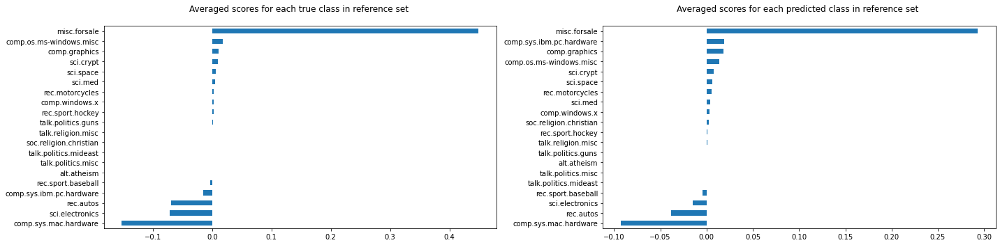
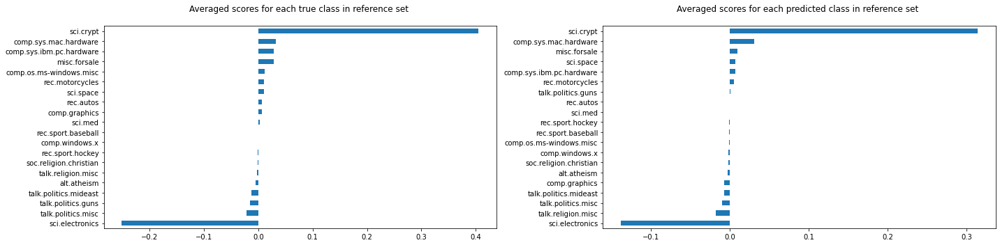
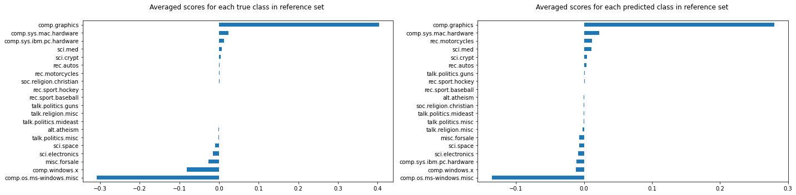

# Similarity explanations for 20 newsgroups dataset

In this notebook, we apply the similarity explanation method to a feed forward neural network (FFNN) trained on the 20 newsgroups dataset.

The 20 newsgroups dataset is a corpus of 18846 text documents (emails) divided into 20 sections. The FFNN is trained to classify each document in the correct section. The model uses pre-trained sentence embeddings as input features, which are obtained from raw text using a [pretrained transformer](https://www.sbert.net/docs/pretrained_models.html).

Given an input document of interest, the similarity explanation method used here aims to find text documents in the training set that are similar to the document of interest according to "how the model sees them", meaning that the similarity metric makes use of the gradients of the model's loss function with respect to the model's parameters.

The similarity explanation tool supports both `pytorch` and `tensorflow` backends. In this example, we will use the `pytorch` backend. Running this notebook on CPU can be very slow, so GPU is recommended.

A more detailed description of the method can be found [here](https://github.com/ramonpzg/alibi/blob/rp-alibi-newdocs-dec23/doc/source/methods/Similarity.ipynb). The implementation follows [Charpiat et al., 2019](https://papers.nips.cc/paper/2019/hash/c61f571dbd2fb949d3fe5ae1608dd48b-Abstract.html) and [Hanawa et al. 2021](https://arxiv.org/abs/2006.04528).

```python
#  Installing required sentence transformer
!pip install sentence_transformers
```

```python
import os
import torch
import string
import numpy as np
import pandas as pd
import matplotlib.pyplot as plt
import torch.nn as nn
from termcolor import colored
from torch.utils.data import DataLoader
from tqdm import tqdm
from sentence_transformers import SentenceTransformer
from sklearn.datasets import fetch_20newsgroups
from sklearn.model_selection import train_test_split
from alibi.explainers import GradientSimilarity
```

## Utils

```python
def to_categorical(y, num_classes):
    """ 1-hot encodes a tensor """
    return np.eye(num_classes, dtype='uint8')[y].astype('float32')

class TorchDataset(torch.utils.data.Dataset):
    """Utility class to create a torch dataloader from numpy arrays.
    """
    def __init__(self, *indexables):
        self.indexables = indexables

    def __getitem__(self, idx):
        output = tuple(indexable[idx] for indexable in self.indexables)
        return output if len(output) > 1 else output[0]

    def __len__(self):
        return len(self.indexables[0])
    
def append_int(num):
    """Converts an integer into an ordinal (ex. 1 -> 1st, 2 -> 2nd, etc.)
    
    Parameters
    ----------
    num
        Integer number
    
    Returns
    -------
    Ordinal suffixes
    """
    if num > 9:
        secondToLastDigit = str(num)[-2]
        if secondToLastDigit == '1':
            return 'th'
    lastDigit = num % 10
    if (lastDigit == 1):
        return 'st'
    elif (lastDigit == 2):
        return 'nd'
    elif (lastDigit == 3):
        return 'rd'
    else:
        return 'th'
    
def break_doc_in_lines(text, nb_words_per_line=18):
    """Breaks document in lines of a fixed number of words for visualization purposes.
    
    Parameters
    ----------
    text
        String to break in line
    nb_words_per_line
        number of words for each line
    
    Returns
    -------
    String with line breakers
    """
    text_l = text.split(' ')
    text_conc = []
    nb_lines = np.floor(len(text_l) / nb_words_per_line).astype(int) + 1
    for i in range(nb_lines):
        tl = text_l[i * nb_words_per_line: (i + 1) * nb_words_per_line]
        text_conc.append(' '.join(tl))
    text = '\n'.join(text_conc)
    
    return text
```

## Load data

Loading and preparing the 20 newsgroups dataset.

Warning:

```
The cell below will load the 20 news groups dataset. This might require a considerable amount of memory.
```

```python
example_idx = 4

print("Loading 20 news groups dataset")
data = fetch_20newsgroups(shuffle=True, random_state=1, subset='train',
                          remove=('headers', 'footers', 'quotes'),
                          return_X_y=False)
X, y = np.asarray(data.data), data.target
target_names = data.target_names
df = pd.DataFrame({'text': X, 'labels': y})

print("Cleaning text")
df['text_cleaned'] = df['text'].str.replace('\s+',' ')
df['text_cleaned'] = df['text_cleaned'].str.strip()
df['text_cleaned'] = df['text_cleaned'].str.slice(0,131072)
df = df.replace('', np.NaN).dropna()
df = df.drop_duplicates(subset='text_cleaned')
print('')

print(colored("Sample document before cleaning", 'red'))
print(f"{df['text'][example_idx]}")
print('')
print(colored("Sample document after cleaning", 'red'))
print(break_doc_in_lines(f"{df['text_cleaned'][example_idx]}"))
print('')

print("Splitting train - test")
df_train, df_test = train_test_split(df, test_size=0.2)
X_train, y_train = df_train['text_cleaned'].values, df_train['labels'].values
X_test, y_test = df_test['text_cleaned'].values, df_test['labels'].values
y_train, y_test = to_categorical(y_train, num_classes=20), to_categorical(y_test, num_classes=20)
print(f"X_train shape: {X_train.shape} - y_train shape: {y_train.shape}")
print(f"X_test shape: {X_test.shape} - y_test shape: {y_test.shape}")
```

```
Loading 20 news groups dataset
Cleaning text


The default value of regex will change from True to False in a future version.


Sample document before cleaning

So its an automatic? Don't know if US spec=CDN spec. for Maximas.


If it is the first set of brake pads on front, then this is fine. My car
eats a set every 15k miles or so. The fact that he is replacing the
muffler too is also ok.


The mileage is fairly low - but typical fwd stuff is CV joints. Check
the maintenance records with the manufacturers requirements for valve
adjustments, timing belt changes and so on.

The 60k mile service is often expensive, so make sure he has done everything.


Well, this is one of the commonly cited methods for identifying a
car with highway miles. 
Might check the gas pedal wear too. Ask him how many sets of tires he
has been through. A highway car might have squeezed by on 2 sets,
a hard driven car 6-10 sets.


Well, the Maxima should be pretty reliable - but if its out of warranty
you should get it checked out by someone knowledgeable first. Stuff
for Japanese cars can be expensive.


1995 model year, I believe. 

Sample document after cleaning
So its an automatic? Don't know if US spec=CDN spec. for Maximas. If it is the first set
of brake pads on front, then this is fine. My car eats a set every 15k miles or
so. The fact that he is replacing the muffler too is also ok. The mileage is fairly low
- but typical fwd stuff is CV joints. Check the maintenance records with the manufacturers requirements for valve
adjustments, timing belt changes and so on. The 60k mile service is often expensive, so make sure he
has done everything. Well, this is one of the commonly cited methods for identifying a car with highway
miles. Might check the gas pedal wear too. Ask him how many sets of tires he has been
through. A highway car might have squeezed by on 2 sets, a hard driven car 6-10 sets. Well,
the Maxima should be pretty reliable - but if its out of warranty you should get it checked
out by someone knowledgeable first. Stuff for Japanese cars can be expensive. 1995 model year, I believe.

Splitting train - test
X_train shape: (14604,) - y_train shape: (14604, 20)
X_test shape: (3652,) - y_test shape: (3652, 20)
```

## Define and train model

We define and train a `pytorch` classifier using sentence embeddings as inputs.

### Define model

```python
class EmbeddingModel:
    """Pre-trained sentence transformer wrapper.
    """
    def __init__(
        self,
        model_name: str = 'paraphrase-MiniLM-L6-v2',  # https://www.sbert.net/docs/pretrained_models.html
        max_seq_length: int = 200,
        batch_size: int = 32,
        device: torch.device = None
    ) -> None:
        if not isinstance(device, torch.device):
            device = torch.device('cuda' if torch.cuda.is_available() else 'cpu')
        self.encode_text = SentenceTransformer(model_name).to(device)
        self.encode_text.max_seq_length = max_seq_length
        self.batch_size = batch_size
    
    def __call__(self, x: np.ndarray) -> np.ndarray:
        return self.encode_text.encode(x, 
                                       convert_to_numpy=True, 
                                       batch_size=self.batch_size,
                                       show_progress_bar=False)

class Classifier(nn.Module):
    """FFNN classifier with pretrained sentence embeddings inputs.
    """
    def __init__(
        self, 
        n_classes= 20
    ) -> None:
        """ Text classification model from sentence embeddings. """
        super().__init__()
        self.head = nn.Sequential(nn.Linear(384, 256), 
                                  nn.LeakyReLU(.1), 
                                  nn.Dropout(.5), 
                                  nn.Linear(256, n_classes))
        
    def forward(self, sentence_embeddings) -> torch.Tensor:
        return self.head(sentence_embeddings)
```

```python
device = torch.device('cuda' if torch.cuda.is_available() else 'cpu') 
```

### Get sentence embeddings and define dataloaders

```python
embedding_model = EmbeddingModel(device=device)

print('Getting train embeddings')    
embeddings_train = embedding_model(X_train)
train_loader = DataLoader(TorchDataset(torch.Tensor(embeddings_train).to(device), 
                                       torch.Tensor(y_train).to(device)), 
                          batch_size=32, 
                          shuffle=True)

print('Getting test embeddings')  
embeddings_test = embedding_model(X_test)
test_loader = DataLoader(TorchDataset(torch.Tensor(embeddings_test).to(device), 
                                      torch.Tensor(y_test).to(device)), 
                         batch_size=32, 
                         shuffle=False)
```

```
Getting train embeddings
Getting test embeddings
```

### Train model

```python
epochs = 3

# initialize classifier
model = Classifier().to(device)
print('Training classifier')
loss_fn = nn.CrossEntropyLoss()
optimizer = torch.optim.Adam(model.parameters(), lr=1e-3)
for epoch in range(epochs):
    for x, y in tqdm(train_loader):
        y_hat = model(x)
        optimizer.zero_grad()
        loss = loss_fn(y_hat, y)
        loss.backward()
        optimizer.step()
```

```
Training classifier


100%|████████████████| 457/457 [00:00<00:00, 972.33it/s]
100%|███████████████| 457/457 [00:00<00:00, 1189.45it/s]
100%|███████████████| 457/457 [00:00<00:00, 1195.13it/s]
```

### Evaluate model

Evaluating the model on train and test set. Since the dataset is well balanced, we only consider accuracy as evaluation metric.

```python
def eval_model(model, loader):
    model.eval()
    logits, labels = [], []
    with torch.no_grad():
        for x, y in loader:
            y_hat = model(x)
            logits += [y_hat.cpu().numpy()]
            labels += [y.cpu().numpy()]
    logits = np.concatenate(logits, 0)
    preds = np.argmax(logits, 1)
    labels = np.concatenate(labels, 0)
    accuracy = (preds == labels.argmax(axis=1)).mean()
    print(f'Accuracy: {accuracy:.3f}')
    
print('Train set evaluation')
eval_model(model, train_loader)
print('Test set evaluation')
eval_model(model, test_loader)
```

```
Train set evaluation
Accuracy: 0.720
Test set evaluation
Accuracy: 0.664
```

## Find similar instances

Selecting a reference set of 1000 random samples from the training set. The `GradientSimilarity` explainer will find the most similar instances among those. This downsampling step is performed in order to speed up the `fit` step.

```python
idxs_ref = np.random.choice(len(X_train), 1000, replace=False)
X_ref = X_train[idxs_ref]
embeddings_ref = embeddings_train[idxs_ref]
y_ref = y_train[idxs_ref]
```

Initializing a `GradientSimilarity` explainer instance.

```python
gsm = GradientSimilarity(model, 
                         loss_fn, 
                         precompute_grads=True, 
                         sim_fn='grad_cos', 
                         backend='pytorch', 
                         device=device)
```

Fitting the explainer on the reference data.

```python
gsm.fit(embeddings_ref, y_ref)
```

```
GradientSimilarity(meta={
  'name': 'GradientSimilarity',
  'type': ['whitebox'],
  'explanations': ['local'],
  'params': {
              'sim_fn_name': 'grad_cos',
              'store_grads': True,
              'backend_name': 'pytorch',
              'task_name': 'classification'}
            ,
  'version': '0.6.6dev'}
)
```

Selecting 3 random instances from the test set. We only select documents with less than 1000 characters for visualization purposes.

```python
idxs_samples = np.where(np.array([len(x) for x in X_test]) <= 1000)[0]
idxs_samples = np.random.choice(idxs_samples, 3, replace=False)

X_sample, embeddings_sample, y_sample = X_test[idxs_samples], embeddings_test[idxs_samples], y_test[idxs_samples]
```

Getting predictions and explanations for each of the 5 test samples.

```python
preds = model(torch.Tensor(embeddings_sample).to(device)).detach().cpu().numpy().argmax(axis=1)
expls = gsm.explain(embeddings_sample, y_sample)
```

## Visualizations

Building a dictionary for each sample for visualization purposes. Each dictionary contains:

* The original text document `x` (not the embedding representation).
* The corresponding label `y`.
* The corresponding model's prediction `pred`.
* The reference instances ordered by similarity `X_sim`.
* The corresponding reference labels ordered by similarity `y_sim`.
* The corresponding model's predictions for the reference set `preds_sim`.

```python
ds = []
for j in range(len(embeddings_sample)):
    y_sim = y_ref[expls.data['ordered_indices'][j]].argmax(axis=1)
    X_sim = X_ref[expls.data['ordered_indices'][j]]
    sim_embedding = embeddings_ref[expls.data['ordered_indices'][j]]
    preds_sim = model(torch.Tensor(sim_embedding).to(device)).detach().cpu().numpy().argmax(axis=1)

    d = {'x': X_sample[j], 
         'y': y_sample[j].argmax(), 
         'pred':preds[j],
         'X_sim': X_sim,
         'y_sim': y_sim, 
         'preds_sim': preds_sim}
    ds.append(d)
```

### Most similar instances

Showing the 3 most similar instances for each of the test instances.

```python
for sample_nb in range(3):
    title = f"Sample nb {sample_nb}"
    print(colored(title, 'blue'))
    print(colored(f"{len(title) * '='}", 'blue'))
    print('')
    
    print(colored("Original instance - ", 'red'), 
          colored(f"Label: {target_names[ds[sample_nb]['y']]} - ", 'red'), 
          colored(f"Prediction: {target_names[ds[sample_nb]['pred']]}", 'red'))
    print(break_doc_in_lines(f"{ds[sample_nb]['x']}"))
    print('')
    
    for i in range(3):
        print(colored(f"{i+1}{append_int(i+1)} most similar instance - ", 'red'), 
              colored(f"Label: {target_names[ds[sample_nb]['y_sim'][i]]} - ", 'red'), 
              colored(f"Prediction: {target_names[ds[sample_nb]['preds_sim'][i]]}", 'red'))
        print(break_doc_in_lines(f"{ds[sample_nb]['X_sim'][i]}"))
        print('')
```

```
Sample nb 0
===========

Original instance -  Label: misc.forsale -  Prediction: misc.forsale
One pair of kg1's in Oak finish with black grilles. Includes original packaging. $200 + shipping Firm.

1st most similar instance -  Label: misc.forsale -  Prediction: misc.forsale
Kirsch Pull down Window Shades - White, Light Filtering - 73.25" Wide, 72" High, can be cut to
width - Brand new, unopened - "Best Quality", Vinyl Coated Cotton - Mounting Brackets included - $35 (Bought
at $60 at J.C.Penney)

2nd most similar instance -  Label: misc.forsale -  Prediction: misc.forsale
Hey, collection. I am interested in buying any in good condition. I am particularly interested in any of
the older, exotic models (eg five ] transformers into one etc... I am looking at paying around $20-$40
depending upon the model, size and original cost etc. I will also pay airmail postage and packing. I
am also happy to buy any old sci-fi related toys eg robots, rocketships, micronauts etc... There is only
one catch. I live in New Zealand so you have to be willing to post the items there.
I hop that someone can help me out. Cheers

3rd most similar instance -  Label: misc.forsale -  Prediction: misc.forsale
HP 9872B 4 pen plotter. $150 Fujistu M2451E 130 meg SCSI tape drive $150 Sony 40 meg SCSI
disk drive (sticks once in a while) $50 Dead Maxtor XT4380E 338 meg ESDI drive $100 Dead Miniscribe
20 meg SCSI drive $10 Adaptac SCSI to ST-412 interface board $20 Daughter boards from tape drives ?QIC-02
- QIC-36? $20 Twist Terms (VT100 terms that the head twists on for 80x25 or 80x72) $150 14"
Analog RGB color monitor (15.7 Khz works nice with amiga's) $100 Spool with 90+ feet of 50 conductor
ribbon cable $75 All prices are or best offer. Prices do not include UPS shipping. All items working
except those stated as Dead.

Sample nb 1
===========

Original instance -  Label: sci.crypt -  Prediction: sci.crypt
I am looking for some Public Domain (and exportable) code for encryption. Nothing elaborate, just something that will
satisfy a marketing need :-) Oh yes, UNIX platform.

1st most similar instance -  Label: sci.crypt -  Prediction: sci.crypt
Hmmmm. I think, with really large keyspaces like this, you need to alter the strategy discussed for DES.
Attempt decryption of several blocks, and check the disctribution of the contents. I don't think it's at all
feasible to keep 2**80 encryptions of a known plaintext block on *any* amount of tape or CD-ROM. And
certainly not 2**128 such encrypted blocks. (Anyone know a cheap way of converting every atom in the solar
system into a one bit storage device?) Actually, a keysearch of this kind shouldn't be much worse than
the simpler kind in terms of speed. It's just that you have to do it over for *every*
encrypted message. Dumb question: Has anyone ever done any serious research on how many legitimate ASCII-encoded 8-byte blocks
there are that could be part of an english sentence? For attacking DES in ECB mode, it seems
like a dictionary of this kind might be pretty valuable....

2nd most similar instance -  Label: sci.crypt -  Prediction: sci.crypt
As am I If "high quality secure NSA classified technology" means handing my key over to whomever, I'll
take PGP any day. Right now they are billing it as voluntary, i.e. bend over, here it comes.
As soon as enough Wiretap chip based units are out there, how much easier do you think it
will be to redefine "on your own" to mean write it yourself and don't even THINK about distributing
it...? Get honest, no one is going to buy this trash if they KNOW it's compromised already, and
less will buy it if the algorithm is not disclosed. The NSA knows that making this stuff available
to the public means handing it to whatever foreign powers are interested in the process. Since when has
export control stopped anyone (especially software wise) Ask yourself carefully if " high quality secure NSA classified technology
" is something they are going to hand out. Not unless you can drive a NSA van through
the holes. uni (Dark)

3rd most similar instance -  Label: sci.crypt -  Prediction: sci.crypt
You're reading far too much into this (aside from the obvious fact that you shouldn't hold anybody to
what they wrote in a 10 year old book in a rapidly changing field like this.) Quite simply
she says that the security should not DEPEND on the secrecy of the algorithm. A secret algorithm can
still be secure, after all, we just don't know it. Only our level of trust is affected, not
the security of the system. The algorithm *could* be RSA for all we know, which we believe to
be secure. They have a much better reason to classify the algorithm than to protect its security. They
want to protect its market share. If they publish the algorithm, then shortly manufacturers would make chips that
implement the algorithm and standard but do not use a key stored in escrow. And of course, everybody
would buy them. The whole push of this chip is that by establishing a standard that you can
only use if you follow their rules, they get us to follow their rules without enacting new laws
that we would fight tooth and nail. Quite simply, with Clipper established, it would be much harder for
another encryption maker to define a new standard, to make phones that can't talk to the leading phone
companies. The result is tappable cryptography without laws forbidding other kinds, for 99% of the populace. To get
untappable crypto, you would have to build a special phone that runs on top of this system, and
everybody you talk to would have to have an indentical one. That's the chicken and egg of crypto.
The government is using its very special ability to solve chicken and egg problems of new technologies to
control this one in a way they like. It's almost admirably clever. When the EFF started, I posed
the question here "What are the police going to do when they wake up and discover they can't
wiretap?" and nobody here had an answer (or even thought it was much of a question) Then came
the backdoor and Digital Telephony bills, which we fought. Now we have their real answer, the cleverest of
all.

Sample nb 2
===========

Original instance -  Label: comp.graphics -  Prediction: comp.graphics
Sorry if this is a FAQ but : "Where can I get a 286 (16 bit) version of
POV-Ray ? " Any help would be greatly appreciated. I need the 286 version since Turbo Pascal won't
let me run a 32 bit program from within my program. Any info on this would also be
a great help. Thanks, Byron. bkidd@esk.compserv.utas.edu.au B.Kidd@cam.compserv.utas.edu.au --

1st most similar instance -  Label: comp.graphics -  Prediction: comp.graphics
FOR IMMEDIATE RELEASE Editorial Contact: Single Source Marketing: Myra Manahan (714) 545-1338 Genoa Systems: Joseph Brunoli (408) 432-9090
Neil Roehm (408) 432-9090/Technical Genoa Presents High Performance Video Graphics Accelerator SAN JOSE, Calif USA -- Genoa Systems
Corporation announces WINDOWSVGA 24, a True Color 24-bit graphics accelerator card that delivers up to 16.8 million colors
at speeds faster than the competition. Plus it offers a full range of resolutions, high refresh rates as
well as unique proprietary performance features. The card is available in both 16-bit ISA bus and 32-bit VESA
Local bus versions (models 8500 AND 8500VL). With 1MB DRAM on board, the WINDOWSVGA 24 card offers maximum
resolution up to 1,280 x 1,024 and supports a refresh rate of 72Hz at 800 x 600 and
resolution up to 1,024 x 768 non-interlaced. Both models provide performance many times greater than standard SVGA boards,
yet conform to all current video standards. WINDOWSVGA 24 features Genoa's FlickerFree(tm) technology, which eliminates screen flash and
flicker to make viewing much more comfortable. the cards also come with Safescan(tm), a utility developed by Genoa
to eliminate the black border around the screen and thereby provide 100-percent screen use for overscanning monitors. WINDOWSVGA
model 8500VL takes full advantage of the speed offered by the new VESA Local bus technology. Most VL
bus cards will only handle data transfers up to 33MHz, but the 8500VL will transfer data at the
full speed of the CPU, up to 50MHz. Genoa is also offering this card in the "TurboBahn" combination
packaged with their TURBOEXPRESS 486VL motherboard. Built around the Cirrus Logic GD-5426 GUI accelerator, WINDOWSVGA 24 offers the
user an exceptional price/performance value. Genoa's advanced proprietary drivers act to "turbocharge" the chip, thereby providing an affordable
accelerator card with power and performance that surpass many of the more highly priced chip cards. The Genoa
user will enjoy optimal speed and reliability for such programs as Windows, AutoCAD, AutoShade, 3D Studio, OS/2, OrCAD
and more. Driver updates and product bulletins are available on Genoa's BBS at (408) 943-1231. Genoa Systems manufactures
and markets an extensive line of graphics adapters, motherboards, audio and multimedia cards for IBM-compatible personal computers. All
products come with a two year limited warranty on parts and labor. Genoa products are currently distributed worldwide
through authorized distributors, resellers, VARs and systems integrators. For more information contact Joe Brunoli, Marketing Manager, Genoa Systems
at 75 E. Trimble Road, San Jose, Calif. 95131; Tel: (408) 432-9090 or (800) 934-3662; Fax: (408) 434-0997.


2nd most similar instance -  Label: comp.graphics -  Prediction: comp.graphics
Well, the temp file thing creates an obvious problem: it is impossible to use cview for viewing CD-ROM
based picture collections. And it is the ONLY non- windows viewer that works properly with my Cirrus-based 24
bit VGA.

3rd most similar instance -  Label: comp.graphics -  Prediction: comp.graphics
If you are looking for viewer try VPIC60
```

### Most similar labels distributions

Showing the average similarity scores for each group of instances in the reference set belonging to the same true class and to the same predicted class.

```python
def plot_distributions(ds, expls, target_names, figsize=(20, 5)):

    for i in range(len(ds)):
        fig, axes = plt.subplots(1, 2, figsize=figsize, sharex=False)
        d = ds[i]

        y_sim = d['y_sim']
        preds_sim = d['preds_sim']
        y = d['y']
        pred = d['pred']
        df_ditribution = pd.DataFrame({'y_sim': y_sim, 
                                       'preds_sim': preds_sim, 
                                       'scores': expls.data['scores'][i]})
        title = f"Sample nb {i}"
        print(colored(title, 'blue'))
        print(colored(f"{len(title) * '='}", 'blue'))
        print('')

        print(colored("Original instance", 'red'))
        print(colored(f"Label: section {d['y']}, {target_names[d['y']]}", 'red')) 
        print(colored(f"Prediction: section {d['pred']}, {target_names[d['pred']]}", 'red'))
        print(break_doc_in_lines(f"{d['x']}"))
        
        df_y = df_ditribution.groupby('y_sim')['scores'].mean()
        df_y.index = target_names
        df_y.sort_values(ascending=True).plot(kind='barh', ax=axes[0])
        axes[0].set_title("Averaged scores for each true class in reference set \n")
        
        df_preds = df_ditribution.groupby('preds_sim')['scores'].mean()
        df_preds.index = target_names
        df_preds.sort_values(ascending=True).plot(kind='barh', ax=axes[1])
        axes[1].set_title("Averaged scores for each predicted class in reference set \n")
        fig.tight_layout()
        plt.show()
```

```python
plot_distributions(ds, expls, target_names)
```

```
Sample nb 0
===========

Original instance
Label: section 6, misc.forsale
Prediction: section 6, misc.forsale
One pair of kg1's in Oak finish with black grilles. Includes original packaging. $200 + shipping Firm.


```



```
Sample nb 1
===========

Original instance
Label: section 11, sci.crypt
Prediction: section 11, sci.crypt
I am looking for some Public Domain (and exportable) code for encryption. Nothing elaborate, just something that will
satisfy a marketing need :-) Oh yes, UNIX platform.


```



```
Sample nb 2
===========

Original instance
Label: section 1, comp.graphics
Prediction: section 1, comp.graphics
Sorry if this is a FAQ but : "Where can I get a 286 (16 bit) version of
POV-Ray ? " Any help would be greatly appreciated. I need the 286 version since Turbo Pascal won't
let me run a 32 bit program from within my program. Any info on this would also be
a great help. Thanks, Byron. bkidd@esk.compserv.utas.edu.au B.Kidd@cam.compserv.utas.edu.au --


```



The plots show how the instances belonging to the same class (and the instances classified by the model as belonging to the same class) of the instance of interest have on average higher similarity scores, as expected.
