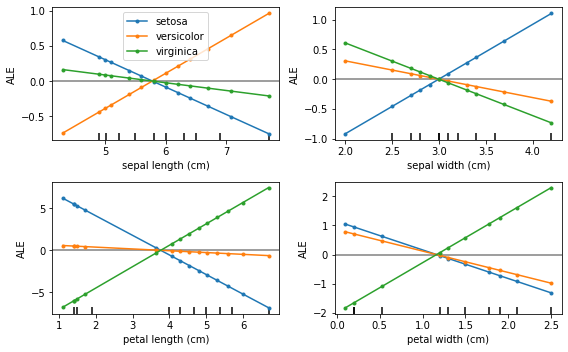
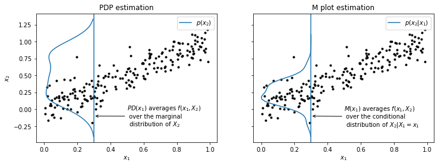
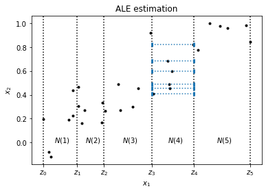
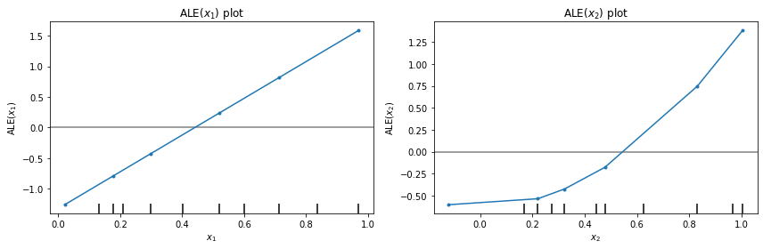

# ALE

[\[source\]](https://github.com/ramonpzg/alibi/blob/rp-alibi-newdocs-dec23/doc/source/api/alibi.explainers.html#alibi.explainers.ALE)

## Accumulated Local Effects

### Overview

Accumulated Local Effects (ALE) is a method for computing feature effects based on the paper [Visualizing the Effects of Predictor Variables in Black Box Supervised Learning Models](https://arxiv.org/abs/1612.08468) by Apley and Zhu. The algorithm provides model-agnostic (_black box_) global explanations for classification and regression models on tabular data.

ALE addresses some key shortcomings of [Partial Dependence Plots](https://christophm.github.io/interpretable-ml-book/pdp.html) (PDP), a popular method for estimating first order feature effects. We discuss these limitations and motivate ALE after presenting the method usage.

### Usage

Initialize the explainer by passing a black-box prediction function and optionally a list of feature names and target (class) names for interpretation:

```python
from alibi.explainers import ALE
ale = ALE(predict_fn, feature_names=feature_names, target_names=target_names)
```

Following the initialization, we can immediately produce an explanation given a dataset of instances $X$:

```python
exp = ale.explain(X)
```

The `explain` method has a default argument, `min_bin_points=4`, which determines the number of bins the range of each feature is subdivided into so that the ALE estimate for each bin is made with at least `min_bin_points`. Smaller values can result in less accurate local estimates while larger values can also result in less accurate estimates by averaging across large parts of the feature range.

Alternatively, we can run the explanation only on a subset of features:

```python
exp = ale.explain(X, features=[0, 1])
```

This is useful if the number of total features is large and only small number is of interest. Also, it can be particularly useful to filter out categorical variable columns as there is no consistent ALE formulation and hence any results for categorical variables would be misleading.

It is also possible to define custom grid points for each feature. The custom grid points are defined in a dictionary where the keys are the features indices and the values are numpy arrays containing the points. The sequence of points for each feature must be monotocaly increasing:

```python
grid_points = {0: np.array([0.1, 0.5, 1.0]), 
               1: np.array([0.1, 0.5, 1.0])}
exp = ale.explain(X, features=[0, 1], grid_points=grid_points)
```

The result `exp` is an `Explanation` object which contains the following data-related attributes:

* `ale_values` - a list of arrays of ALE values (one for each feature). Each array can have multiple columns (if the number of targets is >1 as in classification).
* `constant_value` - the mean prediction over $X$ (zeroth order effects).
* `ale0` - a list of arrays of “centering” values (one for each feature) used by the algorithm to center the `ale_values` around the expected effect for the feature (i.e. the sum of `ale_values` and `ale0` will be the uncentered ALE).
* `feature_values` - a list of arrays (one for each feature) of feature values at which the ALE values were computed.
* `feature_names` - an array of feature names.
* `target_names` - an array of target names.
* `feature_deciles` - a list of arrays (one for each feature) of the feature deciles.

Plotting `ale_values` against `feature_values` recovers the ALE curves. For convenience we include a plotting function `plot_ale` which automatically produces ALE plots using `matplotlib`:

```python
from alibi.explainers import plot_ale
plot_ale(exp)
```

The following is an example ALE plot of a logistic regression model on the Iris dataset (see worked [example](https://github.com/ramonpzg/alibi/blob/rp-alibi-newdocs-dec23/doc/source/examples/ale_classification.ipynb)):



### Examples

[ALE regression example (California house prices)](https://github.com/ramonpzg/alibi/blob/rp-alibi-newdocs-dec23/doc/source/examples/ale_regression_california.ipynb)

[ALE classification example (Iris dataset)](https://github.com/ramonpzg/alibi/blob/rp-alibi-newdocs-dec23/doc/source/examples/ale_classification.ipynb)

### Motivation and definition

The following exposition largely follows [Apley and Zhu (2016)](https://arxiv.org/abs/1612.08468) and [Molnar (2019)](https://christophm.github.io/interpretable-ml-book/ale.html).

Given a predictive model $f(x)$ where $x=(x\_1,\dots, x\_d)$ is a vector of $d$ features, we are interested in computing the _feature effects_ of each feature $x\_i$ on the model $f(x)$. A feature effect of feature $x\_i$ is some function $g(x\_i)$ designed to disentangle the contribution of $x\_i$ to the response $f(x)$. To simplify notation, in the following we condiser the $d=2$ case and define the feature effect functions for the first feature $x\_1$.

#### Partial Dependence

Partial Dependence Plots (PDP) is a very common method for computing feature effects. It is defined as

$$
\text{PD}(x_1) = \mathbb{E}[f(x_1, X_2)] = \int p(x_2)f(x_1, x_2)dx_2,
$$

where $p(x\_2)$ is the marginal distribution of $X\_2$. To estimate the expectation, we can take the training set $X$ and average the predictions of instances where the first feature for all instances is replaced by $x\_1$:

$$
\widehat{\text{PD}}(x_1) = \frac{1}{n}\sum_{j=1}^{n}f(x_1, x_{2, j}).
$$

The PD function attempts to calculate the effect of $x\_1$ by averaging the effects of the other feature $x\_2$ over it's marginal distribution. This is problematic because by doing so we are averaging predictions of many _out of distribution_ instances. For example, if $x\_1$ and $x\_2$ are a person's height and weight and $f$ predicts some other attribute of the person, then the PD function at a fixed height $x\_1$ would average predictions of persons with height $x\_1$ _and all possible weights_ $x\_2$ observed in the training set. Clearly, since height and weight are strongly correlated this would lead to many unrealistic data points. Since the predictor $f$ has not been trained on such impossible data points, the predictions are no longer meaningful. We can say that an implicit assumption motivating the PD approach is that the features are uncorrelated, however this is rarely the case and severely limits the usage of PDP.

An attempt to fix the issue with the PD function is to average over the conditional distribution instead of the marginal which leads to the following feature effect function:

$$
M(x_1) = \mathbb{E}[f(X_1, X_2)\vert X_1=x_1] = \int p(x_2\vert x_1)f(x_1,x_2)dx_2,
$$

where $p(x\_2\vert x\_1)$ is the conditional distribution of $X\_2$. To estimate this function from the training set $X$ we can compute

$$
\widehat{M}(x_1) = \frac{1}{n(x_1)}\sum_{j\in N(x_1)}f(x_1,x_{2,j}),
$$

where $N(x\_1)$ is a subset of indices $j$ for which $x\_{1,j}$ falls into some small neighbourhood of $x\_1$ and $n(x\_1)$ is the number of such instances.

While this refinement addresses the issue of the PD function averaging over impossible data points, the use of the $M(x\_1)$ function as feature effects remains limited when the features are correlated. To go back to the example with people's height and weight, if we fix the height to be some particular value $x\_1$ and calculate the effects according to $M(x\_1)$, because of the correlation of height and weight the function value mixes effects of _both_ features and estimates the **combined** effect. This is undesirable as we cannot attribute the value of $M(x\_1)$ purely to height. Furthermore, suppose height doesn't actually have any effect on the prediction, only weight does. Because of the correlation between height and weight, $M(x\_1)$ would still show an effect which can be highly misleading. Concretely, for a model like $f(x\_1, x\_2)=x\_2$ it is possible that $M(x\_1)\neq 0$ if $x\_1, x\_2$ are correlated.

The following plot summarizes the two approaches for estimating the effect of $x\_1$ at a particular value when $x\_2$ is strongly correlated with $x\_1$:



#### ALE

ALE solves the problem of mixing effects from different features. As with the function $M(x\_1)$, ALE uses the conditional distribution to average over other features, but instead of averaging the predictions directly, it averages _differences in predictions_ to block the effect of correlated features. The ALE function is defined as follows:

\begin{align} \text{ALE}(x\_1) &= \int\_{\min(x\_1)}^{x\_1}\mathbb{E}\left\[\frac{\partial f(X\_1,X\_2)}{\partial X\_1}\Big\vert X\_1=z\_1\right]dz\_1 - c\_1 \ &= \underbrace{\int\_{\min(x\_1)}^{x\_1}\int p(x\_2\vert z\_1)\frac{\partial f(z\_1, x\_2)}{\partial z\_1}dx\_2dz\_1}\_{\text{uncentered ALE\}} - c\_1, \end{align} where the constant $c\_1$ is chosen such that the resulting ALE values are independent of the point $\min(x\_1)$ and have zero mean over the distribution $p(x\_1)$.

The term $\dfrac{\partial f(x\_1, x\_2)}{\partial x\_1}$ is called the _local effect_ of $x\_1$ on $f$. Averaging the local effect over the conditional distribution $p(x\_2\vert x\_1)$ allows us to isolate the effect of $x\_1$ from the effects of other correlated features avoiding the issue of $M$ plots which directly average the predictor $f$. Finally, note that the local effects are integrated over the range of $x\_1$, this corresponds to the _accumulated_ in ALE. This is done as a means of visualizing the _global_ effect of the feature by "piecing together" the calculated local effects.

In practice, we calculate the local effects by finite differences so the predictor $f$ need not be differentiable. Thus, to estimate the ALE from data, we compute the following:

$$
\widehat{\text{ALE}}(x_1)=\underbrace{\sum_{k=1}^{k(x_1)}\frac{1}{n(k)}\sum_{i:x_{1}^{(i)}\in{}N(k)}\left[f(z_{k},x^{(i)}_{\setminus{}1})-f(z_{k-1},x^{(i)}_{\setminus{}1})\right]}_{\text{uncentered ALE}} - c_1.
$$

Here $z\_0,z\_1,\dots$ is a sufficiently fine grid of the feature $x\_1$ (typically quantiles so that each resulting interval contains a similar number of points), $N(k)$ denotes the interval $\[z\_{k-1}, z\_k)$, $n(k)$ denotes the number of points falling into interval $N(k)$ and $k(x\_1)$ denotes the index of the interval into which $x\_1$ falls into, i.e. $x\_1\in \[z\_{k(x\_1)-1}, z\_{k(x\_1)})$. Finally, the notation $f(z\_{k}, x^{(i)}_{\setminus{}1})$ means that for instance $i$ we replace $x\_1$ with the value of the right interval end-point $z\_k$ (likewise for the left interval end-point using $z_{k-1}$), leaving the rest of the features unchanged, and evaluate the difference of predictions at these points.

The following plot illustrates the ALE estimation process. We have subdivided the feature range of $x\_1$ into $5$ bins with roughly the same number of points indexed by $N(k)$. Focusing on bin $N(4)$, for each point falling into this bin, we replace their $x\_1$ feature value by the left and right end-points of the interval, $z\_3$ and $z\_4$. Then we evaluate the difference of the predictions of these points and calculate the average by dividing by the number of points in this interval $n(4)$. We do this for every interval and sum up (accumulate) the results. Finally, to calculate the constant $c\_1$, we subtract the expectation over $p(x\_1)$ of the calculated uncentered ALE so that the resulting ALE values have mean zero over the distribution $p(x\_1)$.



We show the results of ALE calculation for a model $f(x\_1, x\_2) = 3x\_1 + 2x\_2^2$. The resulting plots correctly recover the linear effect of $x\_1$ and the quadratic effect of $x\_2$ on $f$. Note that the ALE is estimated for each interval edge and linearly interpolated in between, for real applications it is important to have a sufficiently fine grid but also one that has enough points into each interval for accurate estimates. The x-axis also shows feature deciles of the feature to help judge in which parts of the feature space the ALE plot is interpolating more and the estimate might be less trustworthy.

The value of $\text{ALE}(x\_i)$ is the main effect of feature $x\_i$ as compared to the average effect of that feature. For example, the value of $\text{ALE}(x\_1)=0.75$ at $x\_1=0.7$, if we sample data from the joint distribution $p(x\_1, x\_2)$ (i.e. realistic data points) and $x\_1=0.7$, then we would expect the first order effect of feature $x\_1$ to be $0.75$ higher than the _average_ first order effect of this feature. Seeing that the $\text{ALE}(x\_1)$ plot crosses zero at $x\_1\approx 0.45$, realistic data points with $x\_1\approx 0.45$ will have effect on $f$ similar to the average first order effect of $x\_1$. For realistic data points with smaller $x\_1$, the effect will become negative with respect to the average effect.



Note

The interpretation of ALE plots is mainly qualitative—the focus should be on the shape of the curve at different points in the feature range. The steepness of the tangent to the curve (or the slope of the linear interpolation) determines the size of the effect of that feature locally—the steeper the tangent, the bigger the effect.

Because the model $f(x\_1, x\_2) = 3x\_1 + 2x\_2^2$ is explicit and differentiable, we can calculate the ALE functions analytically which gives us even more insight. The partial derivatives are given by $(3, 4x\_2)$. Assuming that the conditional distributions $p(x\_2\vert x\_1)$ and $p(x\_1\vert x\_2)$ are uniform, the expectations over the conditional distributions are equal to the partial derivatives. Next, we integrate over the range of the features to obtain the _uncentered_ ALE functions:

\begin{align} \text{ALE}_u(x\_1) &= \int_{\min(x\_1)}^{x\_1}3dz\_1 = 3x\_1 - 3\min(x\_1) \ \text{ALE}_u(x\_2) &= \int_{\min(x\_2)}^{x\_2}4z\_2dz\_2 = 2x\_2^2 - 2\min(x\_2)^2. \end{align}

Finally, to obtaine the ALE functions, we center by setting $c\_i = \mathbb{E}(\text{ALE}\_u(x\_i))$ where the expectation is over the marginal distribution $p(x\_i)$:

\begin{align} \text{ALE}(x\_1) &= 3x\_1 - 3\min(x\_1) - \mathbb{E}(3x\_1 - 3\min(x\_1)) = 3x\_1 - 3\mathbb{E}(x\_1) \ \text{ALE}(x\_2) &= 2x\_2^2 - 2\min(x\_2)^2 - \mathbb{E}(2x\_2^2 -2\min(x\_2)^2) = 2x\_2^2 - 2\mathbb{E}(x\_2^2). \end{align}

This calculation verifies that the ALE curves are the desired feature effects (linear for $x\_1$ and quadratic for $x\_2$) relative to the mean feature effects across the dataset. In fact if $f$ is additive in the individual features like our toy model, then the ALE main effects recover the correct additive components ([Apley and Zhu (2016)](https://arxiv.org/abs/1612.08468)). Furthermore, for additive models we have the decomposition $f(x) = \mathbb{E}(f(x)) + \sum\_{i=1}^{d}\text{ALE}(x\_i)$, here the first term which is the average prediction across the dataset $X$ can be thought of as zeroth order effects.
