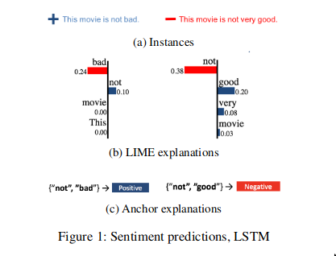
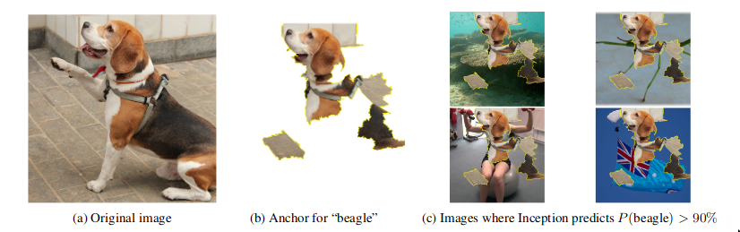
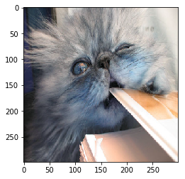
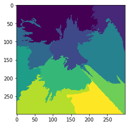
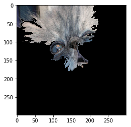

# Anchors

[\[source\]](https://github.com/ramonpzg/alibi/blob/rp-alibi-newdocs-dec23/doc/source/api/alibi.explainers.anchors.rst)

## Anchors

### Overview

The anchor algorithm is based on the [Anchors: High-Precision Model-Agnostic Explanations](https://homes.cs.washington.edu/~marcotcr/aaai18.pdf) paper by Ribeiro et al.(2018) and builds on the open source [code](https://github.com/marcotcr/anchor) from the paper's first author.

The algorithm provides model-agnostic (_black box_) and human interpretable explanations suitable for classification models applied to images, text and tabular data. The idea behind anchors is to explain the behaviour of complex models with high-precision rules called _anchors_. These anchors are locally sufficient conditions to ensure a certain prediction with a high degree of confidence.

Anchors address a key shortcoming of local explanation methods like [LIME](https://arxiv.org/abs/1602.04938) which proxy the local behaviour of the model in a linear way. It is however unclear to what extent the explanation holds up in the region around the instance to be explained, since both the model and data can exhibit non-linear behaviour in the neighborhood of the instance. This approach can easily lead to overconfidence in the explanation and misleading conclusions on unseen but similar instances. The anchor algorithm tackles this issue by incorporating coverage, the region where the explanation applies, into the optimization problem. A simple example from sentiment classification illustrates this (Figure 1). Dependent on the sentence, the occurrence of the word _not_ is interpreted as positive or negative for the sentiment by LIME. It is clear that the explanation using _not_ is very local. Anchors however aim to maximize the coverage, and require _not_ to occur together with _good_ or _bad_ to ensure respectively negative or positive sentiment.



Ribeiro et al., _Anchors: High-Precision Model-Agnostic Explanations_, 2018

As highlighted by the above example, an anchor explanation consists of _if-then rules_, called the anchors, which sufficiently guarantee the explanation locally and try to maximize the area for which the explanation holds. This means that as long as the anchor holds, the prediction should remain the same regardless of the values of the features not present in the anchor. Going back to the sentiment example: as long as _not good_ is present, the sentiment is negative, regardless of the other words in the movie review.

### Concepts and use-case insights

For a more intuitive understanding of what the method tries to achieve, we will loosely define a few concepts and explain some insights we get from an anchor explanation.

A **predicate** represents an expression involving a single feature. Some examples of predicates for a tabular dataset having features such as _Age_, _Relationship_, and _Occupation_ are:

* `28 < Age < 50`
* `Relationship = Husband`
* `Occupation = Blue-Collar`

A **rule** represents a set of predicates connected by the `AND` operator. Considering all the predicate examples above, we can construct the following rule: `28 < Age < 50 AND Relationship = Husband AND Occupation = Blue-Collar`. Note that a rule selects/refers to a particular subpopulation from the given dataset.

We can now define the notion of an **anchor**. Following the definition from [Ribeiro et al. (2018)](https://homes.cs.washington.edu/~marcotcr/aaai18.pdf), "an **anchor** explanation is a **rule** that sufficiently 'anchors' the prediction locally – such that changes to the rest of the feature values of the instance do not matter".

As previously mentioned, the power of the Anchors over other local explanations methods comes from the objective formulation which is to maximize the **coverage** under the **precision** constraints.

**Precision** represents the probability of receiving the same classification label of the explained input if we query the model on other instances that satisfy the anchor predicates. The expected precision range is the interval $\[t, 1]$, where t is the user-specified precision threshold.

**Coverage** represents the proportion of the population which satisfy the anchor predicates. It is a positive number $\le 1$, where a value of $1$ corresponds to the empty anchor.

There are some edge cases that a practitioner should be aware of:

* An anchor with many predicates and a small coverage might indicate that the explained input lies near the decision boundary. Many more predicates are needed to ensure that an instance keeps the predicted label since minor perturbations may push the prediction to another class.
* An empty anchor with a coverage of 1 indicates that there is no salient subset of features that is necessary for the prediction to hold. In other words, with high probability (as measured by the precision), the predicted class of the data point does not change regardless of the perturbations applied to it. This behaviour can be typical for very imbalanced datasets.

Check [FAQ](../overview/faq.md#anchor-explanations) for further details.

### Data modalities

#### Text

For text classification, an interpretable anchor consists of the words that need to be present to ensure a prediction, regardless of the other words in the input. The words that are not present in a candidate anchor can be sampled in 3 ways:

* Replace word token by UNK token.
* Replace word token by sampled token from a corpus with the same POS tag and probability proportional to the similarity in the embedding space. By sampling similar words, we keep more context than simply using the UNK token.
* Replace word tokens with sampled tokens according to the masked language model probability distribution. The tokens can be sampled in parallel, independent of one another, or sequentially(autoregressive), conditioned on the previously generated tokens.

#### Tabular Data

Anchors are also suitable for tabular data with both categorical and continuous features. The continuous features are discretized into quantiles (e.g. deciles), so they become more interpretable. The features in a candidate anchor are kept constant (same category or bin for discretized features) while we sample the other features from a training set. As a result, anchors for tabular data need access to training data. Let's illustrate this with an example. Say we want to predict whether a person makes less or more than £50,000 per year based on the person's characteristics including age (continuous variable) and marital status (categorical variable). The following would then be a potential anchor: Hugo makes more than £50,000 because he is married and his age is between 35 and 45 years.

#### Images

Similar to LIME, images are first segmented into superpixels, maintaining local image structure. The interpretable representation then consists of the presence or absence of each superpixel in the anchor. It is crucial to generate meaningful superpixels in order to arrive at interpretable explanations. The algorithm supports a number of standard image segmentation algorithms ([felzenszwalb, slic and quickshift](https://scikit-image.org/docs/dev/auto_examples/segmentation/plot_segmentations.html#sphx-glr-auto-examples-segmentation-plot-segmentations-py)) and allows the user to provide a custom segmentation function.

The superpixels not present in a candidate anchor can be masked in 2 ways:

* Take the average value of that superpixel.
* Use the pixel values of a superimposed picture over the masked superpixels.



Ribeiro et al., _Anchors: High-Precision Model-Agnostic Explanations_, 2018

#### Efficiently Computing Anchors

The anchor needs to return the same prediction as the original instance with a minimal confidence of e.g. 95%. If multiple candidate anchors satisfy this constraint, we go with the anchor that has the largest coverage. Because the number of potential anchors is exponential in the feature space, we need a faster approximate solution.

The anchors are constructed bottom-up in combination with [beam search](https://en.wikipedia.org/wiki/Beam_search). We start with an empty rule or anchor, and incrementally add an _if-then_ rule in each iteration until the minimal confidence constraint is satisfied. If multiple valid anchors are found, the one with the largest coverage is returned.

In order to select the best candidate anchors for the beam width efficiently during each iteration, we formulate the problem as a [pure exploration multi-armed bandit](https://www.cse.iitb.ac.in/~shivaram/papers/kk_colt_2013.pdf) problem. This limits the number of model prediction calls which can be a computational bottleneck.

For more details, we refer the reader to the original [paper](https://homes.cs.washington.edu/~marcotcr/aaai18.pdf).

### Usage

While each data type has specific requirements to initialize the explainer and return explanations, the underlying algorithm to construct the anchors is the same.

In order to efficiently generate anchors, the following hyperparameters need to be set to sensible values when calling the `explain` method:

* `threshold`: Minimum anchor precision threshold. The algorithm tries to find an anchor that maximizes the coverage under precision constraint. The precision constraint is formally defined as $P(prec(A) \ge t) \ge 1 - \delta$, where $A$ is an anchor, $t$ is the `threshold` parameter, $\delta$ is the `delta` parameter, and $prec(\cdot)$ denotes the precision of an anchor. In other words, we are seeking for an anchor having its precision greater or equal than the given `threshold` with a confidence of `(1 - delta)`. A higher value guarantees that the anchors are faithful to the model, but also leads to more computation time. Note that there are cases in which the precision constraint cannot be satisfied due to the quantile-based discretisation of the numerical features. If that is the case, the best (i.e. highest coverage) non-eligible anchor is returned. The default value is 0.95.
* `delta`: Significance threshold. `1 - delta` represents the confidence threshold for the anchor precision (see `threshold`) and the selection of the best anchor candidate in each iteration (see `tau`).
* `tau`: Multi-armed bandit parameter used to select candidate anchors in each iteration. The multi-armed bandit algorithm tries to find within a tolerance `tau` the most promising (i.e. according to the precision) `beam_size` candidate anchor(s) from a list of proposed anchors. Formally, when the `beam_size=1`, the multi-armed bandit algorithm seeks to find an anchor $A$ such that $P(prec(A) \ge prec(A^\star) - \tau) \ge 1 - \delta$, where $A^\star$ is the anchor with the highest true precision (which we don't know), $\tau$ is the `tau` parameter, $\delta$ is the `delta` parameter, and $prec(\cdot)$ denotes the precision of an anchor.In other words, in each iteration, the algorithm returns with a probability of at least `1 - delta` an anchor $A$ with a precision within an error tolerance of `tau` from the precision of the highest true precision anchor $A^\star$. A bigger value for `tau` means faster convergence but also looser anchor conditions.
* `batch_size`: Batch size used for sampling. The Anchor algorithm will query the black-box model in batches of size `batch_size`. A larger `batch_size` gives more confidence in the anchor, again at the expense of computation time since it involves more model prediction calls. The default value is 100.
* `coverage_samples`: Number of samples used to estimate coverage from during result search. By default set to 10000.
* `beam_size`: Number of candidate anchors selected by the multi-armed bandit algorithm in each iteration from a list of proposed anchors. A bigger beam width can lead to a better overall anchor (i.e. prevents the algorithm of getting stuck in a local maximum) at the expense of more computation time.

#### Text

[\[source\]](https://github.com/ramonpzg/alibi/blob/rp-alibi-newdocs-dec23/doc/source/api/alibi.explainers.html#alibi.explainers.AnchorText)

**Predictor**

Since the explainer works on black-box models, only access to a predict function is needed. The model below is a simple logistic regression trained on movie reviews with negative or positive sentiment and pre-processed with a CountVectorizer:

```python
predict_fn = lambda x: clf.predict(vectorizer.transform(x))
```

**Simple sampling strategies**

`AnchorText` provides two simple sampling strategies: `unknown` and `similarity`. Randomly chosen words, except those in queried anchor, are replaced by the `UNK` token for the `unknown` strategy, and by similar words with the same part of speech of tag for the `similarity` strategy.

To perform text tokenization, pos-tagging, compute word similarity, etc., we use spaCy. The spaCy model can be loaded as follows:

```python
import spacy
from alibi.utils import spacy_model

model = 'en_core_web_md'
spacy_model(model=model)
nlp = spacy.load(model)
```

If we choose to replace words with the `UNK` token, we define the explainer as follows:

```python
explainer = AnchorText(predictor=predict_fn, sampling_strategy='unknown', nlp=nlp)
```

Likewise, if we choose to sample similar words from a corpus, we define the explainer as follows:

```python
explainer = AnchorText(predictor=predict_fn, sampling_strategy='similarity', nlp=nlp)
```

**Language model**

`AnchorText` provides the option to define the perturbation distribution through a `language_model` sampling strategy. In this case, randomly chosen words, except those in the queried anchor, are replaced by words sampled according to the language model's predictions. We provide support for three transformer based language models: `DistilbertBaseUncased`, `BertBaseUncased`, and `RobertaBase`.

A language model can be loaded as follows:

```python
language_model = DistilbertBaseUncased()
```

Then we can initialize the explainer as follows:

```python
explainer = AnchorText(predictor=predict_fn, sampling_strategy="language_model", 
                       language_model=language_model)
```

**Sampling parameters**

Parameters specific to each sampling strategy can be passed to the constructor via `kwargs`. For example:

* If `sampling_strategy="unknown"` we can initialize the explainer as follows:

```python
explainer = AnchorText(
    predictor=predict_fn, 
    sampling_strategy='unknown',       # replace a word by UNK token
    nlp=nlp,                           # spacy object
    sample_proba=0.5,                  # probability of a word to be replaced by UNK token
)
```

* If `sampling_strategy="similarity"` we can initialize the explainer as follows:

```python
explainer = AnchorText(
    predictor=predict_fn, 
    sampling_strategy='similarity',    # replace a word by similar words
    nlp=nlp,                           # spacy object
    sample_proba=0.5,                  # probability of a word to be replaced by as similar word
    use_proba=True,                    # sample according to the similarity distribution
    top_n=20,                          # consider only top 20 most similar words
    temperature=0.2                    # higher temperature implies more randomness when sampling
)
```

* Or if `sampling_strategy="language_model"`, the explainer can be defined as:

```python
explainer = AnchorText(
    predictor=predict_fn,
    sampling_strategy="language_model",   # use language model to predict the masked words
    language_model=language_model,        # language model to be used
    filling="parallel",                   # just one pass through the transformer
    sample_proba=0.5,                     # probability of masking and replacing a word according to the LM 
    frac_mask_templates=0.1,              # fraction of masking templates 
    use_proba=True,                       # use words distribution when sampling (if false sample uniform)
    top_n=50,                             # consider the fist 50 most likely words
    temperature=0.2,                      # higher temperature implies more randomness when sampling
    stopwords=['and', 'a', 'but'],        # those words will not be masked/disturbed
    punctuation=string.punctuation,       # punctuation tokens contained here will not be masked/disturbed
    sample_punctuation=False,             # if False tokens included in `punctuation` will not be sampled 
    batch_size_lm=32                      # batch size used for the language model
)
```

Words outside of the candidate anchor can be replaced by `UNK` token, similar words, or masked out and replaced by the most likely words according to language model prediction, with a probability equal to `sample_proba`. We can sample the _top n_ most similar words or the _top n_ most likely language model predictions by setting the `top_n` parameter. We can put more weight on similar or most likely words by decreasing the `temperature` argument. It is also possible to sample words from the corpus proportional to the word similarity with the ground truth word or according to the language model's conditional probability distribution by setting `use_proba` to `True`. Furthermore, we can avoid masking specific words by including them in the `stopwords` list.

Working with transformers can be computationally and memory-wise expensive. For `sampling_strategy="language_model"` we provide two methods to predict the masked words: `filling="parallel"` and `filling="autoregressive"`.

If `filling="parallel"`, we perform a single forward pass through the transformer. After obtaining the probability distribution of the masked words, each word is sampled independently of the others.

If `filling="autoregressive"`, we perform multiple forward passes through the transformer and generate the words one at a time. Thus, the masked words will be conditioned on the previous ones. **Note that this filling method is computationally expensive**.

To further decrease the explanation runtime, for `sampling_strategy="language_model", filling="parallel"`, we provide a secondary functionality through the `frac_mask_templates`. Behind the scenes, the anchor algorithm is constantly requesting samples to query the predictor. Thus, we need to generate what we call _mask templates_, which are sentences containing words outside the candidate anchors replaced by the `<MASK>` token. The `frac_mask_templates` controls the fraction of mask templates to be generated. For example, if we need to generate 100 samples and the `frac_mask_templates=0.1`, we will generate only 10 mask templates. Those 10 templates are then passed to the language model to predict the masked words. Having the distribution of each word in each mask template, we can generate 100 samples as requested. Note that instead of passing 100 masked sentences through the language model (which is expensive), we only pass 10 sentences. Although this can increase the speed considerably, it can also decrease the diversity of the samples. The maximum batch size used in a forward pass through the language model can be specified by setting `batch_size_lm`.

When `sampling_strategy="language_model"`, we can specify the `punctuation` considered by the sampling algorithm. Any token composed only from characters in the `punctuation` string, will not be perturbed (we call those _punctuation tokens_). Furthermore, we can decide whether to sample _punctuation tokens_ by setting the `sample_punctuation` parameter. If `sample_punctuation=False`, then _punctuation tokens_ will not be sampled.

**Explanation**

Let's define the instance we want to explain and verify that the sentiment prediction on the original instance is positive:

```python
text = 'This is a good book .'
class_names = ['negative', 'positive']
pred = class_names[predict_fn([text])[0]]
```

Now we can explain the instance:

```python
explanation = explainer.explain(text, threshold=0.95)
```

The `explain` method returns an `Explanation` object with the following attributes:

* _anchor_: a list of words in the anchor.
* _precision_: the fraction of times the sampled instances where the anchor holds yields the same prediction as the original instance. The precision will always be $\geq$ `threshold` for a valid anchor.
* _coverage_: the fraction of sampled instances the anchor applies to.

The _raw_ attribute is a dictionary which also contains example instances where the anchor holds and the prediction is the same as on the original instance, as well as examples where the anchor holds but the prediction changed to give the user a sense of where the anchor fails. _raw_ also stores information on the _anchor_, _precision_ and _coverage_ of partial anchors. This allows the user to track the improvement in for instance the _precision_ as more features (words in the case of text) are added to the anchor.

#### Tabular Data

[\[source\]](https://github.com/ramonpzg/alibi/blob/rp-alibi-newdocs-dec23/doc/source/api/alibi.explainers.html#alibi.explainers.AnchorTabular)

**Initialization and fit**

To initialize the explainer, we provide a predict function, a list with the feature names to make the anchors easy to understand as well as an optional mapping from the encoded categorical features to a description of the category. An example for `categorical_names` would be

```python
category_map = {0: ["married", "divorced"], 3: ["high school diploma", "master's degree"]}
```

Each key in _category\_map_ refers to the column index in the input for the relevant categorical variable, while the values are lists with the options for each categorical variable. To make it easy, we provide a utility function `gen_category_map` to generate this map automatically from a Pandas dataframe:

```python
from alibi.utils import gen_category_map
category_map = gen_category_map(df)
```

Then initialize the explainer:

```python
predict_fn = lambda x: clf.predict(preprocessor.transform(x))
explainer = AnchorTabular(predict_fn, feature_names, categorical_names=category_map)
```

The implementation supports one-hot encoding representation of the cateforical features by setting `ohe=True`. The `feature_names` and `categorical_names(category_map)` remain unchanged. The prediction function `predict_fn` should expect as input datapoints with one-hot encoded categorical features. To initialize the explainer with the one-hot encoding support:

```python
explainer = AnchorTabular(predict_fn, feature_names, categorical_names=category_map, ohe=True)
```

Tabular data requires a fit step to map the ordinal features into quantiles and therefore needs access to a representative set of the training data. `disc_perc` is a list with percentiles used for binning:

```python
explainer.fit(X_train, disc_perc=[25, 50, 75])
```

Note that if one-hot encoding support is enabled (`ohe=True`), the `fit` calls expect the data to be one-hot encoded.

**Explanation**

Let's check the prediction of the model on the original instance and explain:

```python
class_names = ['<=50K', '>50K']
pred = class_names[explainer.predict_fn(X)[0]]
explanation = explainer.explain(X, threshold=0.95)
```

The returned `Explanation` object contains the same attributes as the text explainer, so you could explain a prediction as follows:

```
Prediction:  <=50K
Anchor: Marital Status = Never-Married AND Relationship = Own-child
Precision: 1.00
Coverage: 0.13
```

Note that if one-hot encoding support is enabled (`ohe=True`), the `explain` calls expect the data to be one-hot encode.

#### Images

[\[source\]](https://github.com/ramonpzg/alibi/blob/rp-alibi-newdocs-dec23/doc/source/api/alibi.explainers.html#alibi.explainers.AnchorImage)

**Initialization**

Besides the predict function, we also need to specify either a built in or custom superpixel segmentation function. The built in methods are [felzenszwalb](https://scikit-image.org/docs/dev/api/skimage.segmentation.html#skimage.segmentation.felzenszwalb), [slic](https://scikit-image.org/docs/dev/api/skimage.segmentation.html#skimage.segmentation.slic) and [quickshift](https://scikit-image.org/docs/dev/api/skimage.segmentation.html#skimage.segmentation.quickshift). It is important to create sensible superpixels in order to speed up convergence and generate interpretable explanations. Tuning the hyperparameters of the segmentation method is recommended.

```python
explainer = AnchorImage(predict_fn, image_shape, segmentation_fn='slic', 
                        segmentation_kwargs={'n_segments': 15, 'compactness': 20, 'sigma': .5}, 
                        images_background=None)
```

Example of superpixels generated for the Persian cat picture using the _slic_ method:

 

The following function would be an example of a custom segmentation function dividing the image into rectangles.

```python
def superpixel(image, size=(4, 7)):
    segments = np.zeros([image.shape[0], image.shape[1]])
    row_idx, col_idx = np.where(segments == 0)
    for i, j in zip(row_idx, col_idx):
        segments[i, j] = int((image.shape[1]/size[1]) * (i//size[0]) + j//size[1])
    return segments
```

The `images_background` parameter allows the user to provide images used to superimpose on the masked superpixels, not present in the candidate anchor, instead of taking the average value of the masked superpixel. The superimposed images need to have the same shape as the explained instance.

**Explanation**

We can then explain the instance in the usual way:

```python
explanation = explainer.explain(image, p_sample=.5)
```

`p_sample` determines the fraction of superpixels that are either changed to the average superpixel value or that are superimposed.

The `Explanation` object again contains information about the anchor's _precision_, _coverage_ and examples where the anchor does or does not hold. On top of that, it also contains a masked image with only the anchor superpixels visible under the _anchor_ attribute (see image below) as well as the image's superpixels under _segments_.



### Examples

#### Image

[Anchor explanations for ImageNet](https://github.com/ramonpzg/alibi/blob/rp-alibi-newdocs-dec23/doc/source/examples/anchor_image_imagenet.ipynb)

[Anchor explanations for fashion MNIST](https://github.com/ramonpzg/alibi/blob/rp-alibi-newdocs-dec23/doc/source/examples/anchor_image_fashion_mnist.ipynb)

#### Tabular Data

[Anchor explanations on the Iris dataset](https://github.com/ramonpzg/alibi/blob/rp-alibi-newdocs-dec23/doc/source/examples/anchor_tabular_iris.ipynb)

[Anchor explanations for income prediction](https://github.com/ramonpzg/alibi/blob/rp-alibi-newdocs-dec23/doc/source/examples/anchor_tabular_adult.ipynb)

#### Text

[Anchor explanations for movie sentiment](https://github.com/ramonpzg/alibi/blob/rp-alibi-newdocs-dec23/doc/source/examples/anchor_text_movie.ipynb)
