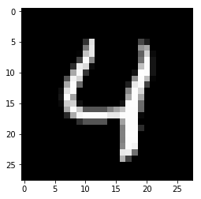
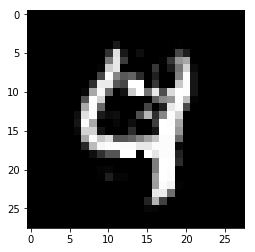
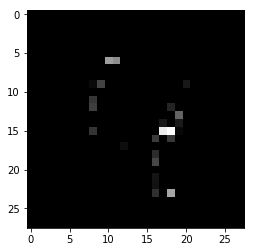

# CEM

[\[source\]](https://github.com/ramonpzg/alibi/blob/rp-alibi-newdocs-dec23/doc/source/api/alibi.explainers.html#alibi.explainers.CEM)

## Contrastive Explanation Method

Note

To enable support for CEM, you may need to run

```bash
pip install alibi[tensorflow]
```

### Overview

The _Contrastive Explanation Method_ (CEM) is based on the paper [Explanations based on the Missing: Towards Constrastive Explanations with Pertinent Negatives](https://arxiv.org/abs/1802.07623) and extends the [code](https://github.com/IBM/Contrastive-Explanation-Method) open sourced by the authors. CEM generates instance based local black box explanations for classification models in terms of Pertinent Positives (PP) and Pertinent Negatives (PN). For a PP, the method finds the features that should be minimally and sufficiently present (e.g. important pixels in an image) to predict the same class as on the original instance. PN's on the other hand identify what features should be minimally and necessarily absent from the instance to be explained in order to maintain the original prediction class. The aim of PN's is not to provide a full set of characteristics that should be absent in the explained instance, but to provide a minimal set that differentiates it from the closest different class. Intuitively, the Pertinent Positives could be compared to Anchors while Pertinent Negatives are similar to Counterfactuals. As the authors of the paper state, CEM can generate clear explanations of the form: "An input x is classified in class y because features $f\_{i}$, ..., $f\_{k}$ are present and because features $f\_{m}$, ..., $f\_{p}$ are absent." The current implementation is most suitable for images and tabular data without categorical features.

In order to create interpretable PP's and PN's, feature-wise perturbation needs to be done in a meaningful way. To keep the perturbations sparse and close to the original instance, the objective function contains an elastic net ($\beta\$$L\_{1}$ + $L\_{2}$) regularizer. Optionally, an auto-encoder can be trained to reconstruct instances of the training set. We can then introduce the $L\_{2}$ reconstruction error of the perturbed instance as an additional loss term in our objective function. As a result, the perturbed instance lies close to the training data manifold.

The ability to add or remove features to arrive at respectively PN's or PP's implies that there are feature values that contain no information with regards to the model's predictions. Consider for instance the MNIST image below where the pixels are scaled between 0 and 1. The pixels with values close to 1 define the number in the image while the background pixels have value 0. We assume that perturbations towards the background value 0 are equivalent to removing features, while perturbations towards 1 imply adding features.



It is intuitive to understand that adding features to get a PN means changing 0's into 1's until a different number is formed, in this case changing a 4 into a 9.



To find the PP, we do the opposite and change 1's from the original instance into 0's, the background value, and only keep a vague outline of the original 4.



It is however often not trivial to find these non-informative feature values and domain knowledge becomes very important.

For more details, we refer the reader to the original [paper](https://arxiv.org/abs/1802.07623).

### Usage

#### Initialization

The optimizer is defined in TensorFlow (TF) internally. We first load our MNIST classifier and the (optional) auto-encoder. The example below uses Keras or TF models. This allows optimization of the objective function to run entirely with automatic differentiation because the TF graph has access to the underlying model architecture. For models built in different frameworks (e.g. scikit-learn), the gradients of part of the loss function with respect to the input features need to be evaluated numerically. We'll handle this case later.

```python
# define models
cnn = load_model('mnist_cnn.h5')
ae = load_model('mnist_ae.h5')
```

We can now initialize the CEM explainer:

```python
# initialize CEM explainer
shape = (1,) + x_train.shape[1:]
mode = 'PN'
cem = CEM(cnn, mode, shape, kappa=0., beta=.1, 
          feature_range=(x_train.min(), x_train.max()), 
          gamma=100, ae_model=ae, max_iterations=1000, 
          c_init=1., c_steps=10, learning_rate_init=1e-2, 
          clip=(-1000.,1000.), no_info_val=-1.)
```

Besides passing the the predictive and auto-encoder models, we set a number of **hyperparameters** ...

... **general**:

* `mode`: 'PN' or 'PP'.
* `shape`: shape of the instance to be explained, starting with batch dimension. Currently only single explanations are supported, so the batch dimension should be equal to 1.
* `feature_range`: global or feature-wise min and max values for the perturbed instance.

... related to the **optimizer**:

* `max_iterations`: number of loss optimization steps for each value of _c_; the multiplier of the first loss term.
* `learning_rate_init`: initial learning rate, follows polynomial decay.
* `clip`: min and max gradient values.

... related to the **non-informative value**:

* `no_info_val`: as explained in the previous section, it is important to define which feature values are considered background and not crucial for the class predictions. For MNIST images scaled between 0 and 1 or -0.5 and 0.5 as in the notebooks, pixel perturbations in the direction of the (low) background pixel value can be seen as removing features, moving towards the non-informative value. As a result, the `no_info_val` parameter is set at a low value like -1. `no_info_val` can be defined globally or feature-wise. For most applications, domain knowledge becomes very important here. If a representative sample of the training set is available, we can always (naively) infer a `no_info_val` by taking the feature-wise median or mean:

```python
cem.fit(x_train, no_info_type='median')
```

... related to the **objective function**:

* `c_init` and `c_steps`: the multiplier $c$ of the first loss term is updated for `c_steps` iterations, starting at `c_init`. The first loss term encourages the perturbed instance to be predicted as a different class for a PN and the same class for a PP. If we find a candidate PN or PP for the current value of $c$, we reduce the value of $c$ for the next optimization cycle to put more emphasis on the regularization terms and improve the solution. If we cannot find a solution, $c$ is increased to put more weight on the prediction class restrictions of the PN and PP before focusing on the regularization.
* `kappa`: the first term in the loss function is defined by a difference between the predicted probabilities for the perturbed instance of the original class and the max of the other classes. $\kappa \geq 0$ defines a cap for this difference, limiting its impact on the overall loss to be optimized. Similar to the original paper, we set $\kappa$ to 0. in the examples.
* `beta`: $\beta$ is the $L\_{1}$ loss term multiplier. A higher value for $\beta$ means more weight on the sparsity restrictions of the perturbations. Similar to the paper, we set $\beta$ to 0.1 for the MNIST and Iris datasets.
* `gamma`: multiplier for the optional $L\_{2}$ reconstruction error. A higher value for $\gamma$ means more emphasis on the reconstruction error penalty defined by the auto-encoder. Similar to the paper, we set $\gamma$ to 100 when we have an auto-encoder available.

While the paper's default values for the loss term coefficients worked well for the simple examples provided in the notebooks, it is recommended to test their robustness for your own applications.

Warning

Once a `CEM` instance is initialized, the parameters of it are frozen even if creating a new instance. This is due to TensorFlow behaviour which holds on to some global state. In order to change parameters of the explainer in the same session (e.g. for explaining different models), you will need to reset the TensorFlow graph manually:

```python
import tensorflow as tf
tf.keras.backend.clear_session()
```

You may need to reload your model after this. Then you can create a new `CEM` instance with new parameters.

#### Explanation

We can finally explain the instance:

```python
explanation = cem.explain(X)
```

The `explain` method returns an `Explanation` object with the following attributes:

* _X_: original instance
* _X\_pred_: predicted class of original instance
* _PN_ or _PP_: Pertinent Negative or Pertinant Positive
* _PN\_pred_ or _PP\_pred_: predicted class of PN or PP
* _grads\_graph_: gradient values computed from the TF graph with respect to the input features at the PN or PP
* _grads\_num_: numerical gradient values with respect to the input features at the PN or PP

#### Numerical Gradients

So far, the whole optimization problem could be defined within the internal TF graph, making autodiff possible. It is however possible that we do not have access to the model architecture and weights, and are only provided with a `predict` function returning probabilities for each class. We initialize the CEM in the same way as before:

```python
# define model
lr = load_model('iris_lr.h5')
predict_fn = lambda x: lr.predict(x)
    
# initialize CEM explainer
shape = (1,) + x_train.shape[1:]
mode = 'PP'
cem = CEM(predict_fn, mode, shape, kappa=0., beta=.1, 
          feature_range=(x_train.min(), x_train.max()), 
          eps=(1e-2, 1e-2), update_num_grad=100)
```

In this case, we need to evaluate the gradients of the loss function with respect to the input features numerically:

$$
\frac{\partial L}{\partial x} = \frac{\partial L}{\partial p} \frac{\partial p}{\partial x}
$$

where $L$ is the loss function, $p$ the predict function and $x$ the input features to optimize. There are now 2 additional hyperparameters to consider:

* `eps`: a tuple to define the perturbation size used to compute the numerical gradients. `eps[0]` and `eps[1]` are used respectively for $^{\delta L}/_{\delta p}$ and $^{\delta p}/_{\delta x}$. `eps[0]` and `eps[1]` can be a combination of float values or numpy arrays. For `eps[0]`, the array dimension should be _(1 x nb of prediction categories)_ and for `eps[1]` it should be _(1 x nb of features)_. For the Iris dataset, `eps` could look as follows:

```python
eps0 = np.array([[1e-2, 1e-2, 1e-2]])  # 3 prediction categories, equivalent to 1e-2
eps1 = np.array([[1e-2, 1e-2, 1e-2, 1e-2]])  # 4 features, also equivalent to 1e-2
eps = (eps0, eps1)
```

* `update_num_grad`: for complex models with a high number of parameters and a high dimensional feature space (e.g. Inception on ImageNet), evaluating numerical gradients can be expensive as they involve prediction calls for each perturbed instance. The `update_num_grad` parameter allows you to set a batch size on which to evaluate the numerical gradients, reducing the number of prediction calls required.

### Examples

[Contrastive Explanations Method (CEM) applied to MNIST](https://github.com/ramonpzg/alibi/blob/rp-alibi-newdocs-dec23/doc/source/examples/cem_mnist.ipynb)

[Contrastive Explanations Method (CEM) applied to Iris dataset](https://github.com/ramonpzg/alibi/blob/rp-alibi-newdocs-dec23/doc/source/examples/cem_iris.ipynb)
