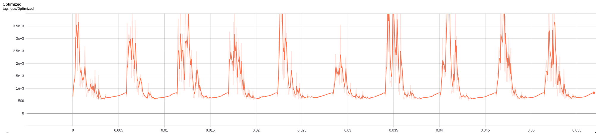

# CFProto

[\[source\]](https://github.com/ramonpzg/alibi/blob/rp-alibi-newdocs-dec23/doc/source/api/alibi.explainers.html#alibi.explainers.CounterfactualProto)

## Counterfactuals Guided by Prototypes

Note

To enable support for Counterfactuals guided by Prototypes, you may need to run

```bash
pip install alibi[tensorflow]
```

### Overview

This method is based on the [Interpretable Counterfactual Explanations Guided by Prototypes](https://arxiv.org/abs/1907.02584) paper which proposes a fast, model agnostic method to find interpretable counterfactual explanations for classifier predictions by using class prototypes.

Humans often think about how they can alter the outcome of a situation. _What do I need to change for the bank to approve my loan?_ is a common example. This form of counterfactual reasoning comes natural to us and explains how to arrive at a desired outcome in an interpretable manner. Moreover, examples of counterfactual instances resulting in a different outcome can give powerful insights of what is important to the the underlying decision process. This makes it a compelling method to explain predictions of machine learning models. In the context of predictive models, a counterfactual instance describes the necessary change in input features of a test instance that alter the prediction to a predefined output (e.g. a prediction class). The counterfactual is found by iteratively perturbing the input features of the test instance during an optimization process until the desired output is achieved.

A high quality counterfactual instance $x\_{cf}$ should have the following desirable properties:

* The model prediction on $x\_{cf}$ needs to be close to the predefined output.
* The perturbation $\delta$ changing the original instance $x\_{0}$ into $x\_{cf} = x\_{0} + \delta$ should be sparse.
* The counterfactual $x\_{cf}$ should be interpretable. This implies that $x\_{cf}$ needs to lie close to both the overall and counterfactual class specific data distribution.
* The counterfactual $x\_{cf}$ needs to be found fast enough so it can be used in a real life setting.

We can obtain those properties by incorporating additional loss terms in the objective function that is optimized using gradient descent. A basic loss function for a counterfactual can look like this:

$$
Loss = cL_{pred} + \beta L_{1} + L_{2}
$$

The first loss term, $cL\_{pred}$, encourages the perturbed instance to predict another class than the original instance. The $\beta\$$L\_{1}$ + $L\_{2}$ terms act as an elastic net regularizer and introduce sparsity by penalizing the size of the difference between the counterfactual and the perturbed instance. While we can obtain sparse counterfactuals using this objective function, these are often not very interpretable because the training data distribution is not taken into account, and the perturbations are not necessarily meaningful.

The [Contrastive Explanation Method (CEM)](https://github.com/ramonpzg/alibi/blob/rp-alibi-newdocs-dec23/doc/source/methods/CEM.ipynb) uses an [autoencoder](https://en.wikipedia.org/wiki/Autoencoder) which is trained to reconstruct instances of the training set. We can then add the $L\_{2}$ reconstruction error of the perturbed instance as a loss term to keep the counterfactual close to the training data distribution. The loss function becomes:

$$
Loss = cL_{pred} + \beta L_{1} + L_{2} + L_{AE}
$$

The $L\_{AE}$ does however not necessarily lead to interpretable solutions or speed up the counterfactual search. The lack of interpretability occurs because the overall data distribution is followed, but not the class specific one. That's where the prototype loss term $L\_{proto}$ comes in. To define the prototype for each prediction class, we can use the encoder part of the previously mentioned autoencoder. We also need the training data or at least a representative sample. We use the model to make predictions on this data set. For each predicted class, we encode the instances belonging to that class. The class prototype is simply the average of the k closest encodings in that class to the encoding of the instance that we want to explain. When we want to generate a counterfactual, we first find the nearest prototype other than the one for the predicted class on the original instance. The $L\_{proto}$ loss term tries to minimize the $L\_{2}$ distance between the counterfactual and the nearest prototype. As a result, the perturbations are guided to the closest prototype, speeding up the counterfactual search and making the perturbations more meaningful as they move towards a typical in-distribution instance. If we do not have a trained encoder available, we can build class representations using [k-d trees](https://en.wikipedia.org/wiki/K-d_tree) for each class. The prototype is then the _k_ nearest instance from a k-d tree other than the tree which represents the predicted class on the original instance. The loss function now looks as follows:

$$
Loss = cL_{pred} + \beta L_{1} + L_{2} + L_{AE} + L_{proto}
$$

The method allows us to select specific prototype classes to guide the counterfactual to. For example, in MNIST the closest prototype to a 9 could be a 4. However, we can specify that we want to move towards the 7 prototype and avoid 4.

In order to help interpretability, we can also add a trust score constraint on the proposed counterfactual. The trust score is defined as the ratio of the distance between the encoded counterfactual and the prototype of the class predicted on the original instance, and the distance between the encoded counterfactual and the prototype of the class predicted for the counterfactual instance. Intuitively, a high trust score implies that the counterfactual is far from the originally predicted class compared to the counterfactual class. For more info on trust scores, please check out the [documentation](https://github.com/ramonpzg/alibi/blob/rp-alibi-newdocs-dec23/doc/source/methods/TrustScores.ipynb).

Because of the $L\_{proto}$ term, we can actually remove the prediction loss term and still obtain an interpretable counterfactual. This is especially relevant for fully black box models. When we provide the counterfactual search method with a Keras or TensorFlow model, it is incorporated in the TensorFlow graph and evaluated using automatic differentiation. However, if we only have access to the model's prediction function, the gradient updates are numerical and typically require a large number of prediction calls because of $L\_{pred}$. These prediction calls can slow the search down significantly and become a bottleneck. We can represent the gradient of the loss term as follows:

$$
\frac{\partial L_{pred}}{\partial x} = \frac{\partial L_{pred}}{\partial p} \frac{\partial p}{\partial x}
$$

where $p$ is the prediction function and $x$ the input features to optimize. For a 28 by 28 MNIST image, the $^{\delta p}/\_{\delta x}$ term alone would require a prediction call with batch size 28x28x2 = 1568. By using the prototypes to guide the search however, we can remove the prediction loss term and only make a single prediction at the end of each gradient update to check whether the predicted class on the proposed counterfactual is different from the original class.

### Categorical Variables

It is crucial for many machine learning applications to deal with both continuous numerical and categorical data. Explanation methods which rely on perturbations or sampling of the input features need to make sure those perturbations are meaningful and capture the underlying structure of the data. If not done properly, the perturbed or sampled instances are possibly out of distribution compared to the training data and result in misleading explanations. The perturbation or sampling process becomes tricky for categorical features. For instance random perturbations across possible categories or enforcing a ranking between categories based on frequency of occurrence in the training data do not capture this structure.

Our method first computes the pairwise distances between categories of a categorical variable based on either the model predictions (MVDM) or the context provided by the other variables in the dataset (ABDM). For MVDM, we use the difference between the conditional model prediction probabilities of each category. This method is based on the _Modified Value Difference Metric_ (MVDM) by [Cost et al (1993)](https://link.springer.com/article/10.1023/A:1022664626993). ABDM stands for _Association-Based Distance Metric_, a categorical distance measure introduced by [Le et al (2005)](https://www.sciencedirect.com/science/article/abs/pii/S0167865505001686). ABDM infers context from the presence of other variables in the data and computes a dissimilarity measure based on the Kullback-Leibler divergence. Both methods can also be combined as _ABDM-MVDM_. We can then apply multidimensional scaling to project the pairwise distances into Euclidean space. More details will be provided in a forthcoming paper.

The different use cases are highlighted in the example notebooks linked at the bottom of the page.

### Usage

#### Initialization

The counterfactuals guided by prototypes method works on fully black-box models. This means that they can work with arbitrary functions that take arrays and return arrays. However, if the user has access to a full TensorFlow (TF) or Keras model, this can be passed in as well to take advantage of the automatic differentiation in TF to speed up the search. This section describes the initialization for a TF/Keras model. Please see the [numerical gradients](cfproto.md#Numerical-Gradients) section for black box models.

We first load our MNIST classifier and the (optional) autoencoder and encoder:

```python
cnn = load_model('mnist_cnn.h5')
ae = load_model('mnist_ae.h5')
enc = load_model('mnist_enc.h5')
```

We can now initialize the counterfactual:

```python
shape = (1,) + x_train.shape[1:]
cf = CounterfactualProto(cnn, shape, kappa=0., beta=.1, gamma=100., theta=100.,
                         ae_model=ae, enc_model=enc, max_iterations=500,
                         feature_range=(-.5, .5), c_init=1., c_steps=5,
                         learning_rate_init=1e-2, clip=(-1000., 1000.), write_dir='./cf')
```

Besides passing the predictive, and (optional) autoencoder and models, we set a number of **hyperparameters** …

... **general**:

* `shape`: shape of the instance to be explained, starting with batch dimension. Currently only single explanations are supported, so the batch dimension should be equal to 1.
* `feature_range`: global or feature-wise min and max values for the perturbed instance.
* `write_dir`: write directory for Tensorboard logging of the loss terms. It can be helpful when tuning the hyperparameters for your use case. It makes it easy to verify that e.g. not 1 loss term dominates the optimization, that the number of iterations is OK etc. You can access Tensorboard by running `tensorboard --logdir {write_dir}` in the terminal. The figure below for example shows the loss to be optimized over different $c$ iterations. It is clear that within each iteration, the number of `max_iterations` steps is too high and we can speed up the search.



... related to the **optimizer**:

* `max_iterations`: number of loss optimization steps for each value of _c_; the multiplier of the first loss term.
* `learning_rate_init`: initial learning rate, follows polynomial decay.
* `clip`: min and max gradient values.

... related to the **objective function**:

* `c_init` and `c_steps`: the multiplier $c$ of the first loss term is updated for `c_steps` iterations, starting at `c_init`. The first loss term encourages the perturbed instance to be predicted as a different class than the original instance. If we find a candidate counterfactual for the current value of $c$, we reduce the value of $c$ for the next optimization cycle to put more emphasis on the other loss terms and improve the solution. If we cannot find a solution, $c$ is increased to put more weight on the prediction class restrictions of the counterfactual.
* `kappa`: the first term in the loss function is defined by a difference between the predicted probabilities for the perturbed instance of the original class and the max of the other classes. $\kappa \geq 0$ defines a cap for this difference, limiting its impact on the overall loss to be optimized. Similar to CEM, we set $\kappa$ to 0 in the examples.
* `beta`: $\beta$ is the $L\_{1}$ loss term multiplier. A higher value for $\beta$ means more weight on the sparsity restrictions of the perturbations. $\beta$ equal to 0.1 works well for the example datasets.
* `gamma`: multiplier for the optional $L\_{2}$ reconstruction error. A higher value for $\gamma$ means more emphasis on the reconstruction error penalty defined by the autoencoder. A value of 100 is reasonable for the examples.
* `theta`: multiplier for the $L\_{proto}$ loss term. A higher $\theta$ means more emphasis on the gradients guiding the counterfactual towards the nearest class prototype. A value of 100 worked well for the examples.

When the dataset contains categorical variables, we need to additionally pass the following arguments:

* `cat_vars`: if the categorical variables have ordinal encodings, this is a dictionary with as keys the categorical columns and values the number of categories for the categorical variable in the dataset. If one-hot encoding is applied to the data, then the keys of the `cat_vars` dictionary represent the column where each categorical variable starts while the values still return the number of categories.
* `ohe`: a flag (True or False) whether the categories are one-hot encoded.

It is also important to remember that the perturbations are applied in the numerical feature space, after the categorical variables have been transformed into numerical features. This has to be reflected by the dimension and values of `feature_range`. Imagine for example that we have a dataset with 10 columns. Two of the features are categorical and one-hot encoded. They can both take 3 values each. As a result, the number of columns in the dataset is reduced to 6 when we transform those categorical features to numerical features. As a result, the `feature_range` needs to contain the upper and lower ranges for 6 features.

While the default values for the loss term coefficients worked well for the simple examples provided in the notebooks, it is recommended to test their robustness for your own applications.

Warning

Once a `CounterfactualProto` instance is initialized, the parameters of it are frozen even if creating a new instance. This is due to TensorFlow behaviour which holds on to some global state. In order to change parameters of the explainer in the same session (e.g. for explaining different models), you will need to reset the TensorFlow graph manually:

```python
import tensorflow as tf
tf.keras.backend.clear_session()
```

You may need to reload your model after this. Then you can create a new `CounterfactualProto` instance with new parameters.

#### Fit

If we use an encoder to find the class prototypes, we need an additional `fit` step on the training data:

```python
cf.fit(x_train)
```

We also need the `fit` step if the data contains categorical features so we can compute the numerical transformations. In practice, most of these optional arguments do not need to be changed.

```python
cf.fit(x_train, d_type='abdm', w=None, disc_perc=[25, 50, 75], standardize_cat_vars=False,
       smooth=1., center=True, update_feature_range=True)
```

* `d_type`: the distance metric used to compute the pairwise distances between the categories of each categorical variable. As discussed in the introduction, the options are `"abdm"`, `"mvdm"` or `"abdm-mvdm"`.
* `w`: if the combined metric `"abdm-mvdm"` is used, `w` is the weight (between 0 and 1) given to `abdm`.
* `disc_perc`: for `abdm`, we infer context from the other features. If there are continuous numerical features present, these are binned according to the quartiles in `disc_perc` before computing the similarity metric.
* `standardize_car_vars`: whether to return the standardized values for the numerical distances of each categorical feature.
* `smooth`: if the difference in the distances between the categorical variables is too large, then a lower value of the `smooth` argument (0, 1) can smoothen out this difference. This would only be relevant if one categorical variable has significantly larger differences between its categories than others. As a result, the counterfactual search process will likely leave that categorical variable unchanged.
* `center`: whether to center the numerical distances of the categorical variables between the min and max feature ranges.
* `update_feature_range`: whether to update the `feature_range` parameter for the categorical variables based on the min and max values it computed in the `fit` step.

#### Explanation

We can now explain the instance:

```python
explanation = cf.explain(X, Y=None, target_class=None, k=20, k_type='mean',
                         threshold=0., verbose=True, print_every=100, log_every=100)
```

* `X`: original instance
* `Y`: one-hot-encoding of class label for `X`, inferred from the prediction on `X` if _None_.
* `target_class`: classes considered for the nearest class prototype. Either a list with class indices or _None_.
* `k`: number of nearest instances used to define the prototype for a class. Defaults to using all instances belonging to the class.
* `k_type`: use either the average encoding of the `k` nearest instances in a class as the class prototype (`k_type`='mean') or the k-nearest encoding in the class (`k_type`='point'). This parameter is only relevant if an encoder is used to define the prototypes.
* `threshold`: threshold level for the ratio between the distance of the counterfactual to the prototype of the predicted class for the original instance over the distance to the prototype of the predicted class for the counterfactual. If the trust score is below the threshold, the proposed counterfactual does not meet the requirements and is rejected.
* `verbose`: if _True_, print progress of counterfactual search every `print_every` steps.
* `log_every`: if `write_dir` for Tensorboard is specified, then log losses every `log_every` steps.

The `explain` method returns an `Explanation` object with the following attributes:

* _cf_: a dictionary with the overall best counterfactual found. _explanation\['cf']_ has the following _key: value_ pairs:
  * _X_: the counterfactual instance
  * _class_: predicted class for the counterfactual
  * _proba_: predicted class probabilities for the counterfactual
  * _grads\_graph_: gradient values computed from the TF graph with respect to the input features at the counterfactual
  * _grads\_num_: numerical gradient values with respect to the input features at the counterfactual
* _orig\_class_: predicted class for original instance
* _orig\_proba_: predicted class probabilities for original instance
* _all_: a dictionary with the iterations as keys and for each iteration a list with counterfactuals found in that iteration as values. So for instance, during the first iteration, _explanation\['all']\[0]_, initially we typically find fairly noisy counterfactuals that improve over the course of the iteration. The counterfactuals for the subsequent iterations then need to be _better_ (sparser) than the previous best counterfactual. So over the next few iterations, we probably find less but _better_ solutions.

#### Numerical Gradients

So far, the whole optimization problem could be defined within the TF graph, making automatic differentiation possible. It is however possible that we do not have access to the model architecture and weights, and are only provided with a `predict` function returning probabilities for each class. The counterfactual can then be initialized in the same way:

```python
# define model
cnn = load_model('mnist_cnn.h5')
predict_fn = lambda x: cnn.predict(x)
ae = load_model('mnist_ae.h5')
enc = load_model('mnist_enc.h5')
    
# initialize explainer
shape = (1,) + x_train.shape[1:]
cf = CounterfactualProto(predict_fn, shape, gamma=100., theta=100.,
                         ae_model=ae, enc_model=enc, max_iterations=500,
                         feature_range=(-.5, .5), c_init=1., c_steps=4,
                         eps=(1e-2, 1e-2), update_num_grad=100)
```

In this case, we need to evaluate the gradients of the loss function with respect to the input features numerically:

$$
\frac{\partial L_{pred}}{\partial x} = \frac{\partial L_{pred}}{\partial p} \frac{\partial p}{\partial x}
$$

where $L\_{pred}$ is the loss term related to the prediction function, $p$ is the prediction function and $x$ are the input features to optimize. There are now 2 additional hyperparameters to consider:

* `eps`: a tuple to define the perturbation size used to compute the numerical gradients. `eps[0]` and `eps[1]` are used respectively for $^{\delta L\_{pred\}}/_{\delta p}$ and $^{\delta p}/_{\delta x}$. `eps[0]` and `eps[1]` can be a combination of float values or numpy arrays. For `eps[0]`, the array dimension should be _(1 x nb of prediction categories)_ and for `eps[1]` it should be _(1 x nb of features)_. For the Iris dataset, `eps` could look as follows:

```python
eps0 = np.array([[1e-2, 1e-2, 1e-2]])  # 3 prediction categories, equivalent to 1e-2
eps1 = np.array([[1e-2, 1e-2, 1e-2, 1e-2]])  # 4 features, also equivalent to 1e-2
eps = (eps0, eps1)
```

* `update_num_grad`: for complex models with a high number of parameters and a high dimensional feature space (e.g. Inception on ImageNet), evaluating numerical gradients can be expensive as they involve prediction calls for each perturbed instance. The `update_num_grad` parameter allows you to set a batch size on which to evaluate the numerical gradients, reducing the number of prediction calls required.

We can also remove the prediction loss term by setting `c_init` to 0 and only run 1 `c_steps`, and still obtain an interpretable counterfactual. This dramatically speeds up the counterfactual search (e.g. by 100x in the MNIST example notebook):

```python
cf = CounterfactualProto(predict_fn, shape, gamma=100., theta=100.,
                         ae_model=ae, enc_model=enc, max_iterations=500,
                         feature_range=(-.5, .5), c_init=0., c_steps=1)
```

#### k-d trees

So far, we assumed that we have a trained encoder available to find the nearest class prototype. This is however not a hard requirement. As mentioned in the _Overview_ section, we can use k-d trees to build class representations, find prototypes by querying the trees for each class and return the k nearest class instance as the closest prototype. We can run the counterfactual as follows:

```python
cf = CounterfactualProto(cnn, shape, use_kdtree=True, theta=10., feature_range=(-.5, .5))
cf.fit(x_train, trustscore_kwargs=None)
explanation = cf.explain(X, k=2)
```

* `trustscore_kwargs`: keyword arguments for the trust score object used to define the k-d trees for each class. Please check the trust scores [documentation](https://github.com/ramonpzg/alibi/blob/rp-alibi-newdocs-dec23/doc/source/methods/TrustScores.ipynb) for more info.

### Examples

[Counterfactuals guided by prototypes on MNIST](https://github.com/ramonpzg/alibi/blob/rp-alibi-newdocs-dec23/doc/source/examples/cfproto_mnist.ipynb)

[Counterfactuals guided by prototypes on California housing dataset](https://github.com/ramonpzg/alibi/blob/rp-alibi-newdocs-dec23/doc/source/examples/cfproto_housing.ipynb)

[Counterfactual explanations with one-hot encoded categorical variables](https://github.com/ramonpzg/alibi/blob/rp-alibi-newdocs-dec23/doc/source/examples/cfproto_cat_adult_ohe.ipynb)

[Counterfactual explanations with ordinally encoded categorical variables](https://github.com/ramonpzg/alibi/blob/rp-alibi-newdocs-dec23/doc/source/examples/cfproto_cat_adult_ord.ipynb)
