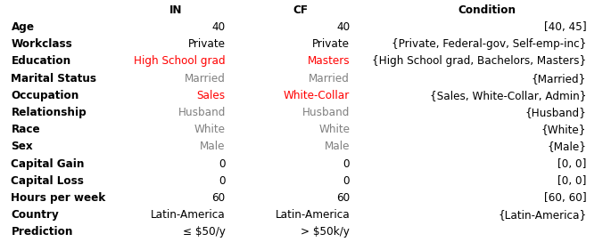
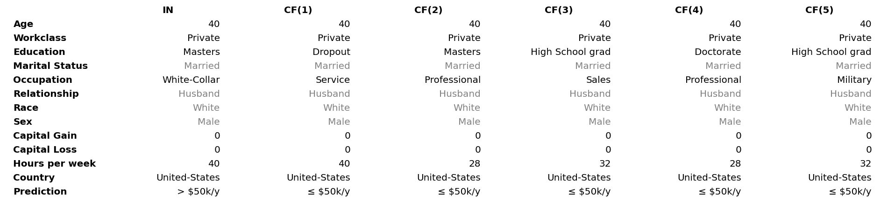
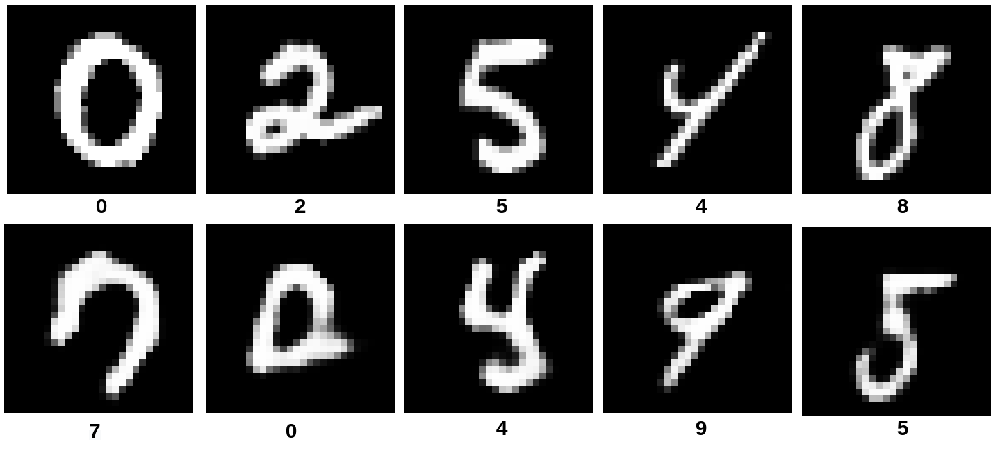
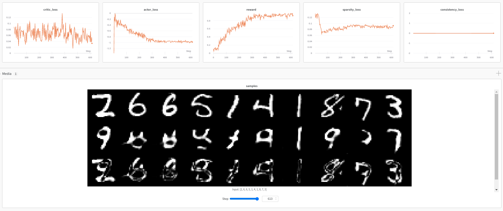
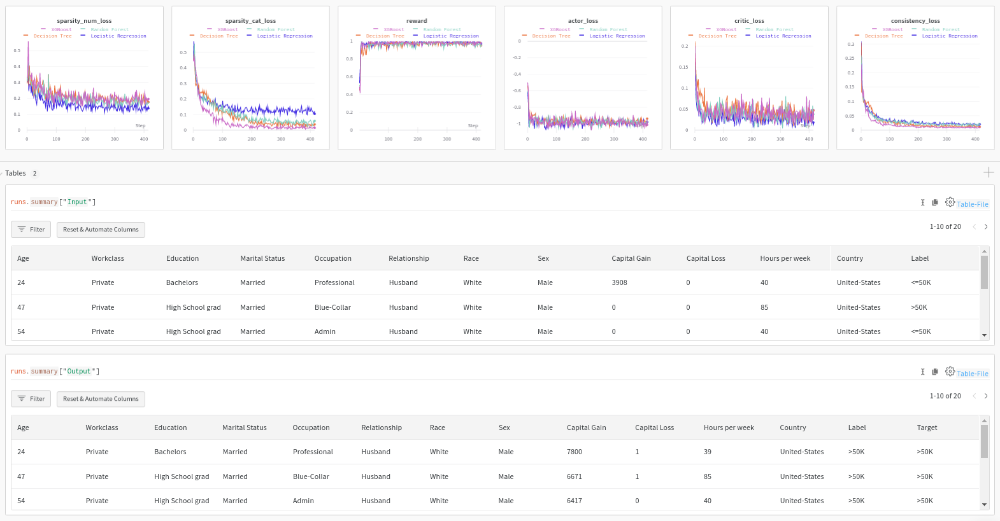

# CFRL

[\[source\]](https://github.com/ramonpzg/alibi/blob/rp-alibi-newdocs-dec23/doc/source/api/alibi.explainers.html#alibi.explainers.CounterfactualRL)

## Counterfactuals with Reinforcement Learning

Note

To enable support for Counterfactuals with Reinforcement Learning, you need one of tensorflow or torch installed. You can do so using:

```bash
pip install alibi[tensorflow]
```

or

```bash
pip install alibi[torch]
```

### Overview

The counterfactual with reinforcement learning is based on the [Model-agnostic and Scalable Counterfactual Explanations via Reinforcement Learning](https://arxiv.org/pdf/2106.02597.pdf) which proposes a fast, model agnostic method to generate batches of counterfactual explanations by replacing the usual optimization procedure with a learnable process. The method **does not** assume model differentiability, relies only on the feedback from the model predictions, allows for target-conditional counterfactual instances and flexible feature range constraints for numerical and categorical features, including the immutability of protected features (e.g, _gender_, _race_). Furthermore, it is easily extendable to multiple data modalities (e.g., images, tabular data).

Counterfactual instances (a.k.a. counterfactual explanations, counterfactuals) are a powerful tool to obtain insight into the underlying decision process exhibited by a black-box model, describing the necessary minimal changes in the input space to alter the prediction towards the desired target. To be of practical use, a counterfactual should be sparse—close (using some distance measure) to the original instance—and indistinguishable from real instances, that is, it should be in-distribution. Thus, for a loan application system that currently outputs a rejection for a given individual, a counterfactual explanation should suggest plausible minimal changes in the feature values that the applicant could perform to get the loan accepted leading to actionable recourse.

A desirable property of a method for generating counterfactuals is to allow feature conditioning. Real-world datasets usually include immutable features such as _gender_ or _race_, which should remain unchanged throughout the counterfactual search procedure. A natural extension of immutability is to restrict a feature to a subset or an interval of values. Thus, following the same loan application example, a customer might be willing to improve their education level from a _High-school graduate_ to _Bachelor’s_ or _Master’s_, but not further. Similarly, a numerical feature such as _age_ should only increase for a counterfactual to be actionable. To enable such feature conditioning, we propose to use a conditioning vector to guide the generation process.

A counterfactual explanation of a given instance represents a sparse, in-distribution example that alters the model prediction towards a specified target. Let $x$ be the original instance, $M$ a black-box model, $y\_M = M(x)$ the model prediction on $x$ and $y\_T$ the target prediction. The goal is to produce a counterfactual instance $x\_{CF} = x + \delta\_{CF}$ where $\delta\_{CF}$ represents a sparse perturbation vector such that $y\_T = M(x\_{CF})$. Instead of solving an optimization problem for each input instance, we train a generative model which models the counterfactual instances $x\_{CF}$ directly and allows for feature level constraints via an optional conditioning vector $c$. A conditional counterfactual explanation $x\_{CF}$ therefore depends on the tuple $s = (x, y\_M, y\_T, c)$.

The method **does not** assume the model $M$ to be differentiable and it trains the counterfactual generator using reinforcement learning, namely [Deep Deterministic Policy Gradient (DDPG)](https://arxiv.org/abs/1509.02971). DDPG interleaves a state-action function approximator called critic ($Q$), with learning an approximator called actor($\mu$) to predict the optimal action, which is equivalent to predicting the optimal counterfactual. The method assumes that the critic is differentiable with respect to the action argument, thus allowing to optimize the actor's parameters efficiently through gradient-based methods.

This model-agnostic training pipeline is compatible with various data modalities and only uses sparse model prediction feedback as a reward. For a classification model returning the predicted class label the reward can be defined by an indicator function, $R = 1(M(x\_{CF}) = y\_{T})$. The reward for a regression model, on the other hand is proportional to the proximity of $M(x\_{CF})$ to the regression target $y\_T$.

Instead of directly modeling the perturbation vector $\delta\_{CF}$ in the potentially high-dimensional input space, we first train an [autoencoder](https://en.wikipedia.org/wiki/Autoencoder). The weights of the autoencoder are frozen and $\mu$ applies the counterfactual perturbations in the latent space of the encoder. The pre-trained decoder maps the counterfactual embedding back to the input feature space. Since $\mu$ operates in the continuous latent space we use the sample efficient DDPG method. We denote by $enc$ and $dec$ the encoder and the decoder networks, respectively. Given the encoded representation of the input instance $z = enc(x)$, the model prediction $y\_M$, the target prediction $y\_T$ and the conditioning vector $c$, the actor outputs the counterfactual’s latent representation $z\_{CF} = \mu(z, y\_M, y\_T, c)$. The decoder then projects the embedding $z\_{CF}$ back to the original input space, followed by optional post-processing.

The training step consists of simultaneously optimizing the actor and critic networks. The critic regresses on the reward $R$ determined by the model prediction, while the actor maximizes the critic’s output for the given instance through $L\_{max}$. The actor also minimizes two objectives to encourage the generation of sparse, in-distribution counterfactuals. The sparsity loss $L\_{sparsity}$ operates on the decoded counterfactual $x\_{CF}$ and combines the $L\_1$ loss over the standardized numerical features and the $L\_0$ loss over the categorical ones. The consistency loss $L\_{consist}$ aims to encode the counterfactual $x\_{CF}$ back to the same latent representation where it was decoded from and helps to produce in-distribution counterfactual instances. Formally, the actor's loss can be written as: $L\_{actor} = L\_{max} + \lambda\_{1}L\_{sparsity} + \lambda\_{2}L\_{consistency}$

#### Tabular



Samoilescu RF et al., _Model-agnostic and Scalable Counterfactual Explanations via Reinforcement Learning_, 2021

In many real-world applications, some of the input features are immutable, have restricted feature ranges, or are constrained to a subset of all possible feature values. These constraints need to be taken into account when generating actionable counterfactual instances. For instance, _age_ and _marital status_ could be features in the loan application example. An actionable counterfactual should however only be able to increase the numerical _age_ feature and keep the categorical _marital status_ feature unchanged. To achieve this we condition the counterfactual generator on a conditioning vector $c$.

Following the decoding phase, as part of post-processing (denoted by a function $pp$), the numerical values are clipped within the desired range, and categorical values are conditionally sampled according to their masking vector. This step ensures that the generated counterfactual respects the desired feature conditioning before passing it to the model. Note that CFRL is flexible and allows non-differentiable post-processing such as casting features to their original data types (e.g., converting a decoded floating-point _age_ to an integer: 40 = int(40.3)) and categorical mapping (e.g., _marital status_ distribution/one-hot encoding to the married value) since we rely solely on the sparse model prediction reward.



Samoilescu RF et al., _Model-agnostic and Scalable Counterfactual Explanations via Reinforcement Learning_, 2021

Counterfactual diversity is important since it allows the user to take an informed action subject to personal preferences. CFRL can be extended to generate diverse counterfactuals too. Note that the deterministic decoding phase ensures consistency over repeated queries but limits the output to a single possible counterfactual per instance. To increase the diversity, we can sample the conditional vector subject to the user-defined feature constraints. Thus, for unconstrained features, we follow the same sampling procedure applied during training, while for constrained ones, we sample a subset of their restricted values which ensures the feasibility of the counterfactual.

#### Images



Samoilescu RF et al., _Model-agnostic and Scalable Counterfactual Explanations via Reinforcement Learning_, 2021

CFRL is a flexible method and can be easily extendable to other data modalities, such as images. The training pipeline remains unchanged and only requires a pre-trained autoencoder for each dataset. The method can generate valid, in-distribution counterfactuals even for high-dimensional data.

### Usage

CFRL provides a base class specifically designed to be easily adaptable to multiple data modalities. CFRL achieves this flexibility by allowing the user to input custom functions as:

* `reward_func` - element-wise reward function.
* `conditional_func` - generates a conditional vector given a input instance.
* `postprocessing_funcs` - post-processing list of functions. Non-differentiable post-processing can be applied.

For more details, see the documentation [here](https://github.com/ramonpzg/alibi/blob/rp-alibi-newdocs-dec23/doc/source/api/alibi.explainers.cfrl_base.rst#alibi.explainers.cfrl_base.DEFAULT_BASE_PARAMS).

#### Image

We first introduce the image dataset scenario due to ease of usage.

**Predictor**

Since CFRL works on black-box models, only access to a predict function is needed. The model below is a simple convolutional neural network(CNN) trained on the MNIST dataset:

```python
predictor = lambda x: cnn(x)
```

Note that for the classification task the CFRL expects the output of the predictor to be a **2D array**, where the second dimension matches the **number of classes**. The output can be either soft-label distribution (actual probabilities/logits for each class) or hard-label distribution (one-hot encoding). Regardless of the output prediction (logits, probabilities, one-hot encoding), for the classification task the CFRL applies the `argmax` operator on the output.

**Autoencoder**

CFRL models the perturbation vector $\delta\_{CF}$ in embedding space, thus a pre-trained autoencoder, `ae`, is required. The autoencoder is a CNN trained on the MNIST dataset, and for simplicity of notation we assume that the model can be factored out in two components, `ae.encoder` and `ae.decoder`, corresponding to the encoder component and decoder component, respectively.

**Initialization**

```python
explainer = CounterfactualRL(predictor=predictor,
                             encoder=ae.encoder,
                             decoder=ae.decoder,
                             coeff_sparsity=COEFF_SPARSITY,
                             coeff_consistency=COEFF_CONSISTENCY,
                             latent_dim=LATENT_DIM,
                             train_steps=300000,
                             batch_size=100,
                             backend="tensorflow")
```

where:

* `predictor` - black-box model.
* `encoder` - pre-trained encoder.
* `decoder` - pre-trained decoder.
* `latent_dim` - embedding/latent dimension.
* `coeff_sparsity` - sparsity loss coefficient.
* `coeff_consistency` - consistency loss coefficient.
* `train_steps` - number of training steps.
* `batch_size` - batch size dimension to be used.
* `backend` - backend to be used. Possible values: `tensorflow`|`pytorch`.

We previously mentioned the CFRL base class can be easily adaptable to multiple data modalities, by allowing the user to specify custom functions. By default, the customizable functions are defined as:

* `reward_func` - by default, checks if the counterfactual prediction label matches the target label.
* `conditional_func` - by default, the function returns `None` which is equivalent to no conditioning.
* `postprocessing_funcs` - by default is an empty list which is equivalent to no post-processing.

**Fit**

Fitting is straightforward, just passing the training set:

```python
explainer.fit(X=X_train)
```

**Explanation**

We can now explain the instance:

```python
explanation = explainer.explain(X=X_test, 
                                Y_t=np.array([1]), 
                                batch_size=100)
```

where:

* `X` - test instances to be explained.
* `Y_t` - target class. This array can contain either a single entrance that is applied for all test instances or multiple entrances, one for each test instance.
* `batch_size` - batch size to be used at prediction time.

The explain method returns an `Explanation` object with the following attributes:

* `"orig"` - a dictionary containing the following key-value pairs:
  * `"X"` - original input instances.
  * `"class"` - classification labels of the input instances.
* `"cf"` - a dictionary containing the following key-value pairs:
  * `"X"` - counterfactual instances.
  * `"class"` - classification labels of the counterfactual instance.
* `"target"` - target labels.
* `"condition"` - counterfactual conditioning.

#### Tabular

The tabular scenario follows closely the details provided for the image one, by replacing the custom functions to match the CFRL original implementation.

**Predictor**

As previously mentioned, CFRL operates in the black-box scenario and thus it can be applied to any model (from differentiable models as neural networks to highly non-differentiable models such as Decision Tree, Random Forest, XGBoost, etc.). The predictor can be defined as:

```python
predictor = lambda x: black_box.predict_proba(x)
```

For classification, the output has to respect the same conventions as described in the _Image_ section, namely to be a **2D array** having the second dimension match the **number of classes**.

Note that for models that do not support `predict_proba` which outputs the distribution over the classes, one can write a custom function that returns a one-hot encoding representation of the label class without affecting the performance since CFRL applies the `argmax` operator over the output distribution.

**Heterogeneous autoencoder**

For the heterogeneous autoencoder, `heae`, we use the same naming convention as for _Image_ datasets and assume that the autoencoder can be factored into two independent components, `heae.encoder` and `heae.decoder`, representing the encoder and decoder modules. For the tabular scenarios, both the encoder and decoder networks can be fully connected networks.

Since we are dealing with a heterogeneous dataset, that has to be reflected in the output of the decoder. Thus, the convention is that the decoder must be a multiheaded network which implies that the output must be a list of tensors. The first head models all the numerical features (if exist), while the rest of the heads model the categorical ones (one head for each categorical feature).

Heterogeneous datasets require special treatment. In this work, we modeled the numerical features by normal distributions with constant standard deviation and categorical features by categorical distributions. Due to the choice of feature modeling, some numerical features can end up having different types than the original numerical features. For example, a feature like `Age` having the type of `int` can become a `float` due to the autoencoder reconstruction (e.g., `Age=26 -> Age=26.3`). This behavior can be undesirable. Thus we performed a casting when processing the output of the autoencoder (decoder component).

We can specify the datatype of each numerical feature by defining:

```python
feature_types = {"Age": int, "Capital Gain": int, "Capital Loss": int, "Hours per week": int}
```

(by default each numerical feature is considered to be `float`, thus it can be omitted from the `feature_types` dictionary).

Then we can obtain a heterogeneous autoencoder pre-processor(`heae_preprocessor`) which standardizes the numerical features and transforms the categorical one into a one-hot encoding. The pre-processor is accompanied by an inverse pre-preprocessor(`heae_inv_preprocessor`), designed to map the raw output of the decoder back to the original input space. The inverse pre-processor includes type casting specified in the `feature_types`.

We can obtain the pre-processing pair by:

```python
from alibi.explainers.backends.cfrl_tabular import get_he_preprocessor
heae_preprocessor, heae_inv_preprocessor = get_he_preprocessor(X=X_train,
                                                               feature_names=adult.feature_names,
                                                               category_map=adult.category_map,
                                                               feature_types=feature_types)
```

**Constraints**

A desirable property of a method for generating counterfactuals is to allow feature conditioning. Real-world datasets usually include immutable features such as _gender_ or _race_, which should remain unchanged throughout the counterfactual search procedure. Similarly, a numerical feature such as _age_ should only increase for a counterfactual to be actionable.

We define the immutable features as:

```python
immutable_features = ['Marital Status', 'Relationship', 'Race', 'Sex']
```

and ranges for numerical attributes as:

```python
ranges = {'Age': [0.0, 1.0], 'Hours per week': [-1.0, 0.0], "Capital Gain": [-1.0, 1.0]}
```

The encoding for ranges has the following meaning:

* `"Age"` - can only increase.
* `"Hours per week"` - can only decrease.
* `"Capital Gain"` - can increase or decrease. It is equivalent of saying that there are no constraints, and therefore can be omitted.

Note that the value `0` must be contained in the specified interval. For more details, see the documentation [here](https://github.com/ramonpzg/alibi/blob/rp-alibi-newdocs-dec23/doc/source/api/alibi.explainers.cfrl_tabular.rst#alibi.explainers.cfrl_tabular.CounterfactualRLTabular).

**Initialization**

```python
explainer = CounterfactualRLTabular(predictor=predictor,
                                    encoder=heae.encoder,
                                    decoder=heae.decoder,
                                    latent_dim=LATENT_DIM,
                                    encoder_preprocessor=heae_preprocessor,
                                    decoder_inv_preprocessor=heae_inv_preprocessor,
                                    coeff_sparsity=COEFF_SPARSITY,
                                    coeff_consistency=COEFF_CONSISTENCY,
                                    feature_names=adult.feature_names,
                                    category_map=adult.category_map,
                                    immutable_features=immutable_features,
                                    ranges=ranges,
                                    train_steps=100000,
                                    batch_size=100,
                                    backend="tensorflow")
```

where:

* decoder - heterogeneous decoder network. The output of the decoder **must be a list of tensors**.
* encoder\_preprocessor - heterogeneous autoencoder/encoder pre-processor.
* decoder\_inv\_preprocessor - heterogeneous autencoder/decoder inverse pre-processor.
* category\_map - dataset category mapping. Keys are feature indexes and values are list feature values. Provided by the alibi dataset.
* feature\_names - list of feature names. Provided by the alibi dataset.
* ranges - numerical feature ranges, described in the previous section.
* immutable\_features - list of immutable features, described in the previous section.

The rest of the arguments were previously described in the _Image_ section.

**Fit**

Similar to the _Image_ section, fitting is straight-forward, just passing the training set:

```python
explainer.fit(X=X_train)
```

**Explanation**

Before asking for an explanation, we can define some conditioning:

```python
C = [{"Age": [0, 20], "Workclass": ["State-gov", "?", "Local-gov"]}]
```

The above condition is equivalent to say that the `Age` is allowed to increase up to `20` years and that the `Workclass` can change to either `"State-gov"`, `"?"`, `"Local-gov"` or remain the same. Note that the conditioning is expressed as a $\delta$ change from the input and the original feature value will be included by default.

We can generate an explanation by calling the `explain` method as follows:

```python
explanation = explainer.explain(X=X_test, 
                                Y_t=np.array([1]), 
                                C=C,
                                batch_size=BATCH_SIZE)
```

where:

* `C` - conditioning. The list can contain either a single entrance that is applied for all test instances or multiple entrances, one for each test instance.

The rest of the arguments were previously described in the _Image_ section.

The explain method returns an `Explanation` object described as well in the _Image_ section.

**Diversity**

We can generate a diverse counterfactual set for a single instance by calling the `explain` method and by setting the `diversity=True`:

```python
explanation = explainer.explain(X=X_test[0:1], 
                                Y_t=np.array([1]), 
                                C=C, 
                                diversity=True, 
                                num_samples=NUM_SAMPLES, 
                                batch_size=BATCH_SIZE)
```

where:

* `diversity` - diversity flag.
* `num_samples` - number of distinct counterfactual instances to be generated.

The rest of the arguments were previously described in the _Image_ section.

**Possible corner case**

As we previously mention, tabular scenario requires a heterogeneous decoder. That is a decoder which outputs a list of tensors, one for all numerical features, and one tensor for each of the categorical features. For homogeneous dataset (e.g., all numerical features) the output of the decoder **must be a list that contains one tensor**. One possible workaround is to wrap the decoder as follows:

```python
class DecoderList(tf.keras.Model):
    def __init__(self, decoder: tf.keras.Model, **kwargs):
        super().__init__(**kwargs)
        self.decoder = decoder

    def call(self, input: Union[tf.Tensor, List[tf.Tensor]], **kwargs):
        return [self.decoder(input, **kwargs)]
    
decoder = DecoderList(decoder)
```

#### Logging

Logging is clearly important when dealing with deep learning models. Thus, we provide an interface to write custom callbacks for logging purposes after each training step which we defined [here](https://github.com/ramonpzg/alibi/blob/rp-alibi-newdocs-dec23/doc/source/api/alibi.explainers.cfrl_base.rst#alibi.explainers.cfrl_base.Callback). In the following section we provide links to notebooks that exemplify how to log using **Weights and Biases**.

Having defined the callbacks, we can define a new explainer that will include logging.

```python
import wandb

# Initialize wandb.
wandb_project = "Adult Census Counterfactual with Reinforcement Learning"
wandb.init(project=wandb_project)

# Define explainer as before and include callbacks.
explainer = CounterfactualRLTabular(...,
                                    callbacks=[LossCallback(), RewardCallback(), TablesCallback()])

# Fit the explainers.
explainer = explainer.fit(X=X_train)

# Close wandb.
wandb.finish()
```

**MNIST Logs**



**Adult Census Logs**



### Examples

[Counterfactuals with Reinforcement Learning on MNIST](https://github.com/ramonpzg/alibi/blob/rp-alibi-newdocs-dec23/doc/source/examples/cfrl_mnist.ipynb)

[Counterfactuals with Reinforcement Learning on Adult Census](https://github.com/ramonpzg/alibi/blob/rp-alibi-newdocs-dec23/doc/source/examples/cfrl_adult.ipynb)
