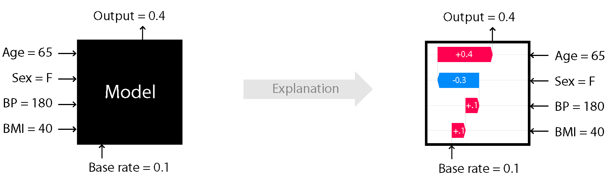
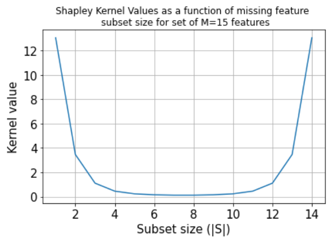

# KernelSHAP

[\[source\]](https://github.com/ramonpzg/alibi/blob/rp-alibi-newdocs-dec23/doc/source/api/alibi.explainers.html#alibi.explainers.KernelShap)

## Kernel SHAP

Note

To enable SHAP support, you may need to run:

```bash
pip install alibi[shap]
```

### Overview

The Kernel SHAP (**SH**apley **A**dditive ex**P**lanations) algorithm is based on the paper [A Unified Approach to Interpreting Model Predictions](https://papers.nips.cc/paper/7062-a-unified-approach-to-interpreting-model-predictions) by Lundberg et al. and builds on the open source [shap library](https://github.com/slundberg/shap) from the paper's first author.

The algorithm provides model-agnostic (_black box_), human interpretable explanations suitable for regression and classification models applied to tabular data. This method is a member of the _additive feature attribution methods_ class; feature attribution refers to the fact that the change of an outcome to be explained (e.g., a class probability in a classification problem) with respect to a _baseline_ (e.g., average prediction probability for that class in the training set) can be attributed in different proportions to the model input features.

A simple illustration of the explanation process is shown in Figure 1. Here we see depicted a model which takes as an input features such as `Age`, `BMI` or `Sex` and outputs a continuous value. We know that the average value of that output in a dataset of interest is `0.1`. Using the Kernel SHAP algorithm, we attribute the `0.3` difference to the input features. Because the sum of the attribute values equals `output - base rate`, this method is _additive_. We can see for example that the `Sex` feature contributes negatively to this prediction whereas the remainder of the features have a positive contribution. For explaining this particular data point, the `Age` feature seems to be the most important. See our examples on how to perform explanations with this algorithm and visualise the results using the `shap` library visualisations [here](https://github.com/ramonpzg/alibi/blob/rp-alibi-newdocs-dec23/doc/source/examples/kernel_shap_wine_intro.ipynb), [here](https://github.com/ramonpzg/alibi/blob/rp-alibi-newdocs-dec23/doc/source/examples/kernel_shap_wine_lr.ipynb) and [here](https://github.com/ramonpzg/alibi/blob/rp-alibi-newdocs-dec23/doc/source/examples/kernel_shap_adult_lr.ipynb).

 Figure 1: Cartoon illustration of black-box explanation models with Kernel SHAP

Image Credit: Scott Lundberg (see source [here](https://github.com/slundberg/shap))

### Usage

In order to compute the shap values , the following hyperparameters can be set when calling the `explain` method:

* `nsamples`: Determines the number of subsets used for the estimation of the shap values. A default of `2*M + 2**11` is provided where `M` is the number of features. One is encouraged to experiment with the number of samples in order to determine a value that balances explanation accuracy and runtime.
* `l1_reg`: can take values `0`, `False` to disable, `auto` for automatic regularisation selection, `bic` or `aic` to use $\ell\_1$ regularised regression with the Bayes/Akaike information criteria for regularisation parameter selection, `num_features(10)` to specify the number of feature effects to be returned or a float value that is used as the regularisation coefficient for the $\ell\_1$ penalised regression. The default option `auto` uses the least angle regression algorithm with the Akaike Information Criterion if a fraction smaller than `0.2` of the total number of subsets is enumerated.

If the dataset to be explained contains categorical variables, then the following options can be specified _unless_ the categorical variables have been grouped (see example below):

* `summarise_result`: if True, the shap values estimated for dimensions of an encoded categorical variable are summed and a single shap value is returned for the categorical variable. This requires that both arguments below are specified:
* `cat_var_start_idx`: a list containing the column indices where categorical variables start. For example if the feature matrix contains a categorical feature starting at index `0` and one at index `10`, then `cat_var_start_idx=[0, 10]`.
* `cat_vars_enc_dim`: a list containing the dimension of the encoded categorical variables. The number of columns specified in this list is summed for each categorical variable starting with the corresponding index in `cat_var_start_idx`. So if `cat_var_start_idx=[0, 10]` and `cat_vars_enc_dim=[3, 5]`, then the columns with indices `0, 1` and `2` and `10, 11, 12, 13` and `14` will be combined to return one shap value for each categorical variable, as opposed to `3` and `5`.

#### Explaining continuous datasets

**Initialisation and fit**

The explainer is initialised by specifying:

* a predict function.
* optionally, setting `link='logit'` if the the model to be explained is a classifier that outputs probabilities. This will apply the logit function to convert outputs to margin space.
* optionally, providing a list of `feature_names`

Hence assuming the classifier takes in 4 inputs and returns probabilities of 3 classes, we initialise its explainer as:

```python
from alibi.explainers import KernelShap

predict_fn = lambda x: clf.predict_proba(x)
explainer = KernelShap(predict_fn, link='logit', feature_names=['a','b','c','d'])
```

To fit our classifier, we simply pass our background or 'reference' dataset to the explainer:

```python
explainer.fit(X_reference)
```

Note that `X_reference` is expected to have a `samples x features` layout.

**Explanation**

To explain an instance `X`, we simply pass it to the explain method:

```python
explanation = explainer.explain(X)
```

The returned explanation object has the following fields:

* `explanation.meta`:

```python
{'name': 'KernelShap',
 'type': ['blackbox'],
 'explanations': ['local', 'global'],
 'params': {'groups': None,
            'group_names': None,
            'weights': None,
            'summarise_background': False
           }
}
```

This field contains metadata such as the explainer name and type as well as the type of explanations this method can generate. In this case, the `params` attribute shows that none of the `fit` method optional parameters have been set.

* `explanation.data`:

```python
{'shap_values': [array([ 0.8340445 ,  0.12000589, -0.07984099,  0.61758141]),
                 array([-0.71522546,  0.31749045,  0.3146705 , -0.13365639]),
                 array([-0.12984616, -0.47194649, -0.23036243, -0.52314911])],
 'expected_value': array([0.74456904, 1.05058744, 1.15837362]),
 'link': 'logit',
 'feature_names': ['a', 'b', 'c', 'd'],
 'categorical_names': {}, 
 'raw': {
     'raw_prediction': array([ 2.23635984,  0.83386654, -0.19693058]),
     'prediction': array([0]),
     'instances': array([ 0.93884707, -0.63216607, -0.4350103 , -0.91969562]),
     'importances': {
         '0': {'ranked_effect': array([0.8340445 , 0.61758141, 0.12000589, 0.07984099]),
               'names': ['a', 'd', 'b', 'c']},
         '1': {'ranked_effect': array([0.71522546, 0.31749045, 0.3146705 , 0.13365639]),
               'names': ['a', 'b', 'c', 'd']},
         '2': {'ranked_effect': array([0.52314911, 0.47194649, 0.23036243, 0.12984616]),
               'names': ['d', 'b', 'c', 'a']},
         'aggregated': {'ranked_effect': array([1.67911611, 1.27438691, 0.90944283, 0.62487392]),
                        'names': ['a', 'd', 'b', 'c']}
         }
     }
}
```

This field contains:

* `shap_values`: a list of length equal to the number of model outputs, where each entry is an array of dimension `samples x features` of shap values. For the example above , only one instance with 4 features has been explained so the shap values for each class are of dimension `1 x 4`
* `expected_value`: an array of the expected value for each model output across `X_reference`
* `link`: which function has been applied to the model output prior to computing the `expected_value` and estimation of the `shap_values`
* `feature_names`: a list with the feature names, if provided. Defaults to a list containing strings of with the format `feature_{}` if no names are passed
* `categorical_names`: a mapping of the categorical variables (represented by indices in the `shap_values` columns) to the description of the category
* `raw`: this field contains:
* `raw_prediction`: a `samples x n_outputs` array of predictions for each instance to be explained. Note that this is calculated by applying the link function specified in `link` to the output of `pred_fn`
* `prediction`: a `samples` array containing the index of the maximum value in the `raw_prediction` array
* `instances`: a `samples x n_features` array of instances which have been explained
* `importances`: a dictionary where each entry is a dictionary containing the sorted average magnitude of the shap value (`ranked_effect`) along with a list of feature names corresponding to the re-ordered shap values (`names`). There are `n_outputs + 1` keys, corresponding to `n_outputs` and to the aggregated output (obtained by summing all the arrays in `shap_values`)

Please see our examples on how to visualise these outputs using the `shap` library visualisations [here](https://github.com/ramonpzg/alibi/blob/rp-alibi-newdocs-dec23/doc/source/examples/kernel_shap_wine_intro.ipynb), [here](https://github.com/ramonpzg/alibi/blob/rp-alibi-newdocs-dec23/doc/source/examples/kernel_shap_wine_lr.ipynb) and [here](https://github.com/ramonpzg/alibi/blob/rp-alibi-newdocs-dec23/doc/source/examples/kernel_shap_adult_lr.ipynb).

#### Explaining heterogeneous (continuous and categorical) datasets

When the dataset contains both continuous and categorical variables, `categorical_names`, an optional mapping from the encoded categorical features to a description of the category can be passed in addition to the `feature_names` list. This mapping is currently used for determining what type of summarisation should be applied if `X_reference` is large and the `fit` argument `summarise_background='auto'` or `summarise_background=True` but in the future it might be used for annotating visualisations. The definition of the map depends on what method is used to handle the categorical variables.

**By grouping categorical data**

By grouping categorical data we estimate a single shap value for each categorical variable.

**Initialisation and fit**

Assume that we have a dataset with features such as `Marital Status` (first column), `Age` (2nd column), `Income` (3rd column) and `Education` (4th column). The 2nd and 3rd column are continuous variables, whereas the 1st and 4th are categorical ones.

The mapping of categorical variables could be generated from a Pandas dataframe using the utility `gen_category_map`, imported from `alibi.utils`. For this example the output could look like:

```python
category_map = {
    0: ["married", "divorced"], 
    3: ["high school diploma", "master's degree"],
}
```

Hence, using the same predict function as before, we initialise the explainer as:

```python
explainer = KernelShap(
    predict_fn, 
    link='logit', 
    feature_names=["Marital Status", "Age", "Income", "Education"],
    categorical_names=category_map,
)
```

To group our data, we have to provide the `groups` list, which contains lists with indices that are grouped together. In our case this would be:

```python
groups = [[0, 1], [2], [3], [4, 5]]
```

Similarly, the group\_names are the same as the feature names

```python
group_names = ["Marital Status", "Age", "Income", "Education"]
```

Note that, in this case, the keys of the `category_map` are indices into `groups`. To fit our explainer we pass _one-hot encoded_ data to the explainer along with the grouping information.

```python
explainer.fit(
    X_reference,
    group_names=group_names,
    groups=groups,
)
```

**Explanation**

To perform an explanation, we pass _one hot encoded_ instances `X` to the `explain` method:

```python
explanation = explainer.explain(X)
```

The explanation returned will contain the grouping information in its `meta` attribute

```python
{'name': 'KernelShap',
 'type': ['blackbox'],
 'explanations': ['local', 'global'],
 'params': {'groups': [[0, 1], [2], [3], [4, 5]],
            'group_names': ["Marital Status", "Age", "Income", "Education"] ,
            'weights': None,
            'summarise_background': False
           }
}
```

whereas inspecting the `data` attribute shows that one shap value is estimated for each of the four groups:

```python
{'shap_values': [array([ 0.8340445 ,  0.12000589, -0.07984099,  0.61758141]),
                 array([-0.71522546,  0.31749045,  0.3146705 , -0.13365639]),
                 array([-0.12984616, -0.47194649, -0.23036243, -0.52314911])],
 'expected_value': array([0.74456904, 1.05058744, 1.15837362]),
 'link': 'logit',
 'feature_names': ["Marital Status", "Age", "Income", "Education"],
 'categorical_names': {}, 
 'raw': {
     'raw_prediction': array([ 2.23635984,  0.83386654, -0.19693058]),
     'prediction': array([0]),
     'instances': array([ 0.93884707, -0.63216607, -0.4350103 , -0.91969562]),
     'importances': {
         '0': {'ranked_effect': array([0.8340445 , 0.61758141, 0.12000589, 0.07984099]),
               'names': ['a', 'd', 'b', 'c']},
         '1': {'ranked_effect': array([0.71522546, 0.31749045, 0.3146705 , 0.13365639]),
               'names': ['a', 'b', 'c', 'd']},
         '2': {'ranked_effect': array([0.52314911, 0.47194649, 0.23036243, 0.12984616]),
               'names': ['d', 'b', 'c', 'a']},
         'aggregated': {'ranked_effect': array([1.67911611, 1.27438691, 0.90944283, 0.62487392]),
                        'names': ['a', 'd', 'b', 'c']}
         }
     }
}
```

**By summing output**

An alternative to grouping, with a higher runtime cost, is to estimate one shap value for each dimension of the one-hot encoded data and sum the shap values of the encoded dimensions to obtain only one shap value per categorical variable.

**Initialisation and fit**

The initialisation step is as before:

```python
explainer = KernelShap(
    predict_fn, 
    link='logit', 
    feature_names=["Marital Status", "Age", "Income", "Education"],
    categorical_names=category_map,
)
```

However, note that the keys of the `category_map` have to correspond to the locations of the categorical variables after the effects for the encoded dimensions have been summed up (see details below).

The fit step requires _one hot encoded_ data and simply takes the reference dataset:

```python
explainer.fit(X_reference)
```

**Explanation**

To obtain a single shap value per categorical result, we have to specify the following arguments to the `explain` method:

* `summarise_result`: indicates that some shap values will be summed
* `cat_vars_start_idx`: the column indices where the first encoded dimension is for each categorical variable
* `cat_vars_enc_dim`: the length of the encoding dimensions for each categorical variable

```python
explanation = explainer.explain(
    X,
    summarise_result=True,
    cat_vars_start_idx=[0, 4],
    cat_vars_enc_dim=[2, 2],
)
```

In our case `Marital Status` starts at column `0` and occupies 2 columns, `Age` and `Income` occupy columns `2` and `3` and `Education` occupies columns `4` and `5`.

**By combining preprocessor and predictor**

Finally, an alternative is to combine the preprocessor and the predictor together in the same object, and fit the explainer on data _before preprocessing_.

**Initialisation and fit**

To do so, we first redefine our predict function as

```python
predict_fn = lambda x: clf.predict(preprocessor.transform(x))
```

The explainer can be initialised as:

```python

explainer = KernelShap(
    predict_fn,
    link='logit',
    feature_names=["Marital Status", "Age", "Income", "Education"],
    categorical_names=category_map,
)
```

Then, the explainer should be fitted on _unprocessed_ data:

```python
explainer.fit(X_referennce_unprocessed)
```

**Explanation**

We can explain _unprocessed records_ simply by calling `explain`:

```python
explanation = explainer.explain(X_unprocessed)
```

#### Running batches of explanations in parallel

Increases in the size of the background dataset, the number of samples used to estimate the shap values or simply explaining a large number of instances dramatically increase the cost of running Kernel SHAP.

To explain batches of instances in parallel, first run `pip install alibi[ray]` to install required dependencies and then simply initialise `KernelShap` specifying the number of physical cores available as follows:

```python
distrib_kernel_shap = KernelShap(predict_fn, distributed_opts={'n_cpus': 10}
```

To explain, simply call the `explain` as before - no other changes are required.

Warning

Windows support for the `ray` Python library is [still experimental](https://docs.ray.io/en/stable/installation.html#windows-support). Using `KernelShap` in parallel is not currently supported on Windows platforms.

#### Miscellaneous

**Runtime considerations**

For a given instance, the runtime of the algorithm depends on:

* the size of the reference dataset
* the dimensionality of the data
* the number of samples used to estimate the shap values

**Adjusting the size of the reference dataset**

The algorithm automatically warns the user if a background dataset size of more than `300` samples is passed. If the runtime of an explanation with the original dataset is too large, then the algorithm can automatically subsample the background dataset during the `fit` step. This can be achieve by specifying the fit step as

```python
explainer.fit(
    X_reference,
    summarise_background=True,
    n_background_samples=150,
)
```

or

```python
explainer.fit(
    X_reference,
    summarise_background='auto'
)
```

The `auto` option will select `300` examples, whereas using the boolean argument allows the user to directly control the size of the reference set. If categorical variables or grouping options are specified, the algorithm uses subsampling of the data. Otherwise, a kmeans clustering algorithm is used to select the background dataset and the samples are weighted according to the frequency of occurrence of the cluster they are assigned to, which is reflected in the `expected_value` attribute of the explainer.

As described above, the explanations are performed with respect to the expected (or weighted-average) output over this dataset so the shap values will be affected by the dataset selection. We recommend experimenting with various ways to choose the background dataset before deploying explanations.

**The dimensionality of the data and the number of samples used in shap value estimation**

The dimensionality of the data has a slight impact on the runtime, since by default the number of samples used for estimation is `2*n_features + 2**11`. In our experiments, we found that either grouping the data or fitting the explainer on unprocessed data resulted in run time savings (but did not run rigorous comparison experiments). If grouping/fitting on unprocessed data alone does not give enough runtime savings, the background dataset could be adjusted. Additionally (or alternatively), the number of samples could be reduced as follows:

```python
explanation = explainer.explain(X, nsamples=500)
```

We recommend experimenting with this setting to understand the variance in the shap values before deploying such configurations.

**Imbalanced datasets**

In some situations, the reference datasets might be imbalanced so one might wish to perform an explanation of the model behaviour around $x$ with respect to $\sum\_{i} w\_i f(y\_i)$ as opposed to $\mathbb{E}\_{\mathcal{D\}}\[f(y)]$. This can be achieved by passing a list or an 1-D numpy array containing a weight for each data point in `X_reference` as the `weights` argument of the `fit` method.

### Theoretical overview

Consider a model $f$ that takes as an input $M$ features. Assume that we want to explain the output of the model $f$ when applied to an input $x$. Since the model output scale does not have an origin (it is an [affine space](https://en.wikipedia.org/wiki/Affine_space)), one can only explain the difference of the observed model output with respect to a chosen origin point. This point can be taken to be the function output value for an arbitrary record or the average output over a set of records, $\mathcal{D}$. Assuming the latter case, for the explanation to be accurate, one requires

$$
f(x) - \mathbb{E}_{y \sim \mathcal{D}}[f(y)] = \sum_{i=1}^M \phi_i
$$

where $\mathcal{D}$ is also known as a _background dataset_ and $\phi\_i$ is the portion of the change attributed to the $i$th feature. This portion is sometimes referred to as feature importance, effect or simply shap value.

One can conceptually imagine the estimation process for the shap value of the $i^{th}$ feature $x\_i$ as consisting of the following steps:

* enumerate all subsets $S$ of the set $F = {1, ..., M} \setminus {i}$
* for each $S \subseteq F \setminus {i}$, compute the contribution of feature $i$ as $C(i|S) = f(S \cup {i}) - f(S)$
* compute the shap value according to

$$
\phi_i := \frac{1}{M} \sum \limits_{{S \subseteq F \setminus \{i\}}} \frac{1}{\binom{M - 1}{|S|}} C(i|S).
$$

The semantics of $f(S)$ in the above is to compute $f$ by treating $\bar{S}$ as missing inputs. Thus, we can imagine the process of computing the SHAP explanation as starting with $S$ that does not contain our feature, adding feature $i$ and then observing the difference in the function value. For a nonlinear function the value obtained will depend on which features are already in $S$, so we average the contribution over all possible ways to choose a subset of size $|S|$ and over all subset sizes. The issue with this method is that:

* the summation contains $2^M$ terms, so the algorithm complexity is $O(M2^M)$
* since most models cannot accept an arbitrary pattern of missing inputs at inference time, calculating $f(S)$ would involve model retraining the model an exponential number of times

To overcome this issue, the following approximations are made:

* the missing features are simulated by replacing them with values from the background dataset
* the feature attributions are estimated instead by solving

$$
\min \limits_{\phi_i, ..., \phi_M} \left\{ \sum \limits_{S \subseteq F} \left[ f(S) - \sum \limits_{j \in S} \phi_j \right]^2 \pi_x(S) \right\}
$$

where

$$
\pi_x(S) = \frac{M-1}{{\binom{M}{|S|}} |S|(M - |S|)}
$$

is the Shapley kernel (Figure 2).



Figure 2: Shapley kernel

Note that the optimisation objective implies above an exponential number of terms. In practice, one considers a finite number of samples `n`, selecting `n` subsets $S\_1, ..., S\_n$ according to the probability distribution induced by the kernel weights. We can see that the kernel favours either small or large subset sizes, since most of the information about the effect of a particular feature for an outcome change can be obtained by excluding that feature or excluding all the features except for it from the input set.

Therefore, Kernel SHAP returns an approximation of the true Shapley values, whose variability depends on factors such as the size of the structure of the background dataset used to estimate the feature attributions and the number of subsets of missing features sampled. Whenever possible, algorithms specialised for specific model structures (e.g., Tree SHAP, Linear SHAP, integrated gradients) should be used since they are faster and more accurate.

#### Comparison to other methods

Like [LIME](https://arxiv.org/abs/1602.04938), this method provides _local explanations_, in the sense that the attributions are estimated to explain the change from a baseline _for a given data point_, $x$. LIME computes the feature attributions by optimising the following objective in order to obtain a locally accurate explanation model (i.e., one that approximates the model to explained well around an instance $x$):

$$
\zeta = \text{arg}\min_{g \in \mathcal{G}} L(f, g, \pi_{x}) + \Omega(g).
$$

Here $f$ is the model to be explained, $g$ is the explanation model (assumed linear), $\pi$ is a local kernel around instance $x$ (usually cosine or $\ell\_2$ kernel) and $\Omega(g)$ penalises explanation model complexity. The choices for $L, \pi$ and $\Omega$ in LIME are heuristic, which can lead to unintuitive behaviour (see [Section 5](https://papers.nips.cc/paper/7062-a-unified-approach-to-interpreting-model-predictions) of Lundberg et al. for a study). Instead, by computing the shap values according to the weighted regression in the previous section, the feature attributions estimated by Kernel SHAP have desirable properties such as _local accuracy_ , _consistency_ and _missingness_, detailed in [Section 3](https://papers.nips.cc/paper/7062-a-unified-approach-to-interpreting-model-predictions) of Lundberg et al..

Although, in general, local explanations are limited in that it is not clear to what a given explanation applies _around_ and instance $x$ (see anchors algorithm overview [here](https://github.com/ramonpzg/alibi/blob/rp-alibi-newdocs-dec23/doc/source/methods/Anchors.ipynb) for a discussion), insights into global model behaviour can be drawn by aggregating the results from local explanations (see the work of Lundberg et al. [here](https://www.nature.com/articles/s42256-019-0138-9)). In the future, a distributed version of the Kernel SHAP algorithm will be available in order to reduce the runtime requirements necessary for explaining large datasets.

### Examples

#### Continuous Data

[Introductory example: Kernel SHAP on Wine dataset](https://github.com/ramonpzg/alibi/blob/rp-alibi-newdocs-dec23/doc/source/examples/kernel_shap_wine_intro.ipynb)

[Comparison with interpretable models](https://github.com/ramonpzg/alibi/blob/rp-alibi-newdocs-dec23/doc/source/examples/kernel_shap_wine_lr.ipynb)

#### Mixed Data

[Handling categorical variables with Kernel SHAP: an income prediction application](https://github.com/ramonpzg/alibi/blob/rp-alibi-newdocs-dec23/doc/source/examples/kernel_shap_adult_lr.ipynb)

[Handlling categorical variables with Kernel SHAP: fitting explainers on data before pre-processing](https://github.com/ramonpzg/alibi/blob/rp-alibi-newdocs-dec23/doc/source/examples/kernel_shap_adult_categorical_preproc.ipynb)

[Distributed Kernel SHAP: paralelizing explanations on multiple cores](https://github.com/ramonpzg/alibi/blob/rp-alibi-newdocs-dec23/doc/source/examples/distributed_kernel_shap_adult_lr.ipynb)
