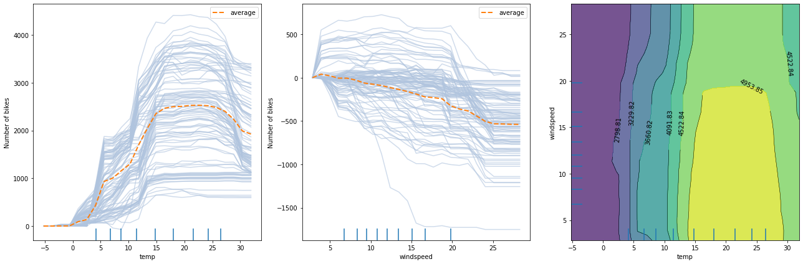
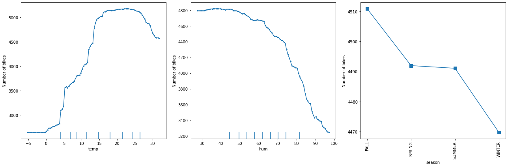
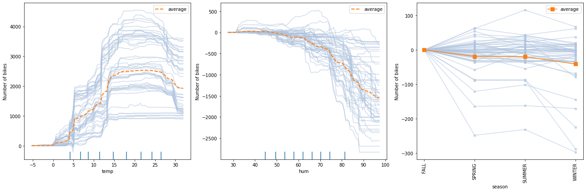
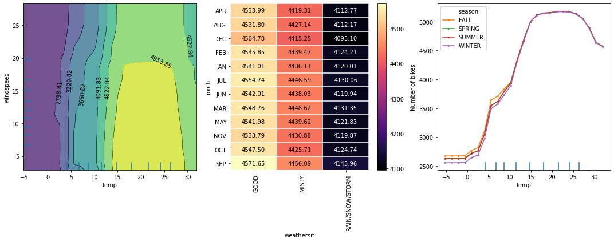
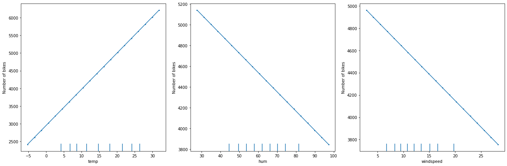

# PartialDependence

[\[source\]](https://github.com/ramonpzg/alibi/blob/rp-alibi-newdocs-dec23/doc/source/api/alibi.explainers.html#alibi.explainers.PartialDependence)

## Partial Dependence

### Overview

The partial dependence (`PD`) plot proposed by [J.H. Friedman (2001)](https://projecteuclid.org/journals/annals-of-statistics/volume-29/issue-5/Greedy-function-approximation-A-gradient-boostingmachine/10.1214/aos/1013203451.full)[\[1\]](partialdependence.md#References), is a method to visualize the marginal effect that one or two features have on the predicted outcome of a machine learning model. By inspecting the `PD` plots, one can understand whether the relation between a feature/pair of features is, for example, a simple linear or quadratic relation, whether it presents a monotonically increasing or decreasing trend, or reveal a more complex response.

The following figure displays two one-way `PD` plots for two features and a one two-way `PD` for the same features. The prediction model is random forest regression trained on the [Bike rental](http://archive.ics.uci.edu/ml/datasets/Bike+Sharing+Dataset)[\[2\]](partialdependence.md#References) dataset (see worked [example](https://github.com/ramonpzg/alibi/blob/rp-alibi-newdocs-dec23/doc/source/examples/pdp_regression_bike.ipynb)).



From the left plot, we can observe that the average model prediction increases with the temperature till it reaches approximately $17^\circ C$. Then it flattens at a high number until the weather becomes too hot (i.e. approx. $27^\circ C$), after which it starts dropping again. A similar analysis can be conducted by inspecting the middle figure for wind speed. As the wind speed increases, fewer and fewer people are riding the bike. Finally, by looking at the right plot, we can visualize how the two features interact. In a few words, the plot suggests that for relatively warm weather, the number of rentals increases as long as the wind is not too rough. For a more detailed analysis, please check the worked [example](https://github.com/ramonpzg/alibi/blob/rp-alibi-newdocs-dec23/doc/source/examples/pdp_regression_bike.ipynb).

For pros & cons of `PD` plots, see the [Partial Dependence](https://docs.seldon.io/projects/alibi/en/stable/overview/high_level.html#partial-dependence) section from the [Introduction](https://docs.seldon.io/projects/alibi/en/stable/overview/high_level.html) materials.

### Usage

To initialize the explainer with any black-box model one can directly pass the prediction function and optionally a list of feature names, a list of target names, and a dictionary of categorical names for interpretation and specification of the categorical features:

```python
from alibi.explainers import PartialDependence
pd = PartialDependence(predictor=prediction_fn,
                       feature_names=feature_names,
                       categorical_names=categorical_names,
                       target_names=target_names)
```

In addition, similar to the `sklearn` implementation, `alibi` supports a faster `PD` computation for some tree-based `sklearn` models through the `TreePartialDependence` explainer. The initialization is similar to the one above, with the difference that the `predictor` argument will be set to the tree predictor object instead of the prediction function.

```python
from alibi.explainer import TreePartialDependence
tree_pd = TreePartialDependence(predictor=tree_predictor,
                                feature_names=feature_names,
                                categorical_names=categorical_names,
                                target_names=target_name)

```

Following the initialization, we can produce an explanation given a dataset $X$:

```python
exp = pd.explain(X=X,
                 features=features,
                 kind='average')
```

Multiple arguments can be provided to the explain method:

* `X` - A `N x F` tabular dataset used to calculate partial dependence curves. This is typically the training dataset or a representative sample.
* `features` - An optional list of features or pairs of features for which to calculate the partial dependence. If not provided, the partial dependence will be computed for every single features in the dataset. Some example for `features` would be: `[0, 2]`, `[0, 2, (0, 2)]`, `[(0, 2)]`, where `0` and `2` correspond to column 0 and 2 in `X`, respectively.
* `kind` - If set to `'average'`, then only the partial dependence (`PD`) averaged across all samples from the dataset is returned. If set to `individual`, then only the individual conditional expectation (`ICE`) is returned for each individual from the dataset. Otherwise, if set to `'both'`, then both the `PD` and the `ICE` are returned.
* `percentiles` - Lower and upper percentiles used to limit the feature values to potentially remove outliers from low-density regions. Note that for features with not many data points with large/low values, the PD estimates are less reliable in those extreme regions. The values must be in \[0, 1]. Only used with `grid_resolution`.
* `grid_resolution` - Number of equidistant points to split the range of each target feature. Only applies if the number of unique values of a target feature in the reference dataset `X` is greater than the `grid_resolution` value. For example, consider a case where a feature can take the following values: `[0.1, 0.3, 0.35, 0.351, 0.4, 0.41, 0.44, ..., 0.5, 0.54, 0.56, 0.6, 0.65, 0.7, 0.9]`, and we are not interested in evaluating the marginal effect at every single point as it can become computationally costly (assume hundreds/thousands of points) without providing any additional information for nearby points (e.g., 0.35 and 351). By setting `grid_resolution=5`, the marginal effect is computed for the values `[0.1, 0.3, 0.5, 0.7, 0.9]` instead, which is less computationally demanding and can provide similar insights regarding the model's behaviour. Note that the extreme values of the grid can be controlled using the `percentiles` argument.
* `grid_points` - Custom grid points. Must be a `dict` where the keys are the target features indices and the values are monotonically increasing `numpy` arrays defining the grid points for numerical feature, and a subset of categorical feature values for a categorical feature. If the `grid_points` are not specified, then the grid will be constructed based on the unique target feature values available in the reference dataset `X`, or based on the `grid_resolution` and `percentiles` (check `grid_resolution` to see when it applies). For categorical features, the corresponding value in the `grid_points` can be specified either as `numpy` array of strings or `numpy` array of integers corresponding the label encodings. Note that the label encoding must match the ordering of the values provided in the `categorical_names`.

Note that for the tree explainer, we no longer have the option to select the `kind` argument since the `TreePartialDependece` can only compute the `PD` and not the `ICE`. In this case, the `explain` call should look like this:

```python
tree_exp = tree_pd.explain(X=X,
                           features=features)
```

The rest of the arguments are still available.

The result `exp`/`tree_exp` is an `Explanation` object which contains the following data-related attributes:

* `feature_values` - A list of arrays or list of arrays containing the evaluation points for each explained feature passed in the `features` argument (see `explain` method).
* `feature_names` - A list of strings or tuples of string containing the names associated with the explained features elements from `feature_values`.
* `feature_deciles` - a list of arrays (one for each numerical features) of the explained feature deciles.
* `pd_values` - a list of arrays of `PD` values (one for each feature/pair of features). Each array has a shape of `T x (V1 x V2 x ...)`, where `T` is the number of target outputs, and `Vi` is the number of evaluation points for the corresponding feature `fi`.
* `ice_values` - a list of arrays of `ICE` values (one for each feature/pair of feature). Each array has a shape of `T x N x (V1 x V2 x ...)`, where `T` is the number of target outputs, `N` is the number of instances in the reference dataset, and `Vi` is the number of evaluation points for the corresponding feature `fi`. For `TreePartialDependence` the value of this attribute is `None`.

Plotting the `pd_values` and `ice_values` against `exp_feature_values` recovers the `PD` and the `ICE` plots, respectively. For convenience we included a plotting function `plot_pd` which automatically produces `PD` and `ICE` plots using `matplotlib`.

```python
from alibi.explainers import plot_pd
plot_pd(exp)
```

The following figure displays the one way `PD` plots for a random forest regression trained on the [Bike rental](http://archive.ics.uci.edu/ml/datasets/Bike+Sharing+Dataset)[\[2\]](partialdependence.md#References) dataset (see worked [example](https://github.com/ramonpzg/alibi/blob/rp-alibi-newdocs-dec23/doc/source/examples/pdp_regression_bike.ipynb)).



The following figure displays the `ICE` plots for a random forest regression trained on the [Bike rental](http://archive.ics.uci.edu/ml/datasets/Bike+Sharing+Dataset)[\[2\]](partialdependence.md#References) dataset (see worked [example](https://github.com/ramonpzg/alibi/blob/rp-alibi-newdocs-dec23/doc/source/examples/pdp_regression_bike.ipynb)).



The following figure displays the two way `PD` plots for a random forest regression trained on the [Bike rental](http://archive.ics.uci.edu/ml/datasets/Bike+Sharing+Dataset)[\[2\]](partialdependence.md#References) dataset (see worked [example](https://github.com/ramonpzg/alibi/blob/rp-alibi-newdocs-dec23/doc/source/examples/pdp_regression_bike.ipynb)).



### Theoretical exposition

Before diving into the mathematical formulation of the `PD`, we first introduce some notation. Consider $\mathcal{F}$ to be the set of all features, $S$ be a set of features of interest (i.e. $S \subseteq \mathcal{F}$) that we want to compute the marginal effect for, and $C$ be their complement (i.e. $C = \mathcal{F} \setminus S$). It is important to note that the subset $S$ is not only restricted to one or two features as mentioned in the previous paragraph but can be any subset of the set $\mathcal{F}$. In practice, though, due to visualization reasons, we will not analyze more than two features at a time.

Given a black-box model, $f$, we are ready to define the partial dependence for a set of features $S$ as:

$$
f_{S}(x_S) = \mathbb{E}_{X_C} [f(x_S, X_C)] = \int f(x_S, X_C) d\mathbb{P}(X_C),
$$

where we denoted random variables by capital letters (e.g., $X\_C$), realizations by lowercase letters (e.g. $x\_S$), and $\mathbb{P}(X\_C)$ the probability distribution/measure over the features set C.

In practice, to approximate the integral above, we compute the average over a reference dataset. Formally, let us consider a reference dataset $\mathcal{X} = {x^{(1)}, x^{(2)}, ..., x^{(n)\}}$. The `PD` for the set $S$ can be approximated as:

$$
f_{S}(x_S) = \frac{1}{n} \sum_{i=1}^{n}f(x_S, x_{C}^{(i)}).
$$

In simple words, to compute the marginal effect of the feature values $x\_S$, we query the model on synthetic instances created from the concatenation of $x\_S$ with the feature values $x\_C^{(i)}$ from the reference dataset and average the model responses. Already from the computation, we can identify a major limitation of the method. The `PD` computation assumes feature independence (i.e., features are not correlated) which is a strong and quite restrictive assumption and usually does not hold in practice. A classic example of positively correlated features is _height_ and _weight_. If $S = {\text{height\}}$ and $C={\text{weight\}}$, the independence assumption will create an unrealistic synthetic instance, by combining values of _height_ and _weight_ that are not correlated (e.g. $\text{height} = 1.85\text{m}$ - height of an adult - and $\text{weight} = 30 \text{kg}$ - weight of a child). This limitation can be addressed by the [Accumulated Local Effects](https://github.com/ramonpzg/alibi/blob/rp-alibi-newdocs-dec23/doc/source/methods/ALE.ipynb)[\[3\]](partialdependence.md#References) (`ALE`) method.

Although the `ALE` can handle correlated features, the `PD` still has some advantages beyond their simple and intuitive definition. The `PD` can directly be extended to categorical features. For each category of a feature, one can compute the `PD` by setting all data instance to have the same category and following the same averaging strategy over the reference dataset (i.e., replace features $C$ with feature values from the reference, compute the response, and average all the responses). Note that `ALE` requires by definition the feature values to be ordinal, which might not be the case for all categorical features. Depending on the context, there exist some methods that allow the `ALE` to be extended to categorical features for which we recommend the [ALE chapter](https://christophm.github.io/interpretable-ml-book/ale.html) from the [Interpretable machine learning](https://christophm.github.io/interpretable-ml-book/)[\[4\]](partialdependence.md#References) book, as further reading.

We illustrate `PD` for the simple case of interpreting a linear regression model and demonstrate that it correctly results in showing a linear relationship between the features and the response. To formally prove the linear relationship, consider the following linear regression model:

$$
f(x) = \beta_0 + \beta_1 x_1 + ... \beta_{|\mathcal{F}|} x_{|\mathcal{F}|}.
$$

Without loss of generality, we can assume the features of interest come first in the equation above and the rest of the features at the end. We can rewrite the above equation as follows:

$$
f(x) = \beta_0 + \beta_1 x_{S_1} + ... + \beta_{|S|} x_{S_{|S|}} + \beta_{|S| + 1} x_{C_{1}} + ... + \beta_{|S| + |C|} x_{C_{|C|}},
$$

where $S\_{i}$ and $C\_{i}$ represent features in $S$ and $C$, respectively.

Following the definition of `PD`, we obtain:

\begin{align} f\_S(x\_{S}) &= \mathbb{E}_{X\_C}\[f(x\_S, X\_C)] \ & = \mathbb{E}_{X\_C}\[\beta\_0 + \beta\_1 x\_{S\_1} + ... + \beta\_{\lvert S\rvert} x\_{S\_{\lvert S\rvert\}} + \beta\_{\lvert S\rvert + 1} x\_{C\_{1\}} + ... + \beta\_{\lvert S\rvert + \lvert C\rvert} x\_{C\_{\lvert C\rvert\}}] \ & = \beta\_0 + \beta\_1 x\_{S\_1} + ... + \beta\_{\lvert S\rvert} x\_{S\_{\lvert S\rvert\}} + \mathbb{E}_{X\_C}\[x_{C\_{1\}} + ... + \beta\_{\lvert S\rvert + \lvert C\rvert} x\_{C\_{\lvert C\rvert\}}] \ & = \beta\_0 + \beta\_1 x\_{S\_1} + ... + \beta\_{\lvert S\rvert} x\_{S\_{\lvert S\rvert\}} + K\_C \ & = (\beta\_0 + K\_C) + \beta\_1 x\_{S\_1} + ... + \beta\_{\lvert S\rvert} x\_{S\_{\lvert S\rvert\}}. \end{align}

The following figure displays the `PD` plots for a linear regression model trained on the for [Bike rentals](http://archive.ics.uci.edu/ml/datasets/Bike+Sharing+Dataset)[\[2\]](partialdependence.md#References) dataset:



As expected, we observe a linear relation between the feature value and the marginal effect.

### Examples

[PD, ICE regression example (Bike rental)](https://github.com/ramonpzg/alibi/blob/rp-alibi-newdocs-dec23/doc/source/examples/pdp_regression_bike.ipynb)

### References

[\[1\]](partialdependence.md#source_1) Friedman, Jerome H. "Greedy function approximation: a gradient boosting machine." Annals of statistics (2001): 1189-1232.

[\[2\]](partialdependence.md#source_4) Fanaee-T, Hadi, and Gama, Joao, 'Event labeling combining ensemble detectors and background knowledge', Progress in Artificial Intelligence (2013): pp. 1-15, Springer Berlin Heidelberg.

[\[3\]](partialdependence.md#source_2) Apley, Daniel W., and Jingyu Zhu. "Visualizing the effects of predictor variables in black box supervised learning models." Journal of the Royal Statistical Society: Series B (Statistical Methodology) 82.4 (2020): 1059-1086.

[\[4\]](partialdependence.md#source_3) Molnar, Christoph. Interpretable machine learning. Lulu. com, 2020.
