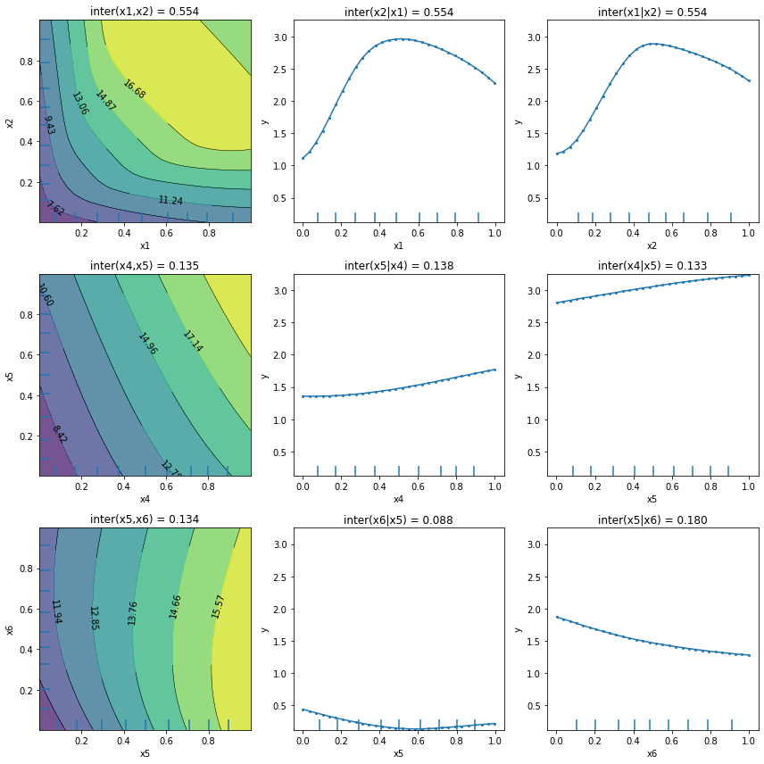

# PartialDependenceVariance

[\[source\]](https://github.com/ramonpzg/alibi/blob/rp-alibi-newdocs-dec23/doc/source/api/alibi.explainers.html#alibi.explainers.PartialDependenceVariance)

## Partial Dependence Variance

### Overview

Partial Dependence Variance is a method proposed by [Greenwell et al. (2018)](https://arxiv.org/abs/1805.04755)[\[1\]](partialdependencevariance.md#References) to compute the global feature importance or the feature interaction of a pair of features. As the naming suggests, the feature importance and the feature interactions are summarized in a single positive number given by the variance within the [Partial Dependence (PD)](https://projecteuclid.org/journals/annals-of-statistics/volume-29/issue-5/Greedy-function-approximation-A-gradient-boostingmachine/10.1214/aos/1013203451.full)[\[2, 3\]](partialdependencevariance.md#References) function. Because the computation relies on the `PD`, the method is quite intuitive and easy to comprehend.

To get a better intuition of what the proposed method tries to achieve, let us consider a simple example. Given a trained model on the [Bike rental](http://archive.ics.uci.edu/ml/datasets/Bike+Sharing+Dataset)[\[4\]](partialdependencevariance.md#References) dataset, one can compute the `PD` function for each individual feature. Figure 1 displays the `PD` for 6 out of 11 features:


**Figure 1**. PD plots for Bike rental datasets.\*

From the inspection of the plots, we can observe that temperature (temp), humidity (hum), wind speed (windspeed) have a strong non-linear relationship with the predicted outcome. We can observe that the model prediction increases with temperature till it reaches approx $17^{\circ}C$. Then it flattens at a high number until the weather becomes too hot (i.e., approx. $27^{\circ}C$ ), after which it starts dropping again. The humidity larger than $60%$ seems to be a factor that inhibits the number of rentals, since we can observe a downward trend form that point onward. Finally, a similar analysis can be conducted for speed. As the wind speed increases, fewer and fewer people are riding the bike.

Quite noticeable are the plots in the second row which show a flat response. Naturally, although some heterogeneity can be hidden, one can assume that the features in the second row have a less impact on the model prediction than the others.

Given the arguments above, one can propose a notion of quantifying the importance of a feature based on a measure of flatness of the `PD` function, for which the variance represents a natural and straightforward candidate. Figure 2 displays the global feature importance for the given example using the variance of the `PD` function (left figure) and a model-internal method (i.e., based on impurity because it is a tree ensemble model) (right figure):


**Figure 2**. Feature importance comparison between the PD variance (left) and impurity-based method (right).

As we can observe, the two methods agree on the top most salient features.

**Advantages**:

* the method offers a standardized procedure to quantify the feature importance for any learning algorithm. This contrasts with some internal feature importance notions for some tree-based algorithms such as [Random Forest](https://link.springer.com/article/10.1023/a:1010933404324)[\[5\]](partialdependencevariance.md#References) or [Gradient Boosting](https://www.jstor.org/stable/2699986)[\[6\]](partialdependencevariance.md#References), which have their own way to define the importance of a feature.
* the method operates in the black-box regime (i.e., can be applied to any prediction model).
* the method can be adapted to quantify the strength of potential interaction effects.

**Drawbacks**:

* since the computation of the feature importance is based on the `PD`, the method captures only the main effect of a feature and ignores possible feature interactions. The `PD` plot can be flat as the feature affects the predictions manly through interactions. This is related to the masked heterogeneity.
* the method can fail to detect feature interactions even though those exist (see theoretical overview example below).

### Usage

To initialize the explainer with any black-box model, one can directly pass the prediction function and optionally a list of feature names, a list of target names, and a dictionary of categorical names for interpretation and specification of the categorical features.

```python
from alibi.explainers import PartialDependenceVariance

pd_variance = PartialDependenceVariance(predictor=predictor_fn,
                                        feature_names=feature_names,
                                        categorical_names=categorical_names,
                                        target_names=target_names)

```

Since the `PartialDependenceVariance` uses the `PartialDependence` explainer, it has support for some tree-based `sklearn` models directly, just by passing the model to the `predictor` argument (i.e., `predictor=tree_predictor`, where `tree_predictor` is a specific `sklearn` tree-based model). The rest of the initialization remains the same.

Following the initialization, we can compute two types of explanation for a given dataset `X` with `F` features.

The first type of explanation computes feature importance. To compute the feature importance one has to pass the argument `method='importance'` to the `explain` function. The call should look like:

```python
exp_importance = pd_variance.explain(X=X, method='importance')
```

By default, the explainer will compute the feature importance for all `F` features in the dataset. The feature set for which to compute the importance can be customized through the argument `features` as will be presented later.

The second type of explanation computes feature interaction between pairs of features. To compute the feature interaction, one has to pass the argument `method='interaction'` to the `explain` function. The call should look like:

```python
exp_interaction = pd_variance.explain(X, method='interaction')
```

By default, the explainer will compute the feature importance for all `F x (F - 1)` feature pair combinations from the dataset. As before, the pairs of feature to compute the feature importance for can be customized.

Multiple other arguments can be specified to the `explain` function:

* `X` - A `N x F` tabular dataset used to calculate partial dependence curves. This is typically the training dataset or a representative sample.
* `features` - A list of features for which to compute the feature importance or a list of feature pairs for which to compute the feature interaction. Some example of `features` would be: `[0, 1, 3]`, `[(0, 1), (0, 3), (1, 3)]`, where `0`,`1`, and `3` correspond to the columns 0, 1, and 3 in `X`. If not provided, the feature importance or the feature interaction will be computed for every feature or for every combination of feature pairs, depending on the parameter `method`.
* `method` - Flag to specify whether to compute the feature importance or the feature interaction of the elements provided in `features`. Supported values: `'importance'` | `'interaction'`.
* `percentiles` - Lower and upper percentiles used to limit the feature values to potentially remove outliers from low-density regions. Note that for features with not many data points with large/low values, the PD estimates are less reliable in those extreme regions. The values must be in \[0, 1]. Only used with `grid_resolution`.
* `grid_resolution` - Number of equidistant points to split the range of each target feature. Only applies if the number of unique values of a target feature in the reference dataset `X` is greater than the `grid_resolution` value. For example, consider a case where a feature can take the following values: `[0.1, 0.3, 0.35, 0.351, 0.4, 0.41, 0.44, ..., 0.5, 0.54, 0.56, 0.6, 0.65, 0.7, 0.9]`, and we are not interested in evaluating the marginal effect at every single point as it can become computationally costly (assume hundreds/thousands of points) without providing any additional information for nearby points (e.g., 0.35 and 0.351). By setting `grid_resolution=5`, the marginal effect is computed for the values `[0.1, 0.3, 0.5, 0.7, 0.9]` instead, which is less computationally demanding and can provide similar insights regarding the model's behaviour. Note that the extreme values of the grid can be controlled using the `percentiles` argument.
* `grid_points` - Custom grid points. Must be a `dict` where the keys are the target features indices and the values are monotonically increasing arrays defining the grid points for a numerical feature, and a subset of categorical feature values for a categorical feature. If the `grid_points` are not specified, then the grid will be constructed based on the unique target feature values available in the dataset `X`, or based on the `grid_resolution` and `percentiles` (check `grid_resolution` to see when it applies). For categorical features, the corresponding value in the `grid_points` can be specified either as array of strings or array of integers corresponding the label encodings. Note that the label encoding must match the ordering of the values provided in the `categorical_names`.

The results `exp` is an `Explanation` object which contains the following data-related attributes:

* `feature_values` - A list of arrays or list of arrays containing the evaluation points for each explained feature passed in the `features` argument (see `explain` method).
* `feature_names` - A list of strings or tuples of string containing the names associated with the explained features elements from `feature_values`.
* `feature_deciles` - a list of arrays (one for each numerical features) of the explained feature deciles.
* `pd_values` - a list of arrays of `PD` values (one for each feature/pair of features). Each array has a shape of `T x (V1 x [V2])`, where `T` is the number of target outputs, and `Vi` is the number of evaluation points for the corresponding feature `fi`.
* `feature_importance` - an array of feature importance for each target and for each explained feature. The array has a size of `T X F`, where `T` is the number of targets and `F` is the number of explained features.
* `feature_interaction` - an array of feature interaction for each target and for each explained feature pair. The array has a size of `T x FP`, where `T` is the number of targets and `FP` is the number of explained feature pairs.
* `conditional_importance_values` - a list of tuples of arrays, where each tuple is associated to a feature pair, and each array inside the tuple corresponds to the conditional feature importance when fixing the value of a feature to a constant and letting the other vary. The arrays inside the tuple have the sizes of `T X V1` and `T X V2`, where `T` is the number of targets, and `Vi` is the number of evaluation points corresponding to feature `fi`.
* `conditional_importance` - a list of tuples of number, where each tuple is associated to a feature pair, and each number inside the tuple corresponds to the conditional feature importance (i.e., taking the importance of the arrays returned in the `conditional_importance_values`). Note that the average of the numbers inside the tuple gives the `feature_interaction` for a feature pair.

`Alibi` exposes a utility function to plot a summary of the feature importance and feature interaction, or a more detailed exposition of them.

To plot a summary of the feature interaction, one can simply call the `plot_pd_variance` as follows:

```python
from alibi.explainers import plot_pd_variance
plot_pd_variance(exp=exp_importance)
```

Figure 3 displays the summary of the feature importance as a horizontal bar plot. By default, the features are sorted in descending order (top to bottom) according to their feature importance.


**Figure 3**. Feature importance summary.

To plot a more detailed exposition of the feature importance, one should set the `summarise=False` flag in the `plot_pd_variance` function. The call should look like:

```python
plot_pd_variance(exp=exp_importance, summarise=False)
```

Figure 4 displays the `PD` plots for the explained features. By default the plots are sorted in descending order (left to right, top to bottom) according to their feature importance:


**Figure 4**. Detailed feature importance plots.

To plot the summary for the feature interaction, we follow the same steps from above:

```python
plot_pd_variance(exp=exp_interaction)
```

As before, in Figure 5, the feature interaction is plotted as a horizontal bar plot, sorted in descending order according to the feature interaction.


**Figure 5**. Feature interaction summary.

To plot the more detailed exposition of the feature interaction, we pass, as before, the flag `summarise=False` to the `plot_pd_variance`. It is recommended that the number of axes columns to be divisible by 3 for visualization purposes (see Figure 6).

```python
plot_pd_variance(exp=exp_interaction, summarise=False, n_cols=3).
```



**Figure 6**. Detailed feature interaction plots.

Note that in this case, for each feature pair, the plots display the 2-way `PD` function and the two conditional importance plots for each individual feature. By default, the three plots groups are sorted in descending order according to their feature interaction strength.

### Theoretical exposition

We split the theoretical exposition in two parts, the first one covering the feature importance and the second one covering the feature interaction.

#### Feature importance

Following the notation from the [Partial Dependence exposition](https://docs.seldon.io/projects/alibi/en/stable/methods/PartialDependence.html#Theoretical-exposition), we say that any variable with a flat `PD` plot is likely to be less important than those for which the `PD` plot varies across a wider range. This notion of variable importance is based on a measure of the flatness of the `PD` function which can be generally stated as:

$$
i(x_S) = F(f_{S}(x_S)),
$$

where $F(\cdot)$ is any measure of the "flatness" for the `PD` of the variables $S$.

[Greenwell et al. (2018)](https://arxiv.org/abs/1805.04755)[\[1\]](partialdependencevariance.md#References) proposed to measure the "flatness" as the sample standard deviation for continuous features and the range statistic divided by four for the categorical features. Note that the range divided by four is an estimate of the standard deviation for a small sample size. Formally, those statistics are defined as:

\begin{equation} i(x\_1) = \begin{cases} \sqrt{\frac{1}{k-1}\sum\_{i=1}^{k}\[f\_{1}(x\_{1i}) - \frac{1}{k}\sum\_{j=1}^{k}f\_{1}(x\_{1i})]^2} \text{, if } x\_{1} \text{ is continuous} \ \[\max\_{i}(f\_{1}(x\_{1i})) - \min\_{i}(f\_{1}(x\_{1i}))] / 4 \text{, if } {x\_1} \text{ is categorical} \end{cases} \end{equation}

**Connection to t-statistic**

Although the choice of computing the variance of the `PD` can be motivated intuitively, one can justify it more rigorously by considering a linear model as follows:

$$
Y = \beta_0 + \beta_1 X_1 + \beta_2 X_2 + ... + \beta_p X_p + \epsilon
$$

where $\beta\_i$, $i = 1, ..., p$ are the regression coefficients and $\epsilon \sim \mathcal{N}(0, \sigma^2)$.

To test the significance of a regression coefficient for a least squares problem, one can apply the [t-test](https://en.wikipedia.org/wiki/Student's_t-test). For that, one has to compute the [t-statistic](https://en.wikipedia.org/wiki/T-statistic) given by:

$$
\text{t-statistic} = \frac{\hat\beta_i - \beta_{H_0}}{s.e.(\hat\beta_i)},
$$

where $\hat\beta\_i$ is an estimate of $\beta\_i$, $\beta\_{H\_0}$ is the value under the null hypothesis, and $s.e.$ is the standard error.

If we set $\beta\_{H\_0} = 0$, then the t-statistic is given by:

$$
\text{t-statistic} = \frac{\hat\beta_i}{s.e.(\beta_i)}.
$$

For completeness, we will provide a sketch of the derivation of the t-statistic for the least squares problem. Using the matrix notation, we can rewrite the least squares problem as follows:

$$
\hat\beta = \arg\min_{\beta \in \mathbb{R}^p} \| Y - X \beta \|_{2}^2,
$$

where $Y$ is the target variable. The least squares solution of the equation above is given by:

$$
\hat\beta = (X^TX)^{-1}X^TY.
$$

Under the assumption that the true model is given by $Y = X\beta + \epsilon$, we can infer the distribution of $\hat\beta$:

$$
\hat\beta = (X^TX)^{-1}X^T(X\beta + \epsilon) = \beta + (X^TX)^{-1}X^T\epsilon.
$$

From the equation above, one can conclude that $\hat\beta - \beta \sim \mathcal{N}(0, \sigma^2(X^TX)^{-1})$. Knowing that $\hat\beta - \beta$ has a multivariate normal distribution, we can look at the diagonal entrance and obtain that $\hat\beta\_i - \beta\_i \sim \mathcal{N}(0, \sigma^2 S\_{ii})$, where $S\_{ii}$ is the i-th diagonal entrance on of the matrix $(X^TX)^{-1}$. The last statement implies that:

$$
z_i = \frac{\hat\beta_i - \beta_i}{\sqrt{\sigma^2 S_{ii}}} \sim \mathcal{N}(0, 1).
$$

Let us denote by $\hat\epsilon = (I - X(X^TX)^{-1}X^T)Y$ the residuals, and $s^2 = \frac{\hat\epsilon^T\hat\epsilon}{n-p}$ be an [unbiased estimate](https://en.wikipedia.org/wiki/Ordinary_least_squares#Estimation) of $\sigma^2$. One can show that:

$$
V = \frac{(n-p)s^2}{\sigma^2} \sim \chi_{n-p}^{2}.
$$

Given that $z\_i \sim \mathcal{N}(0, 1)$ and $V \sim \chi\_{n-p}^2$, we can conclude that $t\_i = \frac{z\_i}{\sqrt{V / (n -p)\}}$ is characterized by a t-student distribution with $n-p$ degrees of freedom. With some simple algebraic manipulation, one can show that $t\_i = \frac{\hat{\beta}\_i - \beta\_i}{s.e.(\hat{\beta}\_i)}$ as follows:

$$
t_i = \frac{\frac{\hat\beta_i - \beta_i}{\sqrt{\sigma^2 S_{ii}}}}{\sqrt{\frac{(n-p)s^2}{\sigma^2} / (n-p)}} = \frac{\frac{\hat\beta_i - \beta_i}{\sqrt{S_{ii}}}}{\sqrt{s^2}} = \frac{\hat\beta_i - \beta_i}{\sqrt{s^2 S_{ii}}} = \frac{\hat\beta_i - \beta_i}{s.e.(\hat\beta_i)}
$$

For a more detailed derivation of the results above, see [this page](https://stats.stackexchange.com/a/117422).

To see exactly the connection between the Partial Dependence Variance feature importance and the t-statistic, we consider the following example also presented in [Greenwell et al. (2018)](https://arxiv.org/abs/1805.04755)[\[1\]](partialdependencevariance.md#References). Consider the linear model:

$$
Y = \hat\beta_0 + \hat\beta X_1 + \hat\beta X_2
$$

where $\hat\beta\_0, \hat\beta\_1, \hat\beta\_2$ are constants, $X\_1$ and $X\_2$ are both independent $\text{Uniform}\[0, 1]$. Since the distributions of $X\_1$ and $X\_2$ are known, one can compute the exact `PD` $f\_i(X\_i)$. For example, $f\_1(X\_1) = \int\_{0}^{1} \mathbb{E}\[Y | X\_1, X\_2] p(X\_2)dX\_2$, where $p(X\_2) = 1$. After simple calculus, one obtains:

$$
f_1(X_1) = \hat\beta_0 + \frac{\hat\beta_2}{2} + \hat\beta_1 X_1 \text{ and } f_2(X_2) = \hat\beta_0 + \frac{\hat\beta_1}{2} + \hat\beta_2 X_2.
$$

Computing the variance for each `PD` function above, gives us:

$$
\mathbb{V}[f_1(X_1)] = \frac{\hat\beta_{1}^{2}}{12} \text{ and } \mathbb{V}[f_2(X_2)] = \frac{\hat\beta_{2}^{2}}{12}
$$

which implies that the standard deviation is given by $\frac{\lvert \hat\beta\_1 \rvert}{\sqrt{12\}}$ and $\frac{\vert \hat\beta\_2 \rvert}{\sqrt{12\}}$, respectively.

On the other hand, the two-tailed t-statistic is given by:

$$
t_1 = \frac{\lvert \hat\beta_1 \rvert}{\sqrt{s^2 S_{11}}} = \frac{\lvert \hat\beta_1 \rvert}{\sqrt{12 s^2}} \text{ and } t_2 = \frac{\lvert \hat\beta_2 \rvert}{\sqrt{s^2 S_{22}}} = \frac{\lvert \hat\beta_2 \rvert}{\sqrt{12 s^2}}
$$

which matches the Partial Dependence Variance up to a proportionality constant. Thus, the variance of the `PD` measures the significance of each regression coefficient and orders them accordingly. In other words, the most important features will correspond to the ones with the most significant p-values.

#### Feature interaction

[Greenwell et al. (2018)](https://arxiv.org/abs/1805.04755)[\[1\]](partialdependencevariance.md#References) also proposed to use the `PD` to measure the feature interaction of two given features. Let $SD(X\_i, X\_j)$, with $i \neq j$, be the standard deviation of the joint `PD` values $f\_{ij}(X\_{ii^\prime}, X\_{jj^\prime})$, for $i^\prime = 1, 2, ..., k\_i$ and $j^\prime = 1, 2, ..., k\_j$. The intuition proposed by the authors is that a weak interaction effect between $X\_i$ and $X\_j$ on the response $Y$ would suggest that importance $i(X\_i, X\_j)$ has little variance when either $X\_i$ or $X\_j$ is held constant and the other varies.

The computation of the feature interaction is straightforward. Consider any two features $(X\_i, X\_j)$, $i \neq j$. We construct the `PD` function $f\_{ij}(X\_i, X\_j)$ and compute the feature importance of $X\_i$ while keeping $X\_j$ constant, for all values of $X\_j$. We denote it by $SD(X\_i | X\_j)$. Following that, we take the standard deviation of the resulting importance scores across all values of $X\_j$. We denote the latter quantity as $i(X\_i | X\_j)$. Similarly, we compute $i(X\_j | X\_i)$. To compute the feature interaction, one simply averages the two results. A large values will indicate a possible feature interaction.

Although the results reported by [Greenwell et al. (2018)](https://arxiv.org/abs/1805.04755)[\[1\]](partialdependencevariance.md#References) seem encouraging, the authors do not offer a rigorous justification for their proposal which makes the method to appear rather heuristic. In the following paragraphs, we provide through concrete examples some arguments on why the method can capture feature interactions and which are some failure cases.

Consider the following function of two variables, $f: \[0, 1] \rightarrow \mathbb{R}$, $f(X\_1, X\_2) = X\_1 + X\_2 + X\_1 X\_2$. Due to its simplistic form, one might be tempted to eyeball the decomposition of the function in three terms: a main effect of $X\_1$ given by $f\_1(X\_1)$, a main effect of $X\_2$ given by $f\_2(X\_2)$, and an interaction term between $(X\_1, X\_2)$ given by $f\_3(X\_1, X\_2) = X\_1 X\_2$. Although this can be a valid function decomposition within an axiomatic framework, it is not the case for the `PD`. This is because in the `PD` case the term $X\_1 X\_2$ does not only contain a feature interaction between $X\_1$ and $X\_2$, but also contains a fraction of their main effects.

To understand why $X\_1 X\_2$ contains also a fraction of the main effects of $X\_1$ and $X\_2$, we first provide an intuitive view of what the main effect consists when using the `PD` functions. Informally, one can think of the main effect of a feature in the `PD` context as how well w.r.t. the mean squared error (MSE) one can approximate $f(X\_1, X\_2)$ by only having access to the feature $X\_1$. In our case we can analyze the three terms:

* $f\_1(X\_1) = X\_1$ is straightforward. Since we have access to the feature $X\_1$, we can approximate the function exactly.
* $f\_2(X\_2) = X\_2$ is also relatively easy. Since we only have access to $X\_1$ and because $f\_2(X\_2)$ does not depend on $X\_1$, the best we can do is to approximate it with a constant. The constant that we choose is dependent of the objective we want to minimize. For MSE, the constant is given by $\mathbb{E}\[f\_2(X\_2)]$, where the expectation is taken w.r.t. the marginal of $X\_2$.
* $f\_3(X\_1, X\_2) = X\_1 X\_2$ is a bit more challenging. As mentioned before, one might be tempted to say that $f\_3$ describes only the feature interaction between $X\_1$ and $X\_2$, but given our `PD` approach, this is not the case. This is because in the `PD` context, the $f\_3$ contains also a fractions of the main effects of $X\_1$ and $X\_2$.

We now elaborate more on the third bullet point. To intuitively see why this is the case, let us fix the value $X\_1=0.2$ and inspect $f\_3(0.2, X\_2)$ by varying $X\_2$ (see Figure 7(a)).


**Figure 7**. Conditional `PD` estimation steps.

Having no access to $X\_2$, the best we can predict $f\_3(X\_1, X\_2)$ based only on $X\_1 = 0.2$ w.r.t. the MSE, is to predict the average response of $f\_3(0.2, X\_2)$ over the marginal of $X\_2$. Formally, the value is given by $\mathbb{E}\_{X\_2}\[f\_3(0.2, X\_2)]$. This is depicted by the green line in Figure 7(b).

The residuals (i.e. what we cannot predict) are given by $f\_3(0.2, X\_2) - \mathbb{E}\[f\_3(0.2, X\_2)]$, displayed in red in Figure 7(c).

The residuals/errors can be attributed to the following:

* either to a fraction from the main effect of $X\_2$.
* either to the interaction between $X\_1$ and $X\_2$.
* or a combination of both.

Intuitively, we would conclude that we do not have any feature interaction between $X\_1$ and $X\_2$ if for any value of $X\_1 = c$, we obtain the same error patterns. In this case, the errors would only be a result from a fraction of the main effect of $X\_2$. Figure 8 displays the two scenarios, without and with feature interaction.


**Figure 8**. Conditional `PD` estimation error patterns. The first row displays error patterns when there is no interaction (i.e., the interaction term is removed). The second row displays error pattern when there is interaction.

We now come back to [Greenwell et al. (2018)](https://arxiv.org/abs/1805.04755)[\[1\]](partialdependencevariance.md#References) proposal on how to measure the feature interaction. For feature $X\_1$, the first step is to compute the standard deviation of the `PD` along the $X\_2$ axis when $X\_1$ is held constant. This is equivalent of computing the root mean squared error (i.e., corresponds to the red lines above). This first step can quantify whether there is some effect we are missing just by using $X\_1$, which we can attribute to either a fraction from the main effect of $X\_2$ or to the interaction between $X\_1$ and $X\_2$ (we still do not know to which one we should attribute). We repeat the same step for every value of $X\_1$. Having all the standard deviations for every value of $X\_{1i}$ (i.e., $SD\_{X\_2}(X\_2 | X\_{1i})$, we compute the standard deviation along the $X\_1$, $i(X\_1 | X\_2) = SD\_{X\_1}\[SD\_{X\_2}(X\_2 | X\_{1})]$. This step is necessary (but not sufficient) to check whether the variance in the error is attributed to the fraction from the main effect of $X\_2$ or to the feature interaction between $X\_1$ and $X\_2$. Note that if the standard deviation $i(X\_1 | X\_2) = SD\_{X\_1}\[SD(X\_2 | X\_1)] = 0$, it means that we have the same variance along the $X\_2$ for every value $X\_{1i}$. This might happen for multiple reasons, but one reason can be if we encounter the same error pattern when we condition on every $X\_{1i}$. If that happens then it means that there is no feature interaction and all the error is attributed to a fraction of the main effect of $X\_2$.

One simple example for which the method fails to capture the feature interaction is for $f:\[-1, 1] \times \[-1, 1] \rightarrow \mathbb{R}$, $f(X\_1, X\_2) = \mathbb{1}(X\_1 X\_2 > 0)$. In this case the variance is the same when keeping $X\_1$ or $X\_2$ constant, but the error patterns differ depending on their sign. The `PD` and the conditional importances are displayed in Figure 9:


**Figure 9**. Feature interaction failure case.

Although there is clear interaction between $X\_1$ and $X\_2$, the method fails to detect it because the variance along the $X\_1$ and $X\_2$ axis is the same.

### Examples

[Partial Dependence Variance, regression example (Friedman's regression problem)](https://github.com/ramonpzg/alibi/blob/rp-alibi-newdocs-dec23/doc/source/examples/pd_variance_regression_friedman.ipynb)

### References

[\[1\]](partialdependencevariance.md#source_1) Greenwell, Brandon M., Bradley C. Boehmke, and Andrew J. McCarthy. "A simple and effective model-based variable importance measure." arXiv preprint arXiv:1805.04755 (2018).

[\[2\]](partialdependencevariance.md#source_2) Friedman, Jerome H. "Greedy function approximation: a gradient boosting machine." Annals of statistics (2001): 1189-1232.

[\[3\]](partialdependencevariance.md#source_3) Molnar, Christoph. Interpretable machine learning. Lulu. com, 2020.

[\[4\]](partialdependencevariance.md#source_4) Fanaee-T, Hadi, and Gama, Joao, 'Event labeling combining ensemble detectors and background knowledge', Progress in Artificial Intelligence (2013): pp. 1-15, Springer Berlin Heidelberg.

[\[5\]](partialdependencevariance.md#source_5) Breiman, Leo. "Random forests." Machine learning 45.1 (2001): 5-32.

[\[6\]](partialdependencevariance.md#source_6) Friedman, Jerome H. "Greedy function approximation: a gradient boosting machine." Annals of statistics (2001): 1189-1232.
