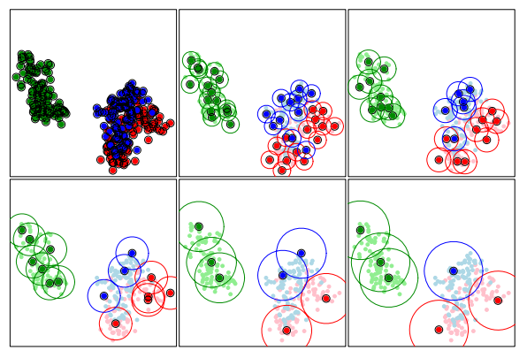
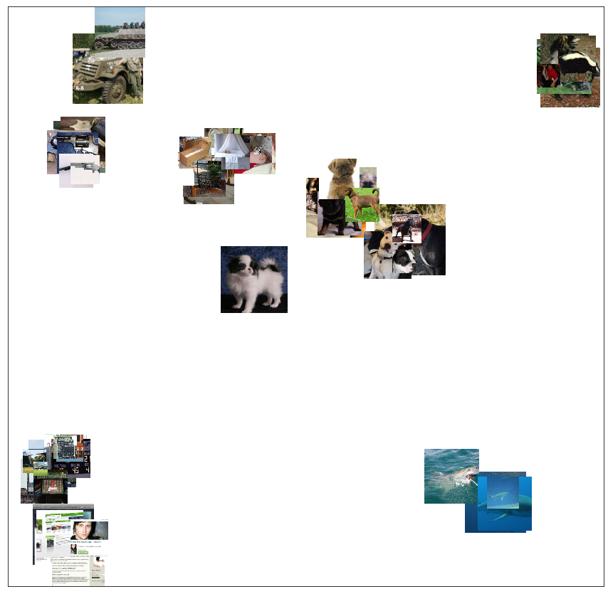

# ProtoSelect

[\[source\]](https://github.com/ramonpzg/alibi/blob/rp-alibi-newdocs-dec23/doc/source/api/alibi.prototypes.html#alibi.prototypes.ProtoSelect)

## ProtoSelect

### Overview

[Bien and Tibshirani (2012)](https://arxiv.org/abs/1202.5933) proposed ProtoSelect, which is a prototype selection method with the goal of constructing not only a condensed view of a dataset but also an interpretable model (applicable to classification only). Prototypes can be defined as instances that are representative of the entire training data distribution. Formally, consider a dataset of training points $\mathcal{X} = {x\_1, ..., x\_n } \subset \mathbf{R}^p$ and their corresponding labels $\mathcal{Y} = {y\_1, ..., y\_n}$, where $y\_i \in {1, 2, ..., L}$. ProtoSelect finds sets $\mathcal{P}\_{l} \subseteq \mathcal{X}$ for each class $l$ such that the set union of $\mathcal{P}\_1, \mathcal{P}\_2, ..., \mathcal{P}\_L$ would provided a distilled view of the training dataset $(\mathcal{X}, \mathcal{Y})$.

Given the sets of prototypes, one can construct a simple interpretable classifier given by:

$$
\hat{c}(x) = \underset{l}{\operatorname{argmin}} \min_{z \in \mathcal{P}_l} d(x, z)
$$

Note that the classifier defined in the equation above would be equivalent to 1-KNN if each set $\mathcal{P}\_l$ would consist only of instances belonging to class $l$.

### ProtoSelect method

ProtoSelect is designed such that each prototype would satisfy a set of desired properties. For a set $\mathcal{P}\_l \subseteq \mathcal{X}$, the neighborhood of a point $x\_i \in \mathcal{P}\_l$ is given by the points contained in an $\epsilon$-ball centered in $x\_i$, denoted as $B(x\_i, \epsilon)$. Thus, given a radius $\epsilon$ for a point $x\_i$, we say that another point $x\_j$ is covered by $x\_i$ if $x\_j$ is contained in the $\epsilon$-ball centered on $x\_i$. A visualization of the prototypes sets for various $\epsilon$ radius values are depicted in the following figure:



Bien and Tibshirani, _PROTOTYPE SELECTION FOR INTERPRETABLE CLASSIFICATION_, 2012

A desirable prototype set for a class $l$ would satisfy the following properties:

* cover as many training points as possible of the class $l$.
* covers as few training points as possible of classes different from $l$.
* is sparse (i.e., contains as few prototypes instances as possible).

Formally, let us first define $\alpha\_{j}^{(l)} \in {0, 1}$ to indicate whether we select $x\_j$ to be in $\mathcal{P}\_l$. Then we can write the three properties as an [integer program](https://en.wikipedia.org/wiki/Integer_programming) as follows:

\begin{equation} \min\_{\alpha\_{j}^{(l)}, \xi\_{i}, \nu\_{i\}} \sum\_{i}{\xi\_i} + \sum\_{i}{\nu\_i} + \lambda \sum\_{j, l}\alpha\_{j}^{(l)} \text{ such that} \end{equation}

\begin{equation} \sum\_{j: x\_i \in B(x\_j, \epsilon)} \alpha\_{j}^{(y\_i)} \ge 1 - \xi\_i, \forall x\_i \in \mathcal{X}, \tag{a} \end{equation}

\begin{equation} \sum\_{j: x\_i \in B(x\_j, \epsilon), l \neq y\_i} \alpha\_{j}^{(l)} \le 0 + \nu\_i, \forall x\_i \in \mathcal{X}, \tag{b} \end{equation}

\begin{equation} \alpha\_{j}^{l} \in {0, 1} \forall j, l, \end{equation}

\begin{equation} \xi\_i, \nu\_i \ge 0. \end{equation}

For each training point $x\_i$, we introduce the slack variables $\xi\_i$ and $\nu\_i$. Before explaining the two constraints, note that $\sum\_{j: x\_i \in B(x\_j, \epsilon)} \alpha\_{j}^{(l)}$ counts the number of balls $B(x\_j, \epsilon)$ with $x\_j \in \mathcal{P}\_l$ that cover the point $x\_i$. The constraint (a) tries to encourage that for each training point $(x\_i, y\_i)$, $x\_i$ is covered in at least one $\epsilon$-ball of a prototype for the class $y\_i$. On the other hand, the constraint (b) tries to encourage that $x\_i$ will not belong to any $\epsilon$-ball centered in a prototype for the other classes $l \ne y\_i$.

Because the integer program defined above cannot be solved in polynomial time, the authors propose two alternative solution. The first one consists of a relaxation of the objective and a transformation of the integer program into a linear program, for which post-processing is required to ensure feasibility of the solution. We refer the reader to the [paper](https://arxiv.org/abs/1202.5933) for more details. The second one, recommended and implemented in _Alibi_, follows a greedy approach. Given the current choice of prototypes subsets $(\mathcal{P}\_1, ..., \mathcal{P}\_L)$, in the next iteration we update it to $(\mathcal{P}_1, ..., \mathcal{P}_{l} \cup {x\_j}, ..., \mathcal{P}\_L)$, where $x\_j$ is selected such that it maximizes the objective $\Delta Obj(x\_j, l) = \Delta \xi(x\_j,l) - \Delta\nu(x\_j, l) - \lambda$, where:

\begin{equation} \Delta \xi(x\_j, l) = \lvert \mathcal{X}_l \cap (B(x\_j, \epsilon) \setminus \cup_{x\_{j^\prime} \in \mathcal{P}_l}B(x_{j^\prime}, \epsilon)) \rvert \tag{a} \end{equation}

\begin{equation} \Delta \nu(x\_j, l) = \lvert B(x\_j, \epsilon) \cap (\mathcal{X} \setminus \mathcal{X}\_l) \rvert \tag{b}. \end{equation}

Note that $\Delta \xi(x\_j, l)$ counts the number of new instances (i.e. not already covered by the existing prototypes) belonging to class $l$ that $x\_j$ covers in the $\epsilon$-ball. On the other hand, $\Delta \nu(x\_j, l)$ counts how many instances belonging to a different class than $l$ the $x\_j$ element covers. Finally, $\lambda$ is the penalty/cost of adding a new prototypes encouraging sparsity (lower number of prototypes). Intuitively, a good prototype for a class $l$ will cover as many new instances belonging to class $l$ (i.e. maximize $\Delta \xi(x\_j, l)$) and avoid covering elements outside the class $l$ (i.e. minimize $\Delta \nu(x\_j, l)$). The prototype selection algorithm stops when all $\Delta Obj(x\_j, l)$ are lower than 0.

### Usage

```python
from alibi.prototypes import ProtoSelect
from alibi.utils.kernel import EuclideanDistance

summariser = ProtoSelect(kernel_distance=EuclideanDistance(), eps=eps, preprocess_fn=preprocess_fn)

```

* `kernel_distance`: Kernel distance to be used. Expected to support computation in batches. Given an input $x$ of size $N\_x \times f\_1 \times f\_2 \times \dotso$ and an input $y$ of size $N\_y \times f\_1 \times f\_2 \times \dotso$, the kernel distance should return a kernel matrix of size $N\_x \times N\_y$.
* `eps`: Epsilon ball size.
* `lambda_penalty`: Penalty for each prototype. Encourages a lower number of prototypes to be selected. Corresponds to $\lambda$ in the paper's notation. If not specified, the default value is set to `1 / N`, where `N` is the size of the dataset to choose the prototype instances from, passed to the [fit](https://docs.seldon.io/projects/alibi/en/stable/api/alibi.prototypes.protoselect.html#alibi.prototypes.protoselect.ProtoSelect.fit) method.
* `batch_size`: Batch size to be used for kernel matrix computation.
* `preprocess_fn`: Preprocessing function used for kernel matrix computation. The preprocessing function takes the input in a `list` or a `numpy` array and transforms it into a `numpy` array which is then fed to the `kernel_distance` function. The use of `preprocess_fn` allows the method to be applied to any data modality.
* `verbose`: Whether to display progression bar while computing prototype points.

Following the initialization, we need to fit the `summariser`.

```python
summariser = summariser.fit(X=X_train, y=y_train)
```

* `X`: Dataset to be summarised.
* `y`: Labels of the dataset `X`. The labels are expected to be represented as integers `[0, 1, ..., L-1]`, where `L` is the number of classes in the dataset `X`.

In a more general case, we can specify an optional dataset $Z$ to choose the prototypes from (see the documentation of the [fit](https://docs.seldon.io/projects/alibi/en/stable/api/alibi.prototypes.protoselect.html#alibi.prototypes.protoselect.ProtoSelect.fit) method). In this scenario, the dataset to be summarised is still $X$, but it is summarised by prototypes belonging to the dataset $Z$. Furthermore, note that we only need to specify the labels for the $X$ set through $y$, but not for $Z$. In case the labels $y$ are missing, the method implicitly assumes that all the instances belong to the same class. This means that the second term in the objective, $\Delta\nu(x\_j, l)$, will be 0. Thus, the algorithm will try to find prototypes that cover as many data instances as possible, with minimum overlap between their corresponding $\epsilon$-balls.

Finally, we can obtain a summary by requesting the maximum number of prototypes to be returned:

```python
summary = summariser.summarise(num_prototypes=num_prototypes)
```

* `num_prototypes`: Maximum number of prototypes to be selected.

As we previously mentioned, the algorithm stops when the objective is less than 0, for all the remaining instances in the set of potential prototypes. This means that the algorithm can return a lower number of prototypes than the one requested.

Another important observation is that the summary returns the prototypes with their corresponding labels although no labels were provided for $Z$. This is possible since each prototype $z$ will belong to a prototype set $\mathcal{P}\_l$, and thus we can assign a label $l$ to $z$. Following the summarisation step, one can train an interpretable 1-KNN classifier on the returned prototypes even for an unlabeled dataset $Z$.

Warning

If the optional argument $Z$ is not provided, it is automatically set to $X$. Although the labels of the data instances belonging to $Z$ are available in this case, the dataset $Z$ is still viewed as an unlabeled dataset. This means that a prototype $z\_i \in Z$ belonging to the class $l$ according to the labels $y$, can be a prototype for a class $k \ne l$.

### Hyperparameter selection

_Alibi_ exposes a cross-validation hyperparameter selection method for the radius $\epsilon$ when the Euclidean distance is used. The method returns the $\epsilon$ radius value that achieves the best accuracy score on a 1-KNN classification task.

```python
from alibi.prototypes.protoselect import cv_protoselect_euclidean

cv = cv_protoselect_euclidean(trainset=(X_train, y_train),
                              valset=(X_val, y_val),
                              num_prototypes=num_prototypes,
                              quantiles=(0., 0.4),
                              preprocess_fn=preprocess_fn)
```

The method API is flexible and allows for various arguments to be passed such as a predefined $\epsilon$-grid, the number of equidistant bins, keyword arguments to the `KFold` split when the validation set is not provided, etc. We refer the reader to the [documentation page](https://docs.seldon.io/projects/alibi/en/stable/api/alibi.prototypes.protoselect.html#alibi.prototypes.protoselect.cv_protoselect_euclidean) for a full parameter description.

The best $\epsilon$-radius can be access through `cv['best_eps']`. The object also contains other metadata gathered throughout the hyperparameter search.

### Data modalities

The method can be applied to any data modality by passing the `preprocess_fn: Callable[[Union[list, np.ndarray]], np.ndarray]` expected to return a `numpy` array feature representation compatible with the kernel provided.

### Prototypes visualization for image modality

As proposed by [Bien and Tibshirani (2012)](https://arxiv.org/pdf/1202.5933.pdf), one can visualize and understand the importance of a prototype in a 2D image scatter plot. To obtain the image size of each prototype, we fit a 1-KNN classifier on the prototypes using the feature representation provided by `preprocess_fn` and the Euclidean distance metric, which is consistent with our choice of kernel dissimilarity. The size of each prototype is proportional to the logarithm of the number of assigned training instances correctly classified according to the 1-KNN classifier. Thus, the larger the image, the more important the prototype is.



Prototypes of a subsampled ImageNet dataset containing 10 classes using a ResNet50 pretrained feature extractor.

```python
import umap
from alibi.prototypes import visualize_prototypes

# define 2D reducer
reducer = umap.UMAP(random_state=26)
reducer = reducer.fit(preprocess_fn(X_train))

# display prototypes in 2D
visualize_image_prototypes(summary=summary,
                           trainset=(X_train, y_train),
                           reducer=reducer.transform,
                           preprocess_fn=preprocess_fn)
```

* `summary`: An `Explanation` object produced by a call to the [summarise](https://docs.seldon.io/projects/alibi/en/stable/api/alibi.prototypes.protoselect.html#alibi.prototypes.protoselect.ProtoSelect.summarise) method.
* `trainset`: Tuple, `(X_train, y_train)`, consisting of the training data instances with the corresponding labels.
* `reducer`: 2D reducer. Reduces the input feature representation to 2D. Note that the reducer operates directly on the input instances if `preprocess_fn=None`. If the `preprocess_fn` is specified, the reducer will be called on the feature representation obtained after calling `preprocess_fn` on the input instances.
* `preprocess_fn`: Preprocessor function.

Here we used a [UMAP](https://arxiv.org/abs/1802.03426) 2D reducer, but any other dimensionality reduction method will do. The `visualize_image_prototypes` method exposes other arguments to control how the images will be displayed. We refer the reader to the [documentation page](https://docs.seldon.io/projects/alibi/en/stable/api/alibi.prototypes.protoselect.html#alibi.prototypes.protoselect.visualize_prototypes) for further details.

### Examples

[Tabular and image datasets](https://github.com/ramonpzg/alibi/blob/rp-alibi-newdocs-dec23/doc/source/examples/protoselect_adult_cifar10.ipynb)
