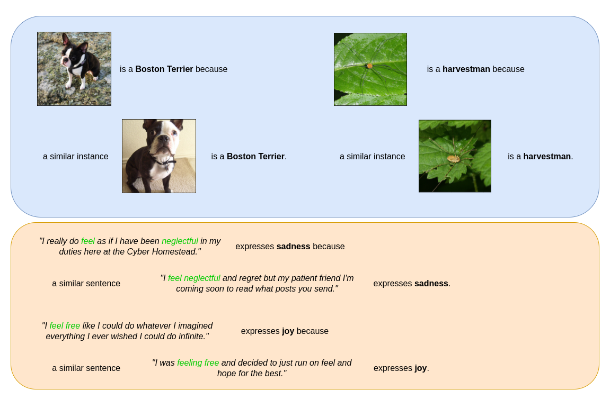
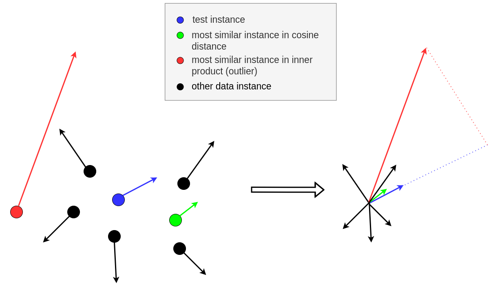

# Similarity

[\[source\]](https://github.com/ramonpzg/alibi/blob/rp-alibi-newdocs-dec23/doc/source/api/alibi.explainers.html#alibi.explainers.GradientSimilarity)

## Similarity explanations

### Overview <a href="#overview" id="overview"></a>

The `GradientSimilarity` class implements an explanation method that belongs to the family of the [similarity-based explanations](https://arxiv.org/abs/2006.04528) methods.

Given an input instance of a machine learning model, similarity-based methods aim to explain the output of the model by finding and presenting instances seen during training that are similar to the given instance. Roughly speaking, an explanation of this type should be interpreted by the user following a rationale of the type: _This_ $X$ _is a_ $Y$ _because a similar instance_ $X^\prime$ _is a_ $Y$.



_Similarity explanations of a ResNet50 model on ImageNet dataset (top) and of a DistilBERT model on Emotions dataset (bottom)._

Various similarity-based methods use different metrics to quantify the similarity between two instances. The `GradientSimilarity` class implements gradients-based metrics, as introduced by [Charpiat et al., 2019](https://papers.nips.cc/paper/2019/hash/c61f571dbd2fb949d3fe5ae1608dd48b-Abstract.html).

#### Theory <a href="#theory" id="theory"></a>

The purpose of gradient-based methods is to define a similarity kernel between two instances that quantify how similar the instances are _according to a model_ trained for a specific task (for example a classifier). In particular, given two instances $z = (x, y)$ and $z^\prime = (x^\prime, y^\prime),$ a model $f\_{\theta}(x)$ parametrized by $\theta$ and a loss function $\mathcal{L}_\theta(z) = \mathcal{L}(f_\theta(x), y)$, we define similarity as the influence of $z$ over $z^\prime$ with respect to the loss function. The similarity quantifies how much an additional parameter's update that changes the loss calculated at $z$ by a certain amount would change the loss calculated at $z^\prime.$

In particular, let us consider the Taylor expansion of the loss function $\mathcal{L}$ at the point $z,$ which reads like:

$$
\mathcal{L}_{\theta + \delta\theta}(z) = \mathcal{L}_\theta(z) + \delta\theta \nabla_\theta \mathcal{L}_\theta(z) + \mathcal{O(||\delta \theta\|^2)}
$$

If we want to change the loss at $z$ by an amount $\epsilon,$ we can do so by changing the model's parameters $\theta$ by an amount $\delta\theta = \epsilon \frac{\nabla\_\theta \mathcal{L}_\theta(z)}{||\nabla_\theta \mathcal{L}\_\theta(z)||^2}$. In fact, by substituting this value in the Taylor expansion above we obtain:

$$
\mathcal{L}_{\theta+\delta\theta} (z)=\mathcal{L}_\theta(z) + \epsilon + \mathcal{O}(|\epsilon|^2)
$$

Now, we would like to measure the impact of such a change of parameters on the loss function calculated at a different point $z^\prime.$ Using Taylor expansion again, the loss at point $z^\prime$ is given by:

$$
\mathcal{L}_{\theta + \delta\theta}(z^\prime) = \mathcal{L}_\theta(z') + \delta\theta \nabla_\theta \mathcal{L}_\theta(z') + \mathcal{O(||\delta \theta\|^2)}
$$

Substituting $\delta\theta = \epsilon \frac{\nabla\_\theta \mathcal{L}_\theta(z)}{||\nabla_\theta \mathcal{L}\_\theta(z)||^2}$ we have

$$
\mathcal{L}_{\theta + \delta\theta}(z') = \mathcal{L}_\theta(z') + \epsilon \frac{\nabla_\theta \mathcal{L}_\theta(z')\cdot\nabla_\theta \mathcal{L}_\theta(z)}{||\nabla_\theta \mathcal{L}_\theta(z)||^2} + \mathcal{O(||\epsilon||^2)}.
$$

In conclusion, the kernel

$$
k_{\theta}(z, z') = \frac{\nabla_\theta \mathcal{L}_\theta(z')\cdot\nabla_\theta \mathcal{L}_\theta(z)}{||\nabla_\theta \mathcal{L}_\theta(z)||^2}
$$

quantifies how much the loss function at point $z'$ has changed after a parameters' update that has changed the loss at point $z$ by an amount $\epsilon.$ It represents the influence that the point $z$ has over the point $z'$ with respect to the loss function.

Based on this kernel, which is not symmetric, the original paper suggests two symmetric alternatives:

$$
k_{\theta}(z, z') = \frac{\nabla_\theta \mathcal{L}_\theta(z')\cdot\nabla_\theta \mathcal{L}_\theta(z)}{||\nabla_\theta \mathcal{L}_\theta(z')||||\nabla_\theta \mathcal{L}_\theta(z)||}.
$$

$$
k_{\theta}(z, z') = \nabla_\theta \mathcal{L}_\theta(z')\cdot\nabla_\theta \mathcal{L}_\theta(z).
$$

All the three versions of the kernel are implemented in the `GradientSimilarity` class (see [Usage](similarity.md#usage) section below).

### Usage <a href="#usage" id="usage"></a>

#### Initialization

```python
from alibi.explainers.similarity.grad import GradientSimilarity

model = <YOUR_MODEL>
loss_fn = <YOUR_LOSS_FUNCTION>

explainer = GradientSimilarity(predictor=model,  # your tensorflow or pytorch model.
                               loss_fn=loss_fn,  # your loss_fn. Usually the loss function of your model.
                               sim_fn='grad_dot',  # 'grad_dot', 'grad_cos' or 'grad_asym_dot'.
                               task='classification',  # 'classification' or 'regression'.
                               precompute_grads=False,  # precompute training set gradients in fit step.
                               backend='tensorflow',  # 'tensorflow' or 'pytorch'.
                               device=None,  #  pytorch device. For example 'cpu' or 'cuda'.
                               verbose=False)
```

* `predictor`: The `GradientSimilarity` class provides both a `tensorflow` and a `pytorch` backend, so your predictor can be a model in either of these frameworks. The `backend` argument must be set accordingly.
* `loss_fn`: The loss function $\mathcal{L}(f\_\theta(x), y)$ used to compute the gradients. Usually the loss function used by the model for training, but it can be any function taking as inputs the model's prediction and the labels $y$-s.
*   `sim_fn`: The similarity function used to compute the kernel $k\_{\theta}(z, z').$ `GradientSimilarity` implements 3 kernels:

    * 'grad\_dot', defined as

    $$
    k_{\theta}(z, z') = \nabla_\theta \mathcal{L}_\theta(z')\cdot\nabla_\theta \mathcal{L}_\theta(z).
    $$

    * 'grad\_cos', defined as

    $$
    k_{\theta}(z, z') = \frac{\nabla_\theta \mathcal{L}_\theta(z')\cdot\nabla_\theta \mathcal{L}_\theta(z)}{||\nabla_\theta \mathcal{L}_\theta(z')||||\nabla_\theta \mathcal{L}_\theta(z)||}.
    $$

    * 'grad\_asym\_dot', defined as

    $$
    k_{\theta}(z, z') = \frac{\nabla_\theta \mathcal{L}_\theta(z')\cdot\nabla_\theta \mathcal{L}_\theta(z)}{||\nabla_\theta \mathcal{L}_\theta(z)||^2}.
    $$
* `precompute_grads`: Whether to pre-compute the training set gradients during the fit step or not.
* `backend`: Backend framework. `tensorflow` or `pytorch`.
* `device`: pytorch device. For example `cpu` or `cuda`.

#### Fit

Fitting is straightforward, just passing the training set:

```python
explainer.fit(X_train, y_train)
```

In this step, the dataset and the data input dimensions are stored as attributes of the class. If `precompute_grads=True`, the gradients for all the training instances are computed and stored as attributes.

#### Explanation

We can now explain the instance by running:

```python
explanation = explainer.explain(X, y)
```

* `X`: Test instances to be explained.
* `y`: Target class (optional). This array can contain either a single entrance that is applied for all test instances or multiple entrances, one for each test instance.

The returned explanation is a standard `alibi` explanation class with the following data attributes:

* `scores`: A numpy array with the similarity score for each train instance.
* `ordered_indices`: A numpy array with the indices corresponding to the train instances, ordered from the most similar to the least similar.
* `most_similar`: A numpy array with the 5 most similar instances in the train set.
* `least_similar`: A numpy array with the 5 least similar instances in the train set.

#### Notes on usage

**Fitting and train set**

The `GradientSimilarity` will order the instances passed on the fit step based on the similarity with the instances passed on the explain step, regardless of whether they have been used for training the model or not. In the [examples below](similarity.md#Examples) we downsample the training set by picking a number of random instances in order to speed up the fit step.

Setting `precompute_grads=True` will speed up the computation during the explain step, but the fit step will require considerably more time as the gradients for all the training instances are computed. It could also require a considerable amount of memory for large datasets as all the gradients are stored as attributes of the class instance.

**Similarity metrics**

As reported in [Hanawa et al. (2021)](https://arxiv.org/pdf/2006.04528.pdf), the `grad_dot` metrics fails the identical class test, meaning that not always the most similar instances produced belong to the same class of the instance of interest. On the other hand, it is highly likely that the most similar instances belong to the same class as the instance of interest when the `grad_cos` metric is used. Note that an important feature of the cosine distance is the normalization coefficient which makes the method insensitive to outliers (i.e. instances with large gradient norms) as illustrated in the following figure:



_Left: 2D data instances (circles) and their corresponding gradients (arrows) for a model parametrized by two parameters; Right: gradient comparison._

**Batch explanations**

When a batch of instances is passed to explain, a naive loop over the instances is performed internally and the gradients are calculated one instance at a time. This is due to limitations in the `tensorflow` and `pytorch` backends which automatically aggregate the values of the gradients in a batch.

### Examples <a href="#examples" id="examples"></a>

[Similarity explanation on MNIST](https://github.com/ramonpzg/alibi/blob/rp-alibi-newdocs-dec23/doc/source/examples/similarity_explanations_mnist.ipynb)

[Similarity explanation on ImageNet](https://github.com/ramonpzg/alibi/blob/rp-alibi-newdocs-dec23/doc/source/examples/similarity_explanations_imagenet.ipynb)

[Similarity explanation on 20 news groups](https://github.com/ramonpzg/alibi/blob/rp-alibi-newdocs-dec23/doc/source/examples/similarity_explanations_20ng.ipynb)
