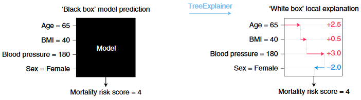
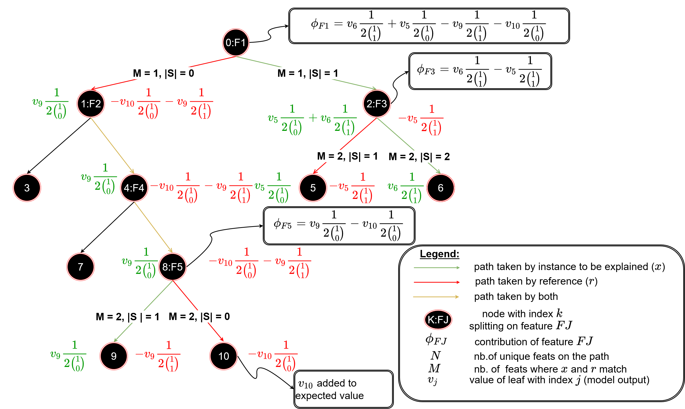

# TreeSHAP

[\[source\]](https://github.com/ramonpzg/alibi/blob/rp-alibi-newdocs-dec23/doc/source/api/alibi.explainers.html#alibi.explainers.TreeShap)

## Tree SHAP

Note

To enable SHAP support, you may need to run:

```bash
pip install alibi[shap]
```

### Overview

The tree SHAP (**SH**apley **A**dditive ex**P**lanations) algorithm is based on the paper [From local explanations to global understanding with explainable AI for trees](https://www.nature.com/articles/s42256-019-0138-9) by Lundberg et al. and builds on the open source [shap library](https://github.com/slundberg/shap) from the paper's first author.

The algorithm provides human interpretable explanations suitable for regression and classification of models with tree structure applied to tabular data. This method is a member of the _additive feature attribution methods_ class; feature attribution refers to the fact that the change of an outcome to be explained (e.g., a class probability in a classification problem) with respect to a _baseline_ (e.g., average prediction probability for that class in the training set) can be attributed in different proportions to the model input features.

A simple illustration of the explanation process is shown in Figure 1. Here we see depicted a tree-based model which takes as an input features such as `Age`, `BMI` or `Blood pressure` and outputs `Mortality risk score`, a continuous value. Let's assume that we aim to explain the difference between and observed outcome and no risk, corresponding to a base value of `0.0`. Using the Tree SHAP algorithm, we attribute the `4.0` difference to the input features. Because the sum of the attribute values equals `output - base value`, this method is _additive_. We can see for example that the `Sex` feature contributes negatively to this prediction whereas the remainder of the features have a positive contribution (i.e., increase the mortality risk). For explaining this particular data point, the `Blood Pressure` feature seems to have the largest effect, and corresponds to an increase in the mortality risk. See our example on how to perform explanations with this algorithm and visualise the results using the `shap` library visualisations [here](https://github.com/ramonpzg/alibi/blob/rp-alibi-newdocs-dec23/doc/source/examples/interventional_tree_shap_adult_xgb.ipynb) and [here](https://github.com/ramonpzg/alibi/blob/rp-alibi-newdocs-dec23/doc/source/examples/path_dependent_tree_shap_adult_xgb.ipynb).



Figure 1: Cartoon ilustration of explanation models with Tree SHAP.

Image Credit: Scott Lundberg (see source [here](https://www.nature.com/articles/s42256-019-0138-9))

### Usage

In order to compute the shap values , the following arguments can optionally be set when calling the `explain` method:

* `interactions`: set to `True` to decompose the shap value of every feature for every example into a main effect and interaction effects
* `approximate`: set to `True` to calculate an approximation to shap values (see our [example](https://github.com/ramonpzg/alibi/blob/rp-alibi-newdocs-dec23/doc/source/examples/path_dependent_tree_shap_adult_xgb.ipynb))
* `check_additivity`: if the explainer is initialised with `model_output = raw` and this option is `True` the explainer checks that the sum of the shap values is equal to model output - expected value
* `tree_limit`: it an `int` is passed, an ensemble formed of only `tree_limit` trees is explained

If the dataset contains categorical variables that have been encoded before being passed to the explainer and a single shap value is desired for each categorical variable, the the following options should be specified:

* `summarise_result`: set to `True`
* `cat_vars_start_idx`: a sequence of integers containing the column indices where categorical variables start. If the feature matrix contains a categorical feature starting at index 0 and one at index 10, then `cat_vars_start_idx=[0, 10]`
* `cat_vars_enc_dim`: a list containing the dimension of the encoded categorical variables. The number of columns specified in this list is summed for each categorical variable starting with the corresponding index in `cat_vars_start_idx`. So if `cat_vars_start_idx=[0, 10]` and `cat_vars_enc_dim=[3, 5]`, then the columns with indices `0, 1` and `2` and `10, 11, 12, 13` and `14` will be combined to return one shap value for each categorical variable, as opposed to `3` and `5`.

#### Path-dependent feature perturbation algorithm

**Initialiastion and fit**

The explainer is initialised with the following agruments:

* a model, which could be an `sklearn`, `xgboost`, `catboost` or `lightgbm` model. Note that some of the models in these packages or models trained with specific objectives may not be supported. In particular, passing raw strings as categorical levels for `catboost` and `lightgbm` is not supported
* `model_output` should always default to `raw` for this algorithm
* optionally, set `task` to `'classification'` or `'regression'` to indicate the type of prediction the model makes. If set to `regression` the `prediction` field of the response is empty
* optionally, a list of feature names via `feature_names`. This is used to provide information about feature importances in the response
* optionally, a dictionary, `category_names`, that maps the columns of the categorical variables to a list of strings representing the names of the categories. This may be used for visualisation in the future.

```python
from alibi.explainers import TreeShap

explainer = TreeShap(
    model, 
    feature_names=['size', 'age'], 
    categorical_names={0: ['S', 'M', 'L', 'XL', 'XXL']}
)
```

For this algorithm, fit is called with no arguments:

```python
explainer.fit()
```

**Explanation**

To explain an instance `X`, we simply pass it to the explain method:

```python
explanation = explainer.explain(X)
```

The returned explanation object has the following fields:

* `explanation.meta`:

```python
{'name': 'TreeShap',
 'type': ['whitebox'],
 'task': 'classification',
 'explanations': ['local', 'global'],
 'params': {'summarise_background': False, 'algorithm': 'tree_path_dependent' ,'kwargs': {}}
}
```

This field contains metadata such as the explainer name and type as well as the type of explanations this method can generate. In this case, the `params` attribute shows the Tree SHAP variant that will be used to explain the model in the `algorithm` attribute.

* `explanation.data`:

```python
data={'shap_values': [
        array([[ 5.0661433e-01,  2.7620478e-02],
       [-4.1725192e+00,  4.4859368e-03],
       [ 4.1338313e-01, -5.5618007e-02]],
      dtype=float32)
    ],
    'shap_interaction_values': [array([], dtype=float64)],
    'expected_value': array([-0.06472124]),
    'model_output': 'raw',
    'categorical_names': {0: ['S', 'M', 'L', 'XL', 'XXL']},
    'feature_names': ['size', 'age'],
    'raw': {
        'raw_prediction': array([-0.73818872, -8.8434663 , -3.24204564]),
        'loss': [],
        'prediction': array([0, 0, 0]),
        'instances': array([[0, 23],
       [4,  55],
       [2,  43]]),
        'labels': array([], dtype=float64),
        'importances': {
            '0': {
                'ranked_effect': array([1.6975055 , 1.3598266], dtype=float32),
                'names': [
                    'size',
                    'age',
                ]
            },
            'aggregated': {
                'ranked_effect': array([1.6975055 , 1.3598266], dtype=float32),
                'names': [
                    'size',
                    'age',
                ]
            }
        }
    }
}
```

This field contains:

* `shap_values`: a list of length equal to the number of model outputs, where each entry is an array of dimension samples x features of shap values. For the example above , 3 instances with 2 features has been explained so the shap values for each class are of dimension 3 x 2
* `shap_interaction_values`: an empty list since this `interactions` was set to `False` in the explain call
* `expected_value`: an array containing expected value for each model output
* `model_output`: `raw` indicates that the model raw output was explained, the only option for the path dependent algorithm
* `feature_names`: a list with the feature names
* `categorical_names`: a mapping of the categorical variables (represented by indices in the shap\_values columns) to the description of the category
* `raw`: this field contains:
  * `raw_prediction`: a samples x n\_outputs array of predictions for each instance to be explained.
  * `prediction`: an array containing the index of the maximum value in the `raw_prediction` array
  * `instances`: a samples x n\_features array of instances which have been explained
  * `labels`: an array containing the labels for the instances to be explained
  * `importances`: a dictionary where each entry is a dictionary containing the sorted average magnitude of the shap value (ranked\_effect) along with a list of feature names corresponding to the re-ordered shap values (names). There are n\_outputs + 1 keys, corresponding to n\_outputs and the aggregated output (obtained by summing all the arrays in shap\_values)

Please see our examples on how to visualise these outputs using the shap library visualisations library visualisations [here](https://github.com/ramonpzg/alibi/blob/rp-alibi-newdocs-dec23/doc/source/examples/interventional_tree_shap_adult_xgb.ipynb) and [here](https://github.com/ramonpzg/alibi/blob/rp-alibi-newdocs-dec23/doc/source/examples/path_dependent_tree_shap_adult_xgb.ipynb).

**Shapley interaction values**

**Initialisation and fit**

Shapley interaction values can only be calculated using the path-dependent feature perturbation algorithm in this release, so no arguments are passed to the `fit` method:

```python
explainer = TreeShap(
    model, 
    model_output='raw',
)

explainer.fit()
```

**Explanation**

To obtain the Shapley interaction values, the `explain` method is called with the option `interactions=True`:

```python
explanation = explainer.explain(X, interactions=True)
```

The explanation contains a list with the shap interaction values for each model output in the `shap_interaction_values` field of the `data` property.

#### Interventional feature perturbation algorithm

**Explaining model output**

**Initialiastion and fit**

```python
explainer = TreeShap(
    model, 
    model_output='raw',
)

explainer.fit(X_reference)
```

Model output can be set to `model_output='probability'` to explain models which return probabilities. Note that this requires the model to be trained with specific objectives. Please the footnote to our path-dependent feature perturbation [example](https://github.com/ramonpzg/alibi/blob/rp-alibi-newdocs-dec23/doc/source/examples/path_dependent_tree_shap_adult_xgb.ipynb) for an example of how to set the model training objective in order to explain probability outputs.

**Explanation**

To explain instances in `X`, the explainer is called as follows:

```python
explanation = explainer.explain(X)
```

**Explaining loss functions**

**Initialisation and fit**

To explain loss function, the following configuration and fit steps are necessary:

```python
explainer = TreeShap(
    model, 
    model_output='log_loss',
)

explainer.fit(X_reference)
```

Only square loss regression objectives and cross-entropy classification objectives are supported in this release.

**Explanation**

Note that the labels need to be passed to the `explain` method in order to obtain the explanation:

```python
explanation = explainer.explain(X, y)
```

#### Miscellaneous

**Runtime considerations**

**Adjusting the size of the reference dataset**

The algorithm automatically warns the user if a background dataset size of more than `1000` samples is passed. If the runtime of an explanation with the original dataset is too large, then the algorithm can automatically subsample the background dataset during the `fit` step. This can be achieve by specifying the fit step as

```python
explainer.fit(
    X_reference,
    summarise_background=True,
    n_background_samples=300,
)
```

or

```python
explainer.fit(
    X_reference,
    summarise_background='auto'
)
```

The `auto` option will select `1000` examples, whereas using the boolean argument allows the user to directly control the size of the reference set. If categorical variables are specified, the algorithm uses subsampling of the data. Otherwise, a kmeans clustering algorithm is used to select the background dataset.

As describe above, the explanations are performed with respect to the expected output over this dataset so the shap values will be affected by the dataset selection. We recommend experimenting with various ways to choose the background dataset before deploying explanations.

### Theoretical overview

Recall that, for a model $f$, the Kernel SHAP algorithm [\[1\]](treeshap.md#References) explains a certain outcome with respect to a chosen reference (or an expected value) by estimating the shap values of each feature $i$ from ${1, ..., M}$, as follows:

* enumerate all subsets $S$ of the set $F \setminus {i}$
* for each $S \subseteq F \setminus {i}$, compute the contribution of feature $i$ as $C(i|S) = f(S \cup {i}) - f(S)$
* compute the shap value according to

\begin{equation}\tag{1} \phi\_i := \frac{1}{M} \sum \limits\_\{{S \subseteq F \setminus {i\}}} \frac{1}{\binom{M - 1}{|S|\}} C(i|S).\
\end{equation}

Since most models do not accept arbitrary patterns of missing values at inference time, $f(S)$ needs to be approximated. The original formulation of the Kernel Shap algorithm [\[1\]](treeshap.md#References) proposes to compute $f(S)$ as the _observational conditional expectation_

\begin{equation}\tag{2} f(S) := \mathbb{E}\left\[f(\mathbf{x}_{S}, \mathbf{X}_{\bar{S\}} | \mathbf{X}\_S = \mathbf{x}\_S) \right] \end{equation}

where the expectation is taken over a _background dataset_, $\mathcal{D}$, after conditioning. Computing this expectation involves drawing sufficiently many samples from $\mathbf{X}\_{\bar{S\}}$ for every sample from $\mathbf{X}\_S$, which is expensive. Instead, $(2)$ is approximated by

$$
f(S) := \mathbb{E} \left[f(\mathbf{x}_{S}, \mathbf{X}_{\bar{S}})\right]
$$

where features in a subset $S$ are fixed and features in $\bar{S}$ are sampled from the background dataset. This quantity is referred to as _marginal_ or _interventional conditional expectation_, to emphasise that setting features in $S$ to the values $\mathbf{x}\_{S}$ can be viewed as an intervention on the instance to be explained.

As described in [\[2\]](treeshap.md#References), if estimating impact of a feature $i$ on the function value by $\mathbb{E} \left\[ f | X\_i = x\_i \right]$, one should bear in mind that observing $X\_i = x\_i$ changes the distribution of the features $X\_{j \neq i}$ if these variables are correlated. Hence, if the conditional expectation if used to estimate $f(S)$, the Shapley values might not be accurate since they also depend on the remaining variables, effect which becomes important if there are strong correlations amongst the independent variables. Furthermore, the authors show that estimating $f(S)$ using the conditional expectation violates the _sensitivity principle_, according to which the Shapley value of a redundant variable should be 0. On the other hand, the intervention breaks the dependencies, ensuring that the sensitivity holds. One potential drawback of this method is that setting a subset of values to certain values without regard to the values of the features in the complement (i.e., $\bar{S}$) can generate instances that are outside the training data distribution, which will affect the model prediction and hence the contributions.

The following sections detail how these methods work and how, unlike Kernel SHAP, compute the exact shap values in polynomial time. The algorithm estimating contributions using interventional expectations is presented, with the remaining sections being dedicated to presenting an approximate algorithm for evaluating the interventional expectation that does not require a background dataset and Shapley interaction values.

#### Interventional feature perturbation

The interventional feature perturbation algorithm provides an efficient way to calculate the expectation $f(S) := \mathbb{E} \left\[f(\mathbf{x}_{S}, \mathbf{X}_{\bar{S\}})\right]$ for all possible subsets $S$, and to combine these values according to equation $(1)$ in order to obtain the Shapley value. Intuitively, one can proceed as follows:

* choose a background sample $r \in \mathcal{D}$
* for each feature $i$, enumerate all subsets $S \subseteq F \setminus {i}$
* for each such subset, $S$, compute $f(S)$ by traversing the tree with a _hybrid sample_ where the features in $\bar{S}$ are replaced by their corresponding values in $r$
* combine results according to equation $(1)$

If $R$ samples from the background distribution are used, then the complexity of this algorithm is $O(RM2^M)$ since we perform $2^M$ enumerations for each of the $M$ features, $R$ times. The key insight into this algorithm is that multiple hybrid samples will end up traversing identical paths and that this can be avoided if the shap values' calculation is reformulated as a summation over the paths in the tree (see [\[4\]](treeshap.md#References) for a proof):

$$
\phi_i = \sum_{P}\phi_{i}^P
$$

where the summation is over paths $P$ in the tree descending from $i$. The value and sign of the contribution of each path descending through a node depends on whether the split from the node is due to a foreground or a background feature, as explained in the practical example below.

**Computing contributions with interventional Tree SHAP: a practical example.**

 Figure 2: Ilustration of the feature contribution and expected value estimation process using interventional perturbation Tree SHAP. The positive and the negative contributions of a node are represented in green and red, respectively.

In the figure above, the paths followed due the instance to be explained $x$ are coloured in red, paths followed due to the background sample in red, and common paths in yellow.

The instance to be explained is perturbed using a reference sample by the values of the features $F1$, $F3$ and $F5$ in $x$ with the corresponding values in $r$. This process gives the name of the algorithm since following the paths indicated by the background sample is akin to intervening on the instance to be explained with features from the background sample. Therefore, one defines the set $F$ in the previous section as $F = { j: x\_{j} \neq r\_{j\}}$ for this case. Note that these are the only features for which one can estimate a contribution given this background sample; the same path is followed for features $F2$ and $F4$ for both the original and the perturbed sample, so these features do not contribute to explain the difference between the observed outcome ($v\_6$) and the outcome that would have been observed if the tree had been traversed according to the reference $(v\_{10})$.

Considering the structure of the tree for the given $x$ and $r$ together with equation $(1)$ reveals that the left subtree can be traversed to compute the negative terms in the summation whereas the right subtree will provide positive terms. This is because the nodes in the left subtree can only be reached if $F1$ takes the value from the background sample, that is, only $F1$ is missing. Because $F2$ and $F4$ do not contribute to explaining $f(x) - f(r)$, the negative contribution of the left subtree will be equal to the negative contribution of node $8$. This node sums two negative components: one when the downstream feature $F5$ is also missing (corresponding to evaluating $f$ at $S = \varnothing$) and one when $F5$ is present (corresponding to evaluating $f$ at $S={F5}$). These negative values are weighted according to the combinatorial factor in equation $(1)$. By a similar reasoning, the nodes in the right subtree are reached only if $F1$ is present and they provide the positive terms for the shap value computation. Note that the combinatorial factor in $(1)$ should be evaluated with $|S| \gets |S| - 1$ for positive contributions since $|S|$ is increased by $1$ because of the feature whose contribution is calculated is present in the right subtree.

A similar reasoning is applied to compute the contributions of the downstream nodes. For example, to estimate the contribution of $F5$, one considers a set $S = \varnothing$ and observes the value of node $10$, and weighs that with the combinatorial factor from equation $(1)$ where $M-1 = 1$ and $|S|=0$ (because there are no features present on the path) and a positive contribution from node $9$ weighted by the same combinatorial factor (because $S = {F5}$ so $|S| - 1 = 0$).

To summarise, the efficient algorithm relies on the following key ideas:

* each node in the tree is assigned a positive contribution reflecting membership of the splitting feature in a subset $S$ and a negative contribution to indicate the feature is missing ($i\in \bar{S}$)
* the positive and negative contributions of a node can be computed by summing the positive and negative contributions of the children nodes, in keeping with the fact that the Shapley value can be computed by summing a contribution from each path the feature is on
* to compute the contribution of a feature at a node, one adds a positive contribution from the node reached by splitting on the feature from the instance to be explained and a negative contribution from the node reached by splitting on the feature in the background sample
* features for which the instance to be explained and the reference follow the same path are assigned $0$ contribution.

**Explaining loss functions**

One advantage of the interventional approach is that it allows to approximately transform the shap values to account for nonlinear transformation of outputs, such as the loss function. Recall that given $\phi\_i, ..., \phi\_M$ the local accuracy property guarantees that given $\phi\_0 = \mathbb{E}\[f(x)]$

\begin{equation}\tag{3} f(x) = \phi\_0 + \sum \limits\_{i=1}^M \phi\_i. \end{equation}

Hence, in order to account for the effect of the nonlinear transformation $h$, one has to find the functions $g\_0, ..., g\_M$ such that

\begin{equation}\tag{4} h(f(x)) = g(\phi\_0) + \sum \limits\_{i=1}^M g\_i(\phi\_i) \end{equation}

For simplicity, let $y=h(x)$. Then using a first-order Taylor series expansion around $\mathbb{E}\[y]$ one obtains

\begin{equation}\tag{5} h(y) \approx h(\mathbb{E}\[y]) + \frac{\partial h(y) }{\partial y} \Bigr|\_{y=\mathbb{E}\[y]}(y - \mathbb{E}\[y]). \end{equation}

Substituting $(3)$ in $(5)$ and comparing coefficients with $(4)$ yields

\begin{equation\*} \begin{split} g\_0 & \approx h(\mathbb{E}\[y]) \ g\_i &\approx \phi\_i \frac{\partial h(y) }{\partial y} \Bigr|\_{y=\mathbb{E}\[y]} . \end{split} \end{equation\*}

Hence, an approximate correction is given by simply scaling the shap values using the gradient of the nonlinear function. Note that in practice one may take the Taylor series expansion at a reference point $r$ from the background dataset and average over the entire background dataset to compute the scaling factor. This introduces an additional source of noise since $h(\mathbb{E}\[y]) = \mathbb{E}\[h(y)]$ only when $h$ is linear.

**Computational complexity**

For a single foreground and background sample and a single tree, the algorithm runs in $O(LD)$ time. Thus, using $R$ background samples and a model containing $T$ trees, yields a complexity of $O(TRLD)$.

#### Path dependent feature perturbation

Another way to approximate equation $(2)$ to compute $f(S)$ given an instance $x$ and a set of missing features $\bar{S}$ is to recursively follow the decision path through the tree and:

* return the node value if a split on a feature $i \in S$ is performed
* take a weighted average of the values returned by children if $i \in \bar{S}$, where the weighing factor is equal to the proportion of training examples flowing down each branch. This proportion is a property of each node, sometimes referred to as _weight_ or _cover_ and measures how important is that node with regard to classifying the training data.

Therefore, in the path-dependent perturbation method, we compute the expectations with respect to the training data distribution by weighting the leaf values according to the proportion of the training examples that flow to that leaf.

To avoid repeating the above recursion $M2^M$ times, one first notices that for a single decision tree, applying a perturbation would result in the sample ending up in a different leaf. Therefore, following each path from the root to a leaf in the tree is equivalent to perturbing subsets of features of varying cardinalities. Consequently, each leaf will contain a certain proportion of all possible subsets $S \subseteq F$. Therefore, to compute the shap values, the following quantities are computed at each leaf, _for every feature $i$ on the path leading to that leaf_:

* the proportion of subsets $S$ at the leaf that contain $i$ and the proportion of subsets $S$ that do not contain $i$
* for each cardinality, the proportion of the sets of that cardinality contained at the leaf. Tracking each cardinality as opposed to a single count of subsets falling into a given leaf is necessary since it allows to apply the weighting factor in equation (1), which depends on the subset size, $|S|$.

This intuition can be summarised as follows: \begin{equation}\tag{6} \phi\_i := \sum \limits\_{j=1}^L \sum \limits\_{P \in {S\_j\}} \frac {w(|P|, j)}{ M\_j {\binom{M\_j - 1}{|P|\}}} (p\_o^{i,j} - p\_z^{i, j}) v\_j \end{equation}

where $S\_j$ is the set of present feature subsets at leaf $j$, $M\_j$ is the length of the path and $w(|P|, j)$ is the proportion of all subsets of cardinality $P$ at leaf $j$, $p\_o^{i, j}$ and $p\_z^{i, j}$ represent the fractions of subsets that contain or do not contain feature $i$ respectively.

**Computational complexity**

Using the above quantities, one can compute the _contribution_ of each leaf to the Shapley value of every feature. This algorithm has complexity $O(TLD^2)$ for an ensemble of trees where $L$ is the number of leaves, $T$ the number of trees in the ensemble and $D$ the maximum tree depth. If the tree is balanced, then $D=\log L$ and the complexity of our algorithm is $O(TL\log^2L)$

**Expected value for the path-dependent perturbation algorithm**

Note that although a background dataset is not provided, the expected value is computed using the node cover information, stored at each node. The computation proceeds recursively, starting at the root. The contribution of a node to the expected value of the tree is a function of the expected values of the children and is computed as follows:

$$
c_j = \frac{c_{r(j)}r_{r(j)} + c_{l(j)}r_{l(j)}}{r_j}
$$

where $j$ denotes the node index, $c\_j$ denotes the node expected value, $r\_j$ is the cover of the $j$th node and $r(j)$ and $l(j)$ represent the indices of the right and left children, respectively. The expected value used by the tree is simply $c\_{root}$. Note that for tree ensembles, the expected values of the ensemble members is weighted according to the tree weight and the weighted expected values of all trees are summed to obtain a single value.

The cover depends on the objective function and the model chosen. For example, in a gradient boosted tree trained with squared loss objective, $r\_j$ is simply the number of training examples flowing through $j$. For an arbitrary objective, this is the sum of the Hessian of the loss function evaluated at each point flowing through $j$, as explained [here](https://github.com/ramonpzg/alibi/blob/rp-alibi-newdocs-dec23/doc/source/examples/xgboost_model_fitting_adult.ipynb).

#### Shapley interaction values

While the Shapley values provide a solution to the problem of allocating a function variation to the input features, in practice it might be of interest to understand how the importance of a feature depends on the other features. The Shapley interaction values can solve this problem, by allocating the change in the function amongst the individual features (_main effects_) and all pairs of features (_interaction effects_). Thus, they are defined as

\begin{equation}\tag{7} \Phi\_{i, j}(f, x) = \sum\_{S \subseteq {F \setminus {i, j\}}} \frac{1}{2|S| {\binom{M-1}{|S| - 1\}}} \nabla\_{ij}(f, x, S), ; i \neq j \end{equation}

and

\begin{equation}\tag{8} \nabla\_{ij}(f, x, S) = \underbrace{f\_{x}(S \cup {i, j}) - f\_x(S \cup {j})}_{j ; present} - \underbrace{\[f\_x(S \cup {i}) - f\_x(S)]}_{j ; not ; present}. \end{equation}

Therefore, the interaction of features $i$ and $j$ can be computed by taking the difference between the shap values of $i$ when $j$ is present and when $j$ is not present. The main effects are defined as

$$
\Phi_{i,i}(f, x) = \phi_i(f, x) - \sum_{i \neq j} \Phi_{i, j}(f, x),
$$

Setting $\Phi\_{0, 0} = f\_x(\varnothing)$ yields the local accuracy property for Shapley interaction values:

$$f(x) = \sum \limits_{i=0}^M \sum \limits_{j=0}^M \Phi_{i, j}.(f, x)$$.

The interaction is split equally between feature $i$ and $j$, which is why the division by two appears in equation $(7)$. The total interaction effect is defined as $\Phi\_{i, j}(f, x) + \Phi\_{j, i}(f,x)$.

**Computational complexity**

According to equation $(8)$, the interaction values can be computed by applying either the interventional or path-dependent feature perturbation algorithm twice: once by fixing the value of feature $j$ to $x\_j$ and computing the shapley value for feature $i$ in this configuration, and once by fixing $x\_j$ to a "missing" value and performing the same computation. Thus, the interaction values can be computed in $O(TMLD^2)$ with the path-dependent perturbation algorithm and $O(TMLDR)$ with the interventional feature perturbation algorithm.

#### Comparison to other methods

Tree-based models are widely used in areas where model interpretability is of interest because node-level statistics gathered from the training data can be used to provide insights into the behaviour of the model across the training dataset, providing a _global explanation_ technique. As shown in our [example](https://github.com/ramonpzg/alibi/blob/rp-alibi-newdocs-dec23/doc/source/examples/path_dependent_tree_shap_adult_xgb.ipynb), considering different statistics gives rise to different importance rankings. As discussed in [\[1\]](treeshap.md#References) and [\[3\]](treeshap.md#References), depending on the statistic chosen, feature importances derived from trees are not _consistent_, meaning that a model where a feature is known to have a bigger impact might fail to have a larger importance. As such, feature importances cannot be compared across models. In contrast, both the path-dependent and interventional perturbation algorithms tackle this limitation.

In contrast to feature importances derived from tree statistics, the Tree SHAP algorithms can also provide local explanations, allowing the identification of features that are globally "not important", but can affect specific outcomes significantly, as might be the case in healthcare applications. Additionally, it provides a means to succinctly summarise the effect magnitude and direction (positive or negative) across potentially large samples. Finally, as shown in [\[1\]](treeshap.md#References) (see [here](https://static-content.springer.com/esm/art%3A10.1038%2Fs42256-019-0138-9/MediaObjects/42256_2019_138_MOESM1_ESM.pdf), p. 26), averaging the instance-level shap values importance to derive a global score for each feature can result in improvements in feature selection tasks.

Another method to derive instance-level explanations for tree-based model has been proposed by Sabaas [here](https://github.com/andosa/treeinterpreter). This feature attribution method is similar in spirit to Shapley value, but does not account for the effect of variable order as explained [here](https://static-content.springer.com/esm/art%3A10.1038%2Fs42256-019-0138-9/MediaObjects/42256_2019_138_MOESM1_ESM.pdf) (pp. 10-11) as well as not satisfying consistency ([\[3\]](treeshap.md#References)).

Finally, both Tree SHAP algorithms exploit model structure to provide exact Shapley values computation albeit using different estimates for the effect of missing features, achieving explanations in low-order polynomial time. The KernelShap method relies on post-hoc (black-box) function modelling and approximations to approximate the same quantities and given enough samples has been shown to to the exact values (see experiments [here](https://static-content.springer.com/esm/art%3A10.1038%2Fs42256-019-0138-9/MediaObjects/42256_2019_138_MOESM1_ESM.pdf) and our [example](https://github.com/ramonpzg/alibi/blob/rp-alibi-newdocs-dec23/doc/source/examples/interventional_tree_shap_adult_xgb.ipynb)). Our Kernel SHAP [documentation](https://github.com/ramonpzg/alibi/blob/rp-alibi-newdocs-dec23/doc/source/methods/KernelSHAP.ipynb) provides comparisons of feature attribution methods based on Shapley values with other algorithms such as LIME and [anchors](https://github.com/ramonpzg/alibi/blob/rp-alibi-newdocs-dec23/doc/source/methods/Anchors.ipynb).

### References

[\[1\]](treeshap.md#source_1) Lundberg, S.M. and Lee, S.I., 2017. A unified approach to interpreting model predictions. In Advances in neural information processing systems (pp. 4765-4774).

[\[2\]](treeshap.md#source_2) Janzing, D., Minorics, L. and Blöbaum, P., 2019. Feature relevance quantification in explainable AI: A causality problem. arXiv preprint arXiv:1910.13413.

[\[3\]](treeshap.md#source_3) Lundberg, S.M., Erion, G.G. and Lee, S.I., 2018. Consistent individualized feature attribution for tree ensembles. arXiv preprint arXiv:1802.03888.

[\[4\]](treeshap.md#source_4) Chen, H., Lundberg, S.M. and Lee, S.I., 2018. Understanding Shapley value explanation algorithms for trees. Under review for publication in Distill, draft available [here](https://hughchen.github.io/its_blog/index.html).

### Examples

#### Path-dependent Feature Perturbation Tree SHAP

[Explaing tree models with path-dependent feature perturbation Tree SHAP](https://github.com/ramonpzg/alibi/blob/rp-alibi-newdocs-dec23/doc/source/examples/path_dependent_tree_shap_adult_xgb.ipynb)

#### Interventional Feature Perturbation Tree SHAP

[Explaing tree models with path-dependent feature perturbation Tree SHAP](https://github.com/ramonpzg/alibi/blob/rp-alibi-newdocs-dec23/doc/source/examples/interventional_tree_shap_adult_xgb.ipynb)
